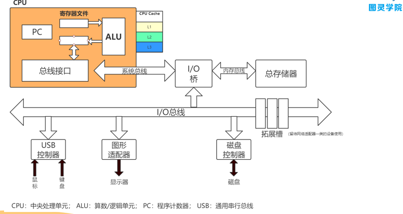
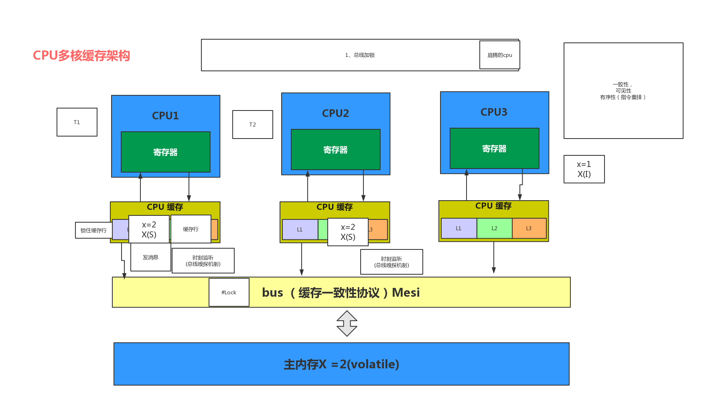
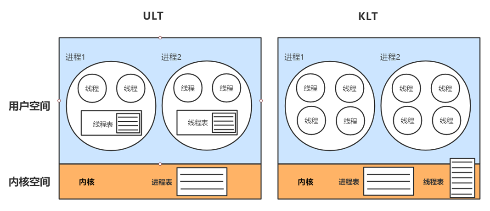

# JMM

大纲：

1、现代计算机理论模型与工作原理
2、什么是线程

* 一个进程之内可以分为一到多个线程
* 线程作为最小调度单位 ，进程作为资源分配的最小单位

3、为什么用到并发，并发的优缺点
4、JMM模型
5、volatile关键字

## 现代计算机理论模型与工作方式

### 1.冯洛依曼计算机模型

* **控制器**：是整个计算机的中枢神经
* **运算器**：运算器的功能是对数据进行各种**算术运算**和**逻辑运算**
* **存储器**：存储器的功能是存储程序、数据和各种信号、命令等信息，并在需
  要时提供这些信息。

* 输入 
* 输出

**2.现代计算机硬件结构原理图**

计算机的五大核心组成部分：

**多级缓存**：寄存器>L1>L2>L3>内存条 

####为什么需要缓存？

> 解决cpu**与内存速度不一致**

####cpu什么时候将L3数据刷新到内存中 ?

> cache缓存中已经满了，则刷回内存，fifo...

**3.cpu的内存结构划分**

> 存储单元包括 CPU 片内缓存Cache和寄存器组

### 2.多CPU缓存架构

1.**多CPU**
**主板上有多个cup**，优点 避免了多个进程进行进程上下文切换.
**2.CPU多核**
一个现代CPU除了**处理器核心**之外还包括寄存器、L1L2L3缓存这些存储设备、浮点运算单元、整数运算单元等一些辅助运算设备以及内部总线等。

优点：跑一个进程中的多线程程序，使用内部总线通信，没有缓存不一致问题。

* cpu数据读取过程: **主内存**--->**cup 缓存**-->**寄存器**

问题：多cpu带来了**数据不一致**.(写入覆盖)

####1.总线加锁

锁**主内存空间**,cpu访问该资源会阻塞(效率低下)

#### 2缓存一致性协议(Mesi实现)

知识补充

什么时候缓存行失效？

* 如果数据的存储长度大于一个缓存行

> volatile底层实际上使用了#Lock（汇编指令）
>
> 缓存行(Cashe Line)：cpu的最小存储单元
>
> 机械硬盘的最小存储单元？ 簇

**Mesi步骤：**

1. cpu1读入x =  2
   - 对bus加 #Lock
   - 对数据**独享**X(E)
   - 时刻监听(总线嗅探机制)
2. cpu2读入 x
   - cpu_2读入该缓存行  cpu1和cpu2的数据**独享**X(E)--->**共享**X(S)   
3. cpu1写回主内存
   1. 锁住缓存行X(S)-->X(M) 		如果同时要修改，在一个指令周期内，进行裁决。
   2. 发消息给总线
   3. cpu2 **共享**X(S)---->**失效**X(I) 
4. cpu2重新读入

> 关键性一步：**cpu2数据失效**，保证了一致性.

| **状态**                  | **描述**                                                     | **监听任务**                                                 |
| ------------------------- | ------------------------------------------------------------ | ------------------------------------------------------------ |
| M 修改 (Modified)         | 该**Cache  line有效**，数据被修改了，和**内存中的数据不一致**，数据只存在于本Cache中。 | 缓存行必须时刻监听所有试图**读**该缓存行相对就主存的操作，这种操作必须在缓存将该缓存行写回主存并将状态变成S（  共享）状态之前被延迟执行。 |
| E 独享、互斥  (Exclusive) | 该Cache  line有效，数据和内存中的**数据一致**，数据只存在于**本Cache中**。 | 缓存行也必须监听其它缓存读主存中该缓存行的操作，一旦有这种操作，该缓存行需要变成S（共享）状态。 |
| S 共享 (Shared)           | 该Cache  line有效，**数据和内存中的数据一致**，数据存在于很多Cache中。 | 缓存行也必须监听其它缓存使该缓存行无效或者独享该缓存行的请求，并将该缓存行变成无效（Invalid）。 |
| I 无效 (Invalid)          | 该Cache  line无效。                                          | 无                                                           |

## 线程

###进程与线程

1. 进程
   1. 系统分配资源的基本单位
   2. 程序的一次执行

2. 线程
   1. 线程是轻量级的进程，一个进程可以分为多个线程

对比：

* 进程是**资源分配最小单位**，线程是**最小调度单位**

###线程的分类

>  为了系统的安全性分连个类型

* 用户级线程ULT**(Use**r-Level Thread)：  用户级线程，主进程创建的伪线程，无cpu时间片使用权限。
  * 问题：如果cpu执行中，线程1阻塞，其他线程都**阻塞了**。(**线程没有cpu时间片**)
  * 优点：避免过度创建线程，避免大量上下文切换
  * 缺点:   程序自己实现堆栈，算法。
* 内核级线程KLT(**Kernel**-Level Thread)):线程的所有管理操作都是由操作系统内核完成的

> 上下文切换会涉及到用户态到内核态的切换原因所在

**内存划分：**

* 内核空间: 其中的线程能操作 Ring0级别cpu

* 用户空间:

**用户态--->内核态**

> ex:jvm 轻量级线程切换到内核态，才可以建立线程(cpu维护的)

**为了系统的安全性**，将cpu分级别

**cpu的级别：**

Ring0:只有内核空间的线程才能使用

Ring3:用户空间中线程都可以使用

###java线程与内核线程的关系:

**jvm创建线程依赖于内核空间**

1:1映射关系

