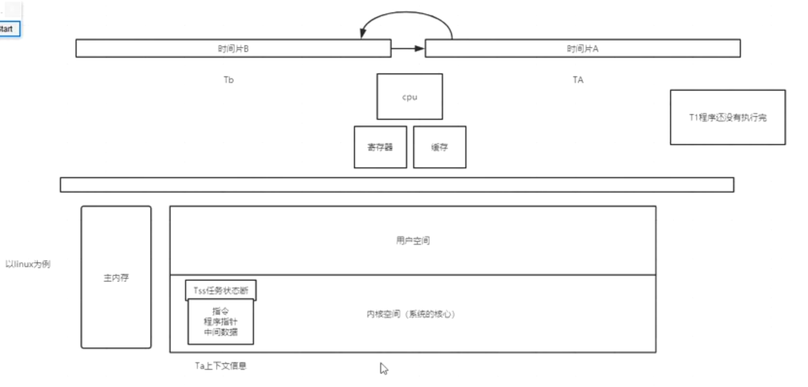
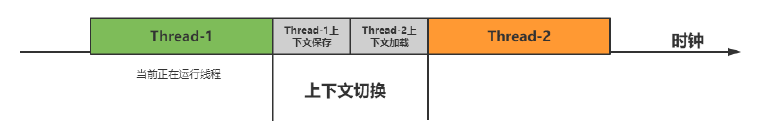
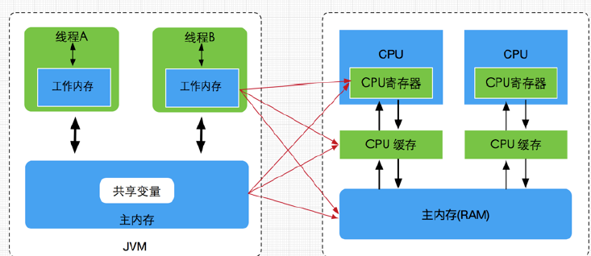
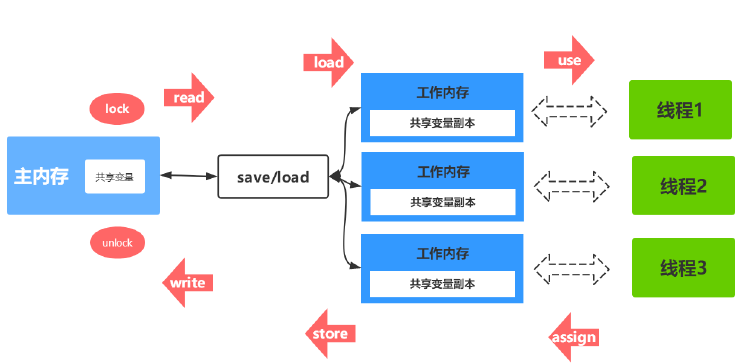
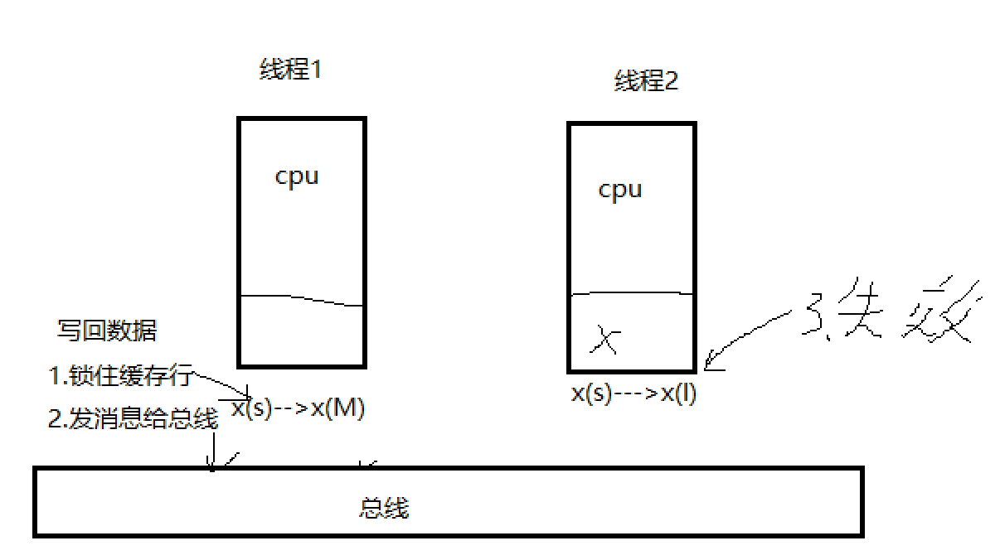
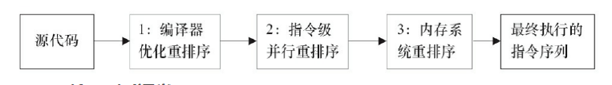
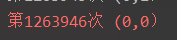
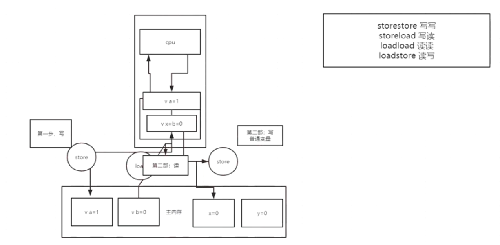
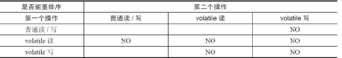
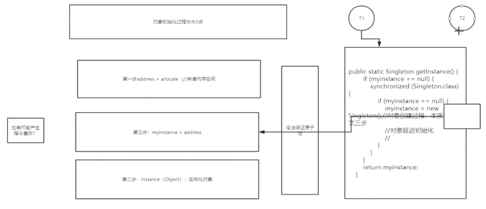

### 并发

优点：

1. 充分利用多核cpu的计算能力.

缺点：

* 高并发场景下，导致频繁的上下文切换,降低效率
* 临界区线程安全问题，容易出现**死锁**的，产生死锁就会造成系统功能不可用

> 死锁：线程A，B相互持有对方的资源并保持不放

死锁的排查：jps ,jstack

总结：

计算机模型-->硬件结构-》cpu的多级缓存-》

#### 一.JVM内存区域与JMM

* JVM进程，它去申请空间时，操作**逻辑空间**，是由操作系统分配的内存。是存在的。

* JMM:是一组**规范**，为了**屏蔽os的不同**。

>  JMM是围绕**可见性，原子性，有序性**展开的

概述:cpu时间片用完，存储在寄存器，cpu缓存中数据-----刷回---->主内存(**内核空间TSS中**)

> 数据回写的地址：TSS **任务状态断**(**内核空间**)

为什么刷回内核空间呢？

> 内核线程由内核空间程序创建
>
> 计算结果存储在寄存器，cpu缓存中






#### 二.Java内存模型与硬件内存架构的关系

> 映射硬件架构



​    *JMM模型跟CPU缓存模型结构类似，是基于**CPU缓存模型建立起来的**，JMM模型是**标准化的**，**屏蔽掉了底层不同计算机的区别**。对于硬件内存来说只有寄存器、缓存内存、主内存的概念，并没有**工作内存(线程私有数据区域)和主内存(堆内存)之分**，也就是说Java内存模型对内存的划分对硬件内存并没有任何影响*


围绕：*<u>**JMM的三大特性可见性，原子性，有序性**</u>*

JMM同步八种原子操作介绍	

1. lock(锁定)：作用于主内存的变量，把一个变量标记为一条线程独占状态
2. unlock(解锁)：作用于主内存的变量，把一个处于锁定状态的变量释放出来，释放后的变量才可以被其他线程锁定
3. **read**(读取)：作用于主内存的变量，把一个变量值从主内存传输到线程的工作内存中，以便随后的load动作使用
4. load(载入)：作用于工作内存的变量，它把read操作从主内存中得到的变量值放入工作内存的变量副本中
5. use(使用)：作用于工作内存的变量，把工作内存中的一个变量值传递给执行引擎
6. **assign**(赋值)：作用于工作内存的变量，它把一个从执行引擎接收到的值赋给工作内存的变量让他
7. **store**(存储)：作用于工作内存的变量，把工作内存中的一个变量的值传送到主内存中，以便随后的write的操作 
8. write(写入)：作用于工作内存的变量，它把store操作从工作内存中的一个变量的值传送到主内存的变量中

<u>八大操作**顺序执行**，但**不一定连续**</u>



主内存(lock)--->(read--->load)---->use------cpu

主内存(unlock)<---(write<--store)<---asign<----cpu

> 其中 read与load是原子操作，store

##### 1.可见性：

实例引入：


> 线程B修改了initFlag 线程A中不会改变

```java

while (!initFlag){
      //加入synchronized,导致容易上下文切换，initFlag更新
      synchronized (object){        
         i++;
      }
 }
```

解决办法：

1. while()中加锁：**加入synchronized,导致容易上下文切换**

2. volatile变量:原理加#lock(汇编指令)MESi协议

>  获得cpu使用权，再次加载数据---->cashe中
>
> while(true){} 线程空跑 --优先级高，一直占用cpu。

##### 2.原子性

​	原子性指的是**一个操作是不可中断**的，即使是在多线程环境下，一个操作一旦开始就**不会被其他线程影响**.

通过 **synchronized和Lock**实现原子性,原理：一次只有一个线程使用临界资源(**同步执行**)

######为什么volatile 不保证原子性?

ex: 10个线程下的 count++   

1. 第一：jvm中count++不是原子指令

*  iload_1   //从局部变量表的slot_1位置加载变量到操作数栈中

*  iinc         // 对slot_1位置的变量进行+1操

  ​	结果会小于预期值...

2. 第二：数据为什么会少与实际数据？

> 从mesi角度讲

**线程2数据的失效**，损失指令，导致本次add操作无效.



#####3有序性：

> **由上个问题，线程2数据的无效，线程2不能立马读入数据，数据可能在更新，cpu不能一直等待，所以让后面的程序先行执行。**

a.**重排序**：



1. **编译器**重排序. class--------> 汇编 

2. **处理器**重排序(2,3). 汇编----->cpu执行    

> java编译器在生成指令序列时， 通过**内存屏障指令**来禁止处理器重排序

b.**as-if-serial语义**：不管怎么重排序，**(单线程)**程序的**执行结果**不能被改变.

>  为了遵守as-if-serial语义：编译器和处理器**不会对存在数据依赖关系 的操作做重排序**，因为这种重排序会改变执行结果，但是操作之间不存在数据依赖关系，这些操作就可能被编译器和处理器重排序。给人幻觉，单线程程序是按照程序的顺序执行的

如果**存在数据依赖关系的操作，不会重排序**，反之不存在依赖关系，会重排序

c.**happens-before** 原则: 前一个操作(**执行结果**)对后一个操作可见.P29

ex：

|          | ProcessorA    | ProcessorB      |
| -------- | ------------- | --------------- |
| 代码     | a = 1; x = b  | b = 2  ; y  = a |
| 运行结果 | a =  b =  0   | a =  b =  0     |
|          | a,b 初始值为0 |                 |

* x = 1,y = 1
* x = 0,y = 1
* x = 1,y = 0

为什么出现 x = 0 , y = 0;

因为出现了**指令重排序**

volatile解决指令重排序：

volatile读：

volatile写：a = 1；  store

```java
      a = 1; //是读还是写？store，volatile写
                    //storeload ,读写屏障，不允许volatile写与第二部volatile读发生重排 

      x = b; // 读还是写？读写都有，先读volatile，写普通变量
             //分两步进行，第一步先volatile读，第二步再普通写 
```





#### 三.volatile内存语义

​	volatile是Java虚拟机提供的**轻量级**的**同步机制**。volatile关键字有如下两个作用保证被volatile修饰的共享变量对所有线程总数可见的，也就是当一个线程修改了一个被volatile修饰共享变量的值，新值总是可以被其他线程立即得知。

* 可见性
* 不保证原子性
* 有序性:禁止指令重排序

volatile有序性实现?

通过**内存屏障指令**来**禁止**特定类型的**处理器重排序**.



* 当第二个操作是volatile写时，不管第一个操作是什么，都不能重排序。这个规则确保
  volatile写之前的操作不会被编译器重排序到volatile写之后。
* 当第一个操作是volatile读时，不管第二个操作是什么，都不能重排序。这个规则确保
  volatile读之后的操作不会被编译器重排序到volatile读之前

内存屏障插入的时间？编译器在生成字节码时作出优化

**内存屏障**(Memory Barrier）：

* storestore：p26
* storeload:写读屏障是一个全能型屏障
* loadload:
* loadstore:

分类：

a.保守策略：

在每个**volatile写**的后面，或者在每个**volatile 读**的前面插入一个StoreLoad屏障。但内存屏障开销很昂贵

JMM最终选择了在每个 **volatile写**的后面插入一个**StoreLoad屏障**.

因为volatile写-读(storeload)内存语义的常见使用模式是：一个写线程写volatile变量，多个读线程读同一个volatile变量.

b.手动加屏障：

```java
//手动加内存屏障
Unsafe类
    public native void loadFence();

    public native void storeFence();

    public native void fullFence();

 public static Unsafe reflectGetUnsafe()
      Field field = Unsafe.class.getDeclaredField("theUnsafe");
      field.setAccessible(true);
      return (Unsafe) field.get(null);
```

反射获得usafe类，因为他是需要系统类加载器。

####总线风暴:

cas与volatile 需要与内存大量的交互。

* 导致大量无效工作内存变量

* 嗅探(大量的总线交换)

* 导致**总线通信信道被占用**

所以加锁 sychronized,lock

##### 双重检查锁定与延迟初始化

DCL(Double-Checked Locking) p69

> 直接在getInstance()方法上加锁消耗性能

dcl优点:

* 多个线程同时创建对象，会通过加锁保证只有一个线程创建。
* 对象创建好后，执行getInstance()方法不需要获得锁。

> 但sychronized代码块内 不保证指令重排序

解决: 对myinstance加volatile修饰

```java
private volatile static Singleton myinstance;

public static Singleton getInstance() {
    if (myinstance == null) {
        synchronized (Singleton.class) {
            if (myinstance == null) {
                myinstance = new Singleton();//对象创建过程，本质可以分文三步
                //对象延迟初始化
                //
            }
        }
    }
    return myinstance;
}
```

对象初始化的3步( myinstance = new Singleton()):

1. address = allocate //申请内存空间
2. instace(Object)实例化对象
3. myinstace = address

高并发中，如果2,3发生重排序

ex:

T1指令重排序(2,3重排序)，那么myinstance != null ,但myinstance是没有值的

T2 判断myinstance != null,返回myinstace，而myinstance是没有实例化对象的





