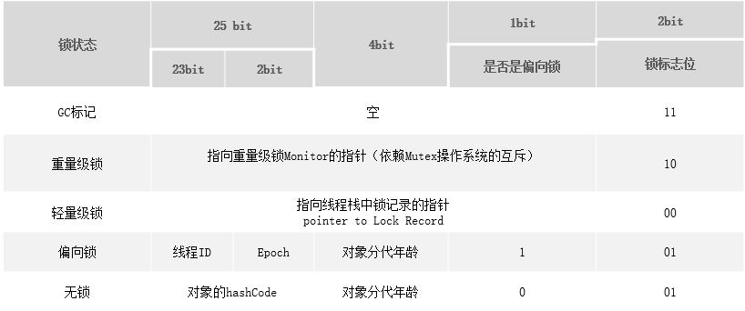

> 

## java锁

> 加锁目的**序列化访问临界资源**，即同一时刻只能有一个线程访问临界资源(**同步互斥访问**)

###a.锁分类:

* 显示锁:ReentrantLock，实现了JUC里的Lock，基于AQS实现，需要手动加锁跟解锁。 lock() , unLock()
* 隐式锁: synchronized加锁机制 ,  Jvm内置锁，不需要手动加锁与解锁。

###b.sychronized对象锁：

1. 同步实例方法，锁是当前**实例对象**

2. 同步**类方法(static**)，锁是当前**类对象**

3. 同步代码块，锁是括号里面的对象

>  跨方法，手动使用synchronized加锁, unsafe类使用 / ReentrantLock

###c.sychronized底层原理:

sychronized底层通过指令：monitorenter/monitorexit执行（虚拟机生成）隐式锁


通过内部对象**Monitor**(监视器锁)实现,synchronized(Object)

> 每一个object对象创建之后,都会在jvm内部维护一个与之对应的monitor(管程)

#### 管程

管理**共享变量**以及对**共享变量操作**的过程。

> 管程在功能上和信号量及PV操作类似，属于一种进程同步互斥工具。Java选择管程来实现并发主要还是因为实现管程比较容易


#### 对象的内存结构：

* 对象头：Mark Word + 类型指针
  * Mark Word:哈希码，gc分代年龄，锁状态标志，线程持有的锁，偏向线程ID
  * 类型指针: 指向它的类型元数据的指针，确定该对象是哪个类的实例
* 实例数据: 创建对象中成员变量，方法等
* 对齐填充:8字节整数倍

MarkWord是**动态定义的数据结构**.(JVM p51)

#### 实例对象存储在哪个位置?

Object实例对象一定时存在堆区的吗？

>  不一定，如果实例对象没有线程逃逸行为，则可以分配在栈上

* 堆区：有逃逸行为
* 栈区：无逃逸行为

逃逸分析（P418）

> 该对象是否被其他方法、线程所引用

实例优化：

* 栈上分配：不允许对象逃逸出**线程**范围
* 标量替换：不允许对象逃逸出**方法**范围(是栈上分配的特例)

### d.jvm内置锁优化升级过程

>  jvm_P475

####1.互斥同步

如果要阻塞和唤醒一条线程，需要陷入用户态--->内核态，需要**耗费时间**

####2.非阻塞同步

无锁编程：基于**冲突监测的并发策略**，不管风险，先进行操作，如果没有其他线程争用共享数据，那操作就直接成功了。

为什么需要硬件指令集的发展?

需要**操作**与**冲突监测**这两个步骤具有原子性。使用处理器指令

x86指令有用cmpxchg指令完成CAS(Compare-and-Swap)功能

CAS:内存位置(V)+旧的预期值(A)+新的预期值(B)

原子过程：当且仅当:V符合A时，B更新V的值.

缺点：

1.资源开销比较大

* cpu压力大，但自旋会由**一个次数限制，如果超过后就会放弃时间片**.
* 大量内存交互，容易总线风暴。

>https://blog.csdn.net/m0_37617778/article/details/108620127

2.ABA

> ABA问题:如果变量V初次读取时是A，赋值的时候仍然是A值，就能说明没有被其他线程改动？ A ---->B-------->A

解决：记录一下**变量的版本**就可以了，在变量的值发生变化时对应的版本也做出相应的变化，然后CAS操作时除了比较和预期值是否一致外，再比较一下版本，就知道变量有没有发生过改变了。

atomic包下AtomicStampedReference类实现了这种思路。Mysql中Innodb的多版本并发锁也是这个原理。

####3.锁粗化与消除

> append方法是加sychronized的，反复进入互斥同步，消耗性能

* 锁粗化：加锁一次，在第一个append之前
* 锁消除： 逃逸分析，数据不会被其他**线程**访问，认为**线程私有**，不用加锁。

锁粗化：

```java
StringBuffer stb = new StringBuffer();
public void test1(){
    //jvm的优化，锁的粗化
    stb.append("1");
    stb.append("2");
    stb.append("3");
}
```

锁消除：JVM不会对同步块进行加锁

```java
public void test1(){
    StringBuffer stb = new StringBuffer();
    //jvm的优化，锁的粗化
    stb.append("1");
    stb.append("2");
    stb.append("3");
}
```

#### 4.自旋锁与自适应自旋锁：

>  如果共享数据的锁状态只会持续一段时间，为了这段时间去挂起和恢复线程并不值得

-XX:PreBlockSpin ：自旋次数的默认值 

4.1自旋锁：....让后面请求锁的线程执行一个忙循环(自旋),不会放弃处理器执行时间.


> 如果自旋时间长，cpu资源浪费

4.2自适应自旋：自旋时间不在固定，而时由**前一次**同一个**锁上的自旋时间**决定.

* 刚刚获得锁------自旋时间增大
* 很少获得锁------自旋时间短或无

#### 5.偏向锁与轻量级锁

5.1偏向锁：由同一线程多次获得锁

> 核心思想是，如果一个线程获得了锁，那么锁就进入偏向模式,再次请求锁时，无需做任何操作。

偏向锁的目标是: 减少**无竞争**且**只有一个线程使用锁**的情况下，使用**轻量级锁**产生的性能消耗（CAS）

偏向锁不会自动释放，除非<u>*有其他线程竞争，膨胀为轻量级锁*。</u>

5.2 轻量级锁: 所适应的场景是线程**交替执行**同步块的场合

轻量级锁的目标是： 减少**无实际竞争**情况下，使用**重量级锁产生的性能消耗**.

<u>由于轻量级锁天然瞄准不存在锁竞争的场景，如果存在锁竞争但**不激烈**，仍然可以用**自旋锁**优化，*自旋失败后再膨胀为重量级锁*。</u>




> 0无锁 1偏向锁

#### 6.锁的膨胀升级

https://www.jianshu.com/p/36eedeb3f912

JVM内置锁在1.5之后版本做了重大的优化，


无锁：未被线程占用

无锁--->偏向锁---->轻量级锁--->重量级锁的大概步骤:

1. 如果标志位：01(无锁)
2. 获取偏向模式
   0. 无偏向,将mark Word 的线程ID指向自己
   1. 偏向，检查ID是否是自己，不是自己CAS修改，失败-->轻量级锁
3. 当前线程栈帧建立Lock Record
4. CAS尝试把对象Mark Word指向Lock Record
   1. 成功,处于**轻量级锁**
   2. 失败，自旋尝试，如果还失败膨胀为重量级锁

>  锁记录(Lock Record)：存储锁对象Mark Word


