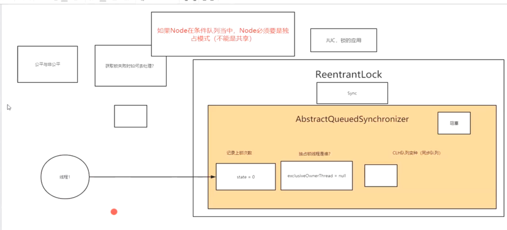
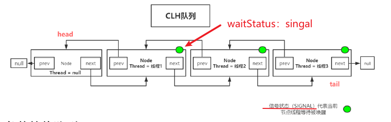
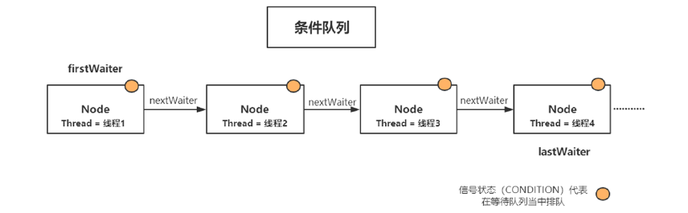
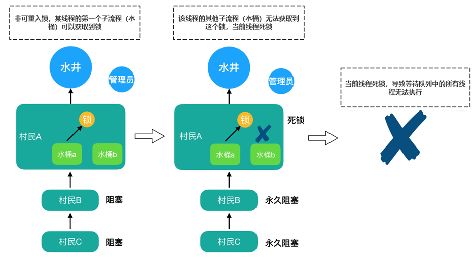

# AbstractQueuedSynchronizer(AQS)

> 生平不识Doug Lea，学懂并发也枉然
>
> ```java
> package java.util.concurrent.locks;
> ```

AQS定义了一套多线程访问共享资源的**同步器框架**，是一个**依赖状态(state)**的同步器。 (state获取锁的次数)

​	juc当中的大多数同步器实现都是围绕着共同的**基础行为**，比如**等待队列、条件队列、独占获取、共享获取**等，而这个行为的**抽象**就是基于AbstractQueuedSynchronizer简称AQS。

> 《艺术》P121  《实战》P255

###1.AQS具备特性

* 阻塞等待队列
* 共享/独占
* 公平/非公平
* 可重入
* 允许中断

###2.AQS框架的实现

* 一般通过**定义内部类Sync继承AQS**
* 将**同步器所有调用都映射到Sync**对应的方法  p123

####2.1 AQS内部维护属性**volatile int state (32位)**

* state表示资源的**可用状态**

####2.2 State三种访问方式

* getState()、setState()、compareAndSetState() 

####2.3 AQS定义两种资源共享方式

* Exclusive-独占，只有**一个线程能执行**，如ReentrantLock
* Share-共享，多个线程可以同时执行，如Semaphore/CountDownLatch

####2.4 AQS定义两种队列

* **同步等待**队列

* **条件**等待队列:

####2.5 AQS同步器:

>  自定义同步器通过内部类Sync继承AbstractQueuedSynchronizer实现

同步器的设计是基于**模板方法**模式的

#####2.5.1AQS:

```java
// 指向同步等待队列的头节点
private transient volatile Node head;
//指向同步等待队列的尾节点
private transient volatile Node tail;
//同步资源状态
private volatile int state;
```

waitStatus:


> ```
> CAS更改状态，volatile保证线程可见性
> ```

* CANCELLED(1): 已经死亡,需要移除队列

* SIGNAL(-1): 代表当前线程等待被唤醒

* CONDITION(-2)：节点在条件等待队列中------signal()---->同步队列

* PROPAGATE(-3):**共享**式同步状态



#####2.5.3同步等待队列(CLH)：

> AQS当中的同步等待队列也称CLH队列,基于双向链表数据结构的队列，是FIFO先入先出线程等待队列

Java中的CLH队列是原CLH队列的一个**变种**,线程由原**自旋机制**改为**阻塞**机制。




##### 2.5.4条件等待队列

> Condition是一个多线程间协调通信的工具类，某些线程一起等待某个条件（Condition）,只有当该条件具备时，这些等待线程才会被唤醒，从而重新争夺锁

单向队列，nextWaiter。

如果Node在条件队列当中，**Node**必须是**独占模式**(不能是共享)---blockingQueue



#####2.5.6公平与非公平：

公平锁:直接去排队----尾插法插入clh队列

非公平锁:先尝试插队，不成，在排队------先获取锁,不成，在尾插

> 非公平锁的优缺点

* 优点:**吞吐量高**

* 缺点：其他**线程容易"饥饿"**

ReentrrantLock构造方法可以定义公平与非公平

```java
//根据要求创建公平锁或非公平锁  true: 公平
public ReentrantLock(boolean fair) {
    sync = fair ? new FairSync() : new NonfairSync();
}
```

ReentrrantLock是公平锁?

先判断是否有节点：hasQueuedPredecessors()

源码：

```java
if (!hasQueuedPredecessors() && compareAndSetState(0, acquires)) {
    //独占线程指向当前线程
    setExclusiveOwnerThread(current);
```

```java
unsafe.compareAndSwapInt(this, stateOffset, expect, update);
```

###Lock加锁源码分析：

1.lock执行 acquire

2.tryAcquire()获取锁失败，执行入同步队列addWatiter(独占，1)

3.addWaiter() tail空  | 不空，执行enq()

4.enq()  tail空，创建空头节点，再插入。

```
 static final class FairSync extends Sync {
        private static final long serialVersionUID = -3000897897090466540L;
		//公平锁
        final void lock() {
            acquire(1);
        }

```

```java
 
public final void acquire(int arg) 
    //tryAcquire()获取锁失败，执行入同步队列addWatiter(独占，1)
    if (!tryAcquire(arg) &&
            acquireQueued(addWaiter(Node.EXCLUSIVE), arg))
        selfInterrupt();
}
```

```java
private Node addWaiter(Node mode) {
    // 1. 将当前线程构建成Node类型
    Node node = new Node(Thread.currentThread(), mode);
    // Try the fast path of enq; backup to full enq on failure
    Node pred = tail;
    // 2. 1当前尾节点是否为null？
    if (pred != null) {
        // 2.2 将当前节点尾插入的方式
        node.prev = pred;
        // 2.3 CAS将节点插入同步队列的尾部
        if (compareAndSetTail(pred, node)) {
            pred.next = node;
            return node;
        }
    }
    enq(node); //tail 尾 为空
    return node;
}
```

入队操作：基于**CAS的设置尾节点**方法compareAndSetTail() 

死循环目的：如果原子交换失败，那么会一直循环。

```java
/**
 * 节点加入CLH同步队列
 */
private Node enq(final Node node) {
    for (;;) {
        Node t = tail;
        if (t == null) { // Must initialize
            //队列为空需要初始化，创建空的头节点
            if (compareAndSetHead(new Node()))
                tail = head;
        } else {
            node.prev = t;
            //set尾部节点
            if (compareAndSetTail(t, node)) {//当前节点置为尾部
                t.next = node; //前驱节点的next指针指向当前节点
                return t;
            }
        }
    }
}
   /**
     * CAS 修改尾部节点指向. 并发入队时使用. 注意是tailOffset
     */
    private final boolean compareAndSetTail(Node expect, Node update) {
        return unsafe.compareAndSwapObject(this, tailOffset, expect, update);
    }
```

节点进入同步队列之后，进入自旋的过程，每个节点(线程)都在观察，当条件满足，获取到了同步状态，就从

艺术p127

```java
/**
 * 已经在队列当中的Thread节点，准备阻塞等待获取锁
 */
final boolean acquireQueued(final Node node, int arg) {
    boolean failed = true;
    try {
        boolean interrupted = false;
        for (;;) {//死循环
            final Node p = node.predecessor();//找到当前结点的前驱结点
            if (p == head && tryAcquire(arg)) {//如果前驱结点是头结点，才tryAcquire，其他结点是没有机会tryAcquire的。
                setHead(node);//获取同步状态成功，将当前结点设置为头结点。
                p.next = null; // help GC
                failed = false;
                return interrupted;
            }
            /**
             * 如果前驱节点不是Head，通过shouldParkAfterFailedAcquire判断是否应该阻塞
             * 前驱节点信号量为-1，当前线程可以安全被parkAndCheckInterrupt用来阻塞线程
             */
            if (shouldParkAfterFailedAcquire(p, node) &&
                    parkAndCheckInterrupt())
                interrupted = true;
        }
    } finally {
        if (failed)
            cancelAcquire(node);
    }
}
```

---

#####2.5.7重入锁

>  重进入是指任意线程在获得到锁之后能够再次获取该锁而不会被锁阻塞。

>  

####2.6读写锁：

《艺术》P140

读写锁在同一时刻可以允许多个读线程访问，但写线程访问时，所有读/写线程均被阻塞。它维护了**一对锁**，一个读锁一个写锁，通过分离读锁和写锁，有很好的**并发性和吞吐量**

比如锁**ReentrantReadWriteLock**,通过readLock()和writeLock()获得读写锁

```java
ReentrantReadWriteLock rwl = new ReentrantReadWriteLock();
Locl r = rwl.readLock();
Locl w = rwl.writeLock();
```

#####2.6.1.实现

读写锁的自定义同步器需要在**同步状态(一个整型变量)**，上维护多个读线程和一个写线程的状态。

**按位切割**使用前16位(读状态)+后16位(写状态)

>  int(32位) =  读(16位)+写(16位)

写状态:S & 0X0000FFFF（高位抹去）

读状态:S>>>16（y右移16位）

#####2.6.2锁降级

锁降级指写锁降级成为读锁。

把持写锁---->获取读锁----->释放

> 把持住写锁，再获取读锁，然后释放写锁（期间不回释放写锁）

####为什么要锁降级？

**保证数据的可见性**。不获取读锁，直接释放写锁。另外的线程可能获得写锁，修改数据。

### 写锁的获取与释放

写锁：支持重入的排他锁。

如果当前线程获取**写锁**时，**读锁**已经被获取，进入**等待**状态。

为什么？保证写锁的操作对读锁可见。如果允许读锁已经在获取状态下对写锁获取，那么正在运行的其他读线程就无法感知次线程操作。

####Node 源码

waitStatus的几种状态：CANCELLED，SIGNAL....

 **PROPAGATE** = -3;代表都可以唤醒。

```java
static final class Node {
    /**
     * 标记节点未共享模式
     * */
    static final Node  SHARED = new Node();
    /**
     *  标记节点为独占模式
     */
    static final Node EXCLUSIVE = null;
    /**
     * 在同步队列中等待的线程等待超时或者被中断，需要从同步队列中取消等待
     * */
    static final int CANCELLED =  1;
    /**
     *  后继节点的线程处于等待状态，而当前的节点如果释放了同步状态或者被取消，
     *  将会通知后继节点，使后继节点的线程得以运行。
     */
    static final int SIGNAL    = -1;
    /**
     *  节点在等待队列中，节点的线程等待在Condition上，当其他线程对Condition调用了signal()方法后，
     *  该节点会从等待队列中转移到同步队列中，加入到同步状态的获取中
     */
    static final int CONDITION = -2;
    /**
     * 表示下一次共享式同步状态获取将会被无条件地传播下去
     */
    static final int PROPAGATE = -3;

    /**
     * 标记当前节点的信号量状态 (1,0,-1,-2,-3)5种状态
     * 使用CAS更改状态，volatile保证线程可见性，高并发场景下，
     * 即被一个线程修改后，状态会立马让其他线程可见。
     */
    volatile int waitStatus;

    /**
     * 前驱节点，当前节点加入到同步队列中被设置
     */
    volatile Node prev;

    /**
     * 后继节点
     */
    volatile Node next;

    /**
     * 节点同步状态的线程
     */
    volatile Thread thread;

    /**
     * 等待队列中的后继节点，如果当前节点是共享的，那么这个字段是一个SHARED常量，
     * 也就是说节点类型(独占和共享)和等待队列中的后继节点共用同一个字段。
     */
    Node nextWaiter;
```

