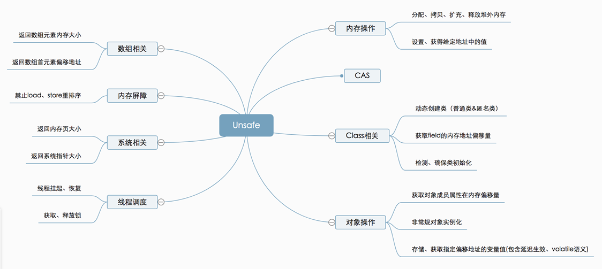
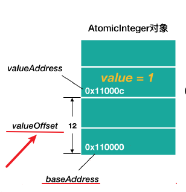
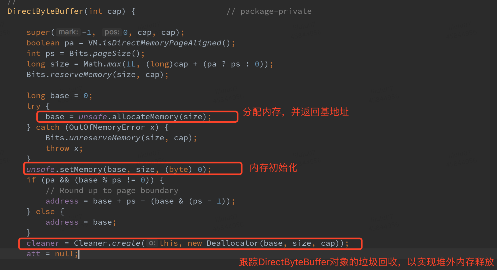

# 原子操作

> 原子即“不能被进一步分割的最小粒子”，原子操作（atomic operation）即”不可被中断的一个或一系列操作”

艺术:p19页

# 处理器如何实现原子操作？

##总线加锁

所谓总线锁就是使用处理器提供的一个**LOCK＃信**号，当一个处理器在总线上输出此信号时，其他处理器的请求将被阻塞住,那么该处理器可以独占使用**共享内存。**

##缓存行加锁

CAS的指令CmpChgx使用缓存行加锁，使用MESI协议。

按照MESI协议解释即可。

> 注意 ： 此处不用像 i++ 100次，损失指令。 此处是CAS，cas失败，数据无效没事。

cmpchgx，ADD（加），OR（或）等指令操作都会加锁。

#Atomic

在Atomic包里一共有12个类，四种原子更新方式,原子更新基本类型,原子更新数组,原子更新引用,原子更新字段, **Atomic**包里的类基本都是使用**Unsafe**实现的包装类。

•**基本类：** **AtomicInteger**、AtomicLong、AtomicBoolean；

•**引用类型：**AtomicReference、AtomicReference的ABA实例、**AtomicStampedRerence**、AtomicMarkableReference；

•**数组类型：**AtomicIntegerArray、AtomicLongArray、AtomicReferenceArray

•**属性原子修改器（**Updater）：AtomicIntegerFieldUpdater、AtomicLongFieldUpdater、AtomicReferenceFieldUpdater

###什么是ABA问题?

A-->B-->A.

atomicInteger.get() a是A  ---> a: B  ----> compareAndSet(a,2).a是A

```java
int a = atomicInteger.get();
System.out.println("操作线程"+Thread.currentThread().getName()+"--修改前操作数值:"+a);
try {
    Thread.sleep(1000);
} catch (InterruptedException e) {
    e.printStackTrace();
}
boolean isCasSuccess = atomicInteger.compareAndSet(a,2);

```

干扰线程：

```java
Thread other = new Thread(new Runnable() {
    @Override
    public void run() {
        atomicInteger.incrementAndGet();// 1+1 = 2;
        System.out.println("操作线程"+Thread.currentThread().getName()+"--increase后值:"+atomicInteger.get());
        atomicInteger.decrementAndGet();// atomic-1 = 2-1;
        System.out.println("操作线程"+Thread.currentThread().getName()+"--decrease后值:"+atomicInteger.get());
    }
},"干扰线程");
```

###如何解决ABA？

>  追加版本号

使用**AtomicStampedReference**来解决ABA问题。

 new AtomicStampedReference<>(1, 0);  第一个参数：初始值， 第二个 版本号。

```java
private static AtomicStampedReference<Integer> atomicStampedRef = new AtomicStampedReference<>(1, 0);   
boolean isCASSuccess = atomicStampedRef.compareAndSet(1,2,stamp,stamp +1);  //此时expectedReference未发生改变，但是stamp已经被修改了,所以CAS失败
```

维护版本号：

```java
int stamp = atomicStampedRef.getStamp();//版本
atomicStampedRef.compareAndSet(1,2,stamp,stamp+1);
```

####AtomicIntegerArray

它操作的是数组的克隆值

```java
public AtomicIntegerArray(int[] array) {
    // Visibility guaranteed by final field guarantees
    this.array = array.clone();
}
```

####AtomicIntegerFieldUpdater

 **old一定要用volatile.**:高并发下，保证可见性

```java
static class Student{
    private String name;
    public volatile int old;
```

```java
AtomicIntegerFieldUpdater aifu = AtomicIntegerFieldUpdater.newUpdater(Student.class,"old");
Student stu = new Student("杨过",18);
aifu.getAndIncrement(stu);//会将Student中的age加一
```

# Unsafe



源码：

使用反射获取unsafe：

```java
public static Unsafe reflectGetUnsafe() {
    try {
        Field field = Unsafe.class.getDeclaredField("theUnsafe");
        field.setAccessible(true);
        return (Unsafe) field.get(null);
    } catch (Exception e) {
        e.printStackTrace();
    }
    return null;
}
```

###1.cas

自定义一个类 使用unsafe的cas；

```java
public class AtomicStudentAgeUpdater {
    private String name ;
    private volatile int age;

    private static final Unsafe unsafe = UnsafeInstance.reflectGetUnsafe();
    private static final long valueOffset; //偏移量

    static {
        try {
            valueOffset = unsafe.objectFieldOffset(AtomicStudentAgeUpdater.class.getDeclaredField("age"));
            System.out.println("valueOffset:--->"+valueOffset);
        } catch (Exception e) {
            throw new Error(e);
        }
    }
	public void compareAndSwapAge(int old,int target){
    unsafe.compareAndSwapInt(this,valueOffset,old,target);//
}
```

unsafe源码：

```java
private static final Unsafe theUnsafe;

private static final long valueOffset;

public final native boolean compareAndSwapObject(Object var1, long var2, Object var4, Object var5);

public final native boolean compareAndSwapInt(Object var1, long var2, int var4, int var5);

public final native boolean compareAndSwapLong(Object var1, long var2, long var4, long var6);
```

####什么是偏移量valueOffset

对象内存结构：对象头+实例数据+对齐填充位

实例数据中：属性在对象内存空间中的偏移

ex:

```java
 unsafe.compareAndSwapInt(this,valueOffset,old,target);
```

baseAddress+valueOffset得到value的内存地址



###2.内存操作

堆外内存（直接内存）的分配、拷贝、释放、给定地址值操作等方法。

```java
//分配内存, 相当于C++的malloc函数
public native long allocateMemory(long bytes);
//扩充内存
public native long reallocateMemory(long address, long bytes);
//释放内存
public native void freeMemory(long address);
public native void setMemory(Object o, long offset, long bytes,
byte value);
//内存拷贝
public native void copyMemory(Object srcBase, long srcOffset,
Object destBase, long destOffset, long bytes);
//获取给定地址值，忽略修饰限定符的访问限制。与此类似操作还有: getInt，
getDouble，getLong，getChar等
public native Object getObject(Object o, long offset);
//为给定地址设置值，忽略修饰限定符的访问限制，与此类似操作还有:
putInt,putDouble，putLong，putChar等
public native void putObject(Object o, long offset, Object x);
public native byte getByte(long address);
//为给定地址设置byte类型的值（当且仅当该内存地址为
allocateMemory分配 时，此方法结果才是确定的）
public native void putByte(long address, byte x);
```

使用直接内存原因：‘

* 使用堆外内存的原因对垃圾回收停顿的改善。由于**堆外内存是直接受操作系统管理**而不是JVM，所以当我们使用堆外内存时，即可保持较小的堆内内存规模。从而在GC时减少回收停顿对于应用的影响。
  * 提升程序I/O操作的性能。通常在I/O通信过程中，会存在堆内内存到 堆外内存的数据拷贝操作，对于需要频繁进行内存间**数据拷贝**且**生命周期较短**的暂存数据，都建议存储到堆外内存。

ex:

DirectByteBuffer



- 使用了 Cleaner（虚引用）来监测 ByteBuffer 对象，一旦ByteBuffer 对象被垃圾回收，那么就会由 ReferenceHandler 线程通过 Cleaner 的 clean 方法调

用 **freeMemory** 来释放直接内存.

###3.线程调度

```java
//取消阻塞线程
public native void unpark(Object thread);
//阻塞线程
public native void park(boolean isAbsolute, long time);
//获得对象锁（可重入锁）
@Deprecated
public native void monitorEnter(Object o);
//释放对象锁
@Deprecated
public native void monitorExit(Object o);
//尝试获取对象锁
@Deprecated
public native boolean tryMonitorEnter(Object o);
```

lockSupprot的使用

```java
LockSupport.park();//阻塞当前线程
LockSupport.unpark(t);//唤醒指定的线程
```

> LockSupport的park、unpark方法实际是调用Unsafe的park、unpark方式来实现

cas:

```java
    public native void unpark(Object var1);

    public native void park(boolean var1, long var2);xxxxxxxxxx     public native void unpark(Object var1);    public native void park(boolean var1, long var2);public native void park(boolean var1, long var2);
```

​	

跨方法加sychronized隐士锁

```java
Unsafe unsafe = UnsafeInstance.reflectGetUnsafe();

unsafe.monitorEnter(object);
//业务逻辑写在此处之间
unsafe.monitorExit(object);
```

###4.内存屏障

```java
UnsafeInstance.reflectGetUnsafe().loadFence();//读屏障

UnsafeInstance.reflectGetUnsafe().storeFence();//写屏障

UnsafeInstance.reflectGetUnsafe().fullFence();//读写屏障

```

