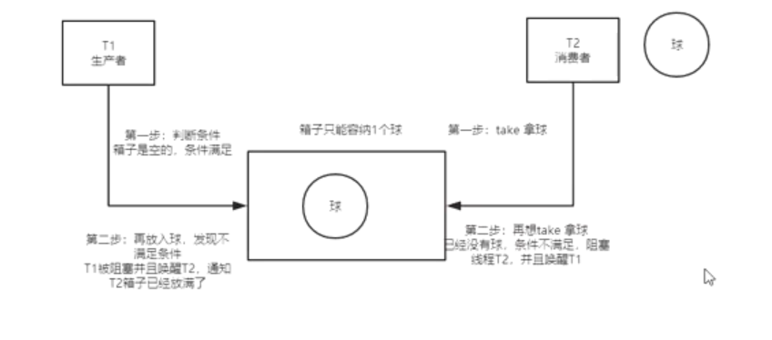

前提：

put

jdk1.7 头插法

jdk1.8 

HashMap的扩容？

什么时候resize呢？

* Capacity：HashMap当前长度。

* LoadFactor：负载因子，默认值0.75f。

就比如当前的容量大小为100，当你存进第76个的时候，判断发现需要进行resize了，那就进行扩容，但是HashMap的扩容也不是简单的扩大点容量这么简单的。

扩容分为两步

* 扩容：创建一个新的Entry空数组，长度是原数组的2倍。

* ReHash：遍历原Entry数组，把所有的Entry重新Hash到新数组。

HashMap的默认初始化长度是多少？16  ===**1<<4**就是16

大家是否还记得我说的HashMap是通过key的hashCode去寻找index的，那index一样就形成链表了，也就是说”帅丙“和”丙帅“的index都可能是2，在一个链表上的。

**equals**！是的，所以如果我们对equals方法进行了重写，建议一定要对hashCode方法重写

HashMap扩容死锁


## BlockingQueue阻塞队列

1、ArrayBlockingQueue 由数组支持的有界队列

2、LinkedBlockingQueue 由链接节点支持的可选有界队列

3、PriorityBlockingQueue 由优先级堆支持的无界优先级队列

4、DelayQueue 由优先级堆支持的、基于时间的调度队列


**BlockingQueue 队列  使用 ReetranLock & Condition (只能是独占模式)**

使用ArrayBlockingQueue实现BlockingQueue：



###ArrayBlockingQueue 源码分析：

属性：

```java
 /** The queued items */
final Object[] items;
/** Main lock guarding all access */
final ReentrantLock lock;

/** Condition for waiting takes */
private final Condition notEmpty;

/** Condition for waiting puts */
private final Condition notFull;
```

创建的是一个 **非公平**的 ReetranLock .

条件队列是不会唤醒竞争锁的。只有 条件队列 ---- > 同步队列。

```java
	public ArrayBlockingQueue(int capacity) {
   	 this(capacity, false);
	}
  public ArrayBlockingQueue(int capacity, boolean fair) {
        if (capacity <= 0)
            throw new IllegalArgumentException();
        this.items = new Object[capacity];
        lock = new ReentrantLock(fair); //里面有clh同步队列
        notEmpty = lock.newCondition(); //创建两组条件
        notFull =  lock.newCondition();
    }
```

put操作：

1.获取独占锁         lock.lockInterruptibly();

2.判断当前队列是否已满，已满调用awit()将线程node 加入条件队列

```java
//在此队列的尾部插入指定的元素，如果队列已满，则等待空间变得可用。
public void put(E e) throws InterruptedException {
    checkNotNull(e);
    final ReentrantLock lock = this.lock;
    lock.lockInterruptibly(); //加锁
    try {
        while (count == items.length)
            notFull.await(); 
        enqueue(e);
    } finally {
        lock.unlock();
    }
}
```

####Condition的wait()

> 当前线程一定获取了锁，即同步队列的头节点。--> 等待队列 & 释放锁。

1.加入条件等待队列

2.释放独占锁资源

3.如果不在同步队列中则不断挂起，永远不能被唤醒 if ((interruptMode = checkInterruptWhileWaiting(node)) != 0)    break;

4.acquireQueued(node, savedState)将此节点在同步队列中自旋。

```java

        /** 该模式表示在退出等待时重新中断 */
        private static final int REINTERRUPT =  1;
        /** 异常中断 */
        private static final int THROW_IE    = -1;
/**
 * 加入条件队列等待，条件队列入口
 */
public final void await() throws InterruptedException {
    //如果当前线程被中断则直接抛出异常
    if (Thread.interrupted())
        throw new InterruptedException();
    //把当前节点加入条件队列
    Node node = addConditionWaiter();
    //释放掉已经获取的独占锁资源
    int savedState = fullyRelease(node);
    int interruptMode = 0;
    //如果不在同步队列中则不断挂起
    while (!isOnSyncQueue(node)) {
        LockSupport.park(this);
        //这里被唤醒可能是正常的signal操作也可能是中断
        if ((interruptMode = checkInterruptWhileWaiting(node)) != 0)
            break;
    }
    /**
     * 走到这里说明节点已经条件满足被加入到了同步队列中或者中断了
     * 这个方法很熟悉吧？就跟独占锁调用同样的获取锁方法，从这里可以看出条件队列只能用于独占锁
     * 在处理中断之前首先要做的是从同步队列中成功获取锁资源
     */
    
    if (acquireQueued(node, savedState) && interruptMode != THROW_IE) //acquireQueued() 获取
        interruptMode = REINTERRUPT;
    
    //走到这里说明已经成功获取到了独占锁，接下来就做些收尾工作
    //删除条件队列中被取消的节点
    if (node.nextWaiter != null) // 吹了cancelled的节点
        unlinkCancelledWaiters();
    //根据不同模式处理中断
    if (interruptMode != 0)
        reportInterruptAfterWait(interruptMode);
}
```

#### 为什么条件队列一定是独占的？

if (acquireQueued(node, savedState) && interruptMode != THROW_IE)

####addConditionWaiter()

* 将线程加入条件队列。

```java
private Node addConditionWaiter() {
    Node t = lastWaiter;
    // If lastWaiter is cancelled, clean out.
    if (t != null && t.waitStatus != Node.CONDITION) {
        unlinkCancelledWaiters();
        t = lastWaiter;
    }
    Node node = new Node(Thread.currentThread(), Node.CONDITION);
    if (t == null)
        firstWaiter = node;
    else
        t.nextWaiter = node;
    lastWaiter = node;
    return node;
}
```

####checkInterruptWhileWaiting()

1.cas修改 waitStatus

2.如果没有入同步队列 -- > 让出cpu资源

```java
final boolean transferAfterCancelledWait(Node node) {
    if (compareAndSetWaitStatus(node, Node.CONDITION, 0)) {
        enq(node);
        return true;
    }
    /*
     * If we lost out to a signal(), then we can't proceed
     * until it finishes its enq().  Cancelling during an
     * incomplete transfer is both rare and transient, so just
     * spin.
     */
    while (!isOnSyncQueue(node)) //
        Thread.yield();
    return false;
}
```

# HashMap死锁与数据丢失

*  java1.7 hashMap会产生死锁

* java1.8不会死锁，但多线程下，数据会丢失，put()的时候，会覆盖头部节点。----------concurrenMap使用CAS去解决数据丢失

## jdk1.7死锁原因

hashmap在多线程场景下，扩容期间存在节点位置互换指正引用的问题，有可能导致。

#####jdk1.7源码:

```java
void resize(int newCapacity) {
    Entry[] oldTable = table;
    int oldCapacity = oldTable.length;
    if (oldCapacity == MAXIMUM_CAPACITY) {
        threshold = Integer.MAX_VALUE;
        return;
    }

    Entry[] newTable = new Entry[newCapacity]; //创建数组
    transfer(newTable, initHashSeedAsNeeded(newCapacity));
    table = newTable;
    threshold = (int)Math.min(newCapacity * loadFactor, MAXIMUM_CAPACITY + 1);
}
```

###### transfer()

因为扩容到新数组的问题。

1.遍历 table[] 数组

```java
void transfer(Entry[] newTable, boolean rehash) {
    int newCapacity = newTable.length;
    for (Entry<K,V> e : table) {
        while(null != e) {
            Entry<K,V> next = e.next;
            //阻塞 LockSupport.park()
            if (rehash) {
                e.hash = null == e.key ? 0 : hash(e.key);
            }
            int i = indexFor(e.hash, newCapacity);
            e.next = newTable[i];
            newTable[i] = e;
            e = next;
        }
    }
}
```


#####jdk1.8


# ConcurrentHashMap

采用**锁分段技术**提高并发访问效率。当一个线程占用锁访问其中一个段数据的时候，其他的数据也能被其他线程访问。

segment数组 + HashEntry数组

segment继承可重入锁(ReentrantLock) 。

####put() 源码：

f = tabAt(tab, i = (n - 1) & hash)    

* CAS：Node[i]= =null ,插入在头节点，避免了值的丢失。put（）

* 锁桶 : Node[i] != null, 加锁：  synchronized (f) {

```java
final V putVal(K key, V value, boolean onlyIfAbsent) {
    if (key == null || value == null) throw new NullPointerException();
    int hash = spread(key.hashCode());
    int binCount = 0;
    for (Node<K,V>[] tab = table;;) {
        Node<K,V> f; int n, i, fh;
        if (tab == null || (n = tab.length) == 0)
            tab = initTable();
        else if ((f = tabAt(tab, i = (n - 1) & hash)) == null) {
            if (casTabAt(tab, i, null,
                         new Node<K,V>(hash, key, value, null)))
                break;                   // no lock when adding to empty bin
        }
        else if ((fh = f.hash) == MOVED)
            tab = helpTransfer(tab, f);
        else {
            V oldVal = null;1
            synchronized (f) {
                if (tabAt(tab, i) == f) {
                    if (fh >= 0) {
                        binCount = 1;
                        for (Node<K,V> e = f;; ++binCount) {
                            K ek;
                            if (e.hash == hash &&
                                ((ek = e.key) == key ||
                                 (ek != null && key.equals(ek)))) {
                                oldVal = e.val;
                                if (!onlyIfAbsent)
                                    e.val = value;
                                break;
                            }
                            Node<K,V> pred = e;
                            if ((e = e.next) == null) {
                                pred.next = new Node<K,V>(hash, key,
                                                          value, null);
                                break;
                            }
                        }
                    }
                    else if (f instanceof TreeBin) {
                        Node<K,V> p;
                        binCount = 2;
                        if ((p = ((TreeBin<K,V>)f).putTreeVal(hash, key,
                                                       value)) != null) {
                            oldVal = p.val;
                            if (!onlyIfAbsent)
                                p.val = value;
                        }
                    }
                }
            }
            if (binCount != 0) {
                if (binCount >= TREEIFY_THRESHOLD)
                    treeifyBin(tab, i);
                if (oldVal != null)
                    return oldVal;
                break;
            }
        }
    }
    addCount(1L, binCount);
    return null;
}
```

###### jdk8的concurrenthashmap

锁住数组桶。sychronized(f)


#### segment

#### Filed

```java
/* ---------------- Fields -------------- */

 
transient volatile Node<K,V>[] table;

private transient volatile Node<K,V>[] nextTable;

private transient volatile long baseCount;
// sizeCtl: -1 正在扩容。
private transient volatile int sizeCtl;

private transient volatile int transferIndex;

private transient volatile int cellsBusy;

private transient volatile CounterCell[] counterCells;
```

table数组是一个数组加链表的结构


 

