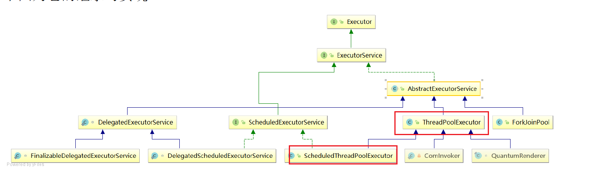
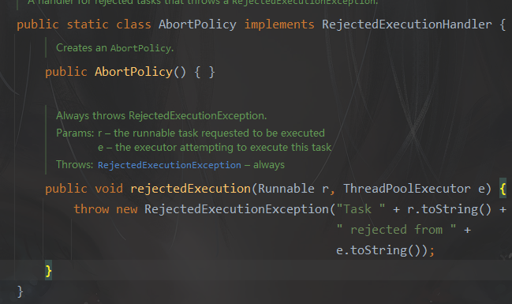
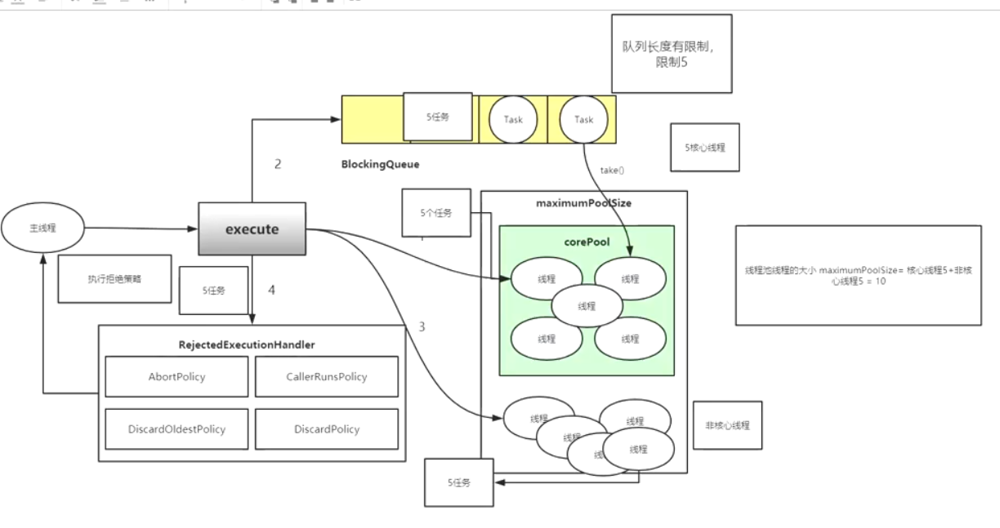
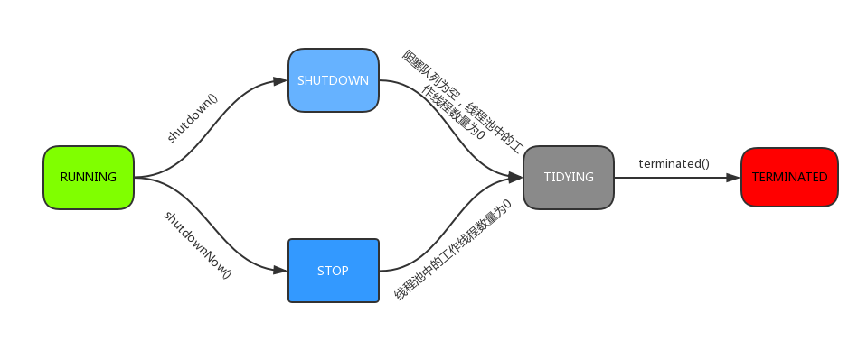
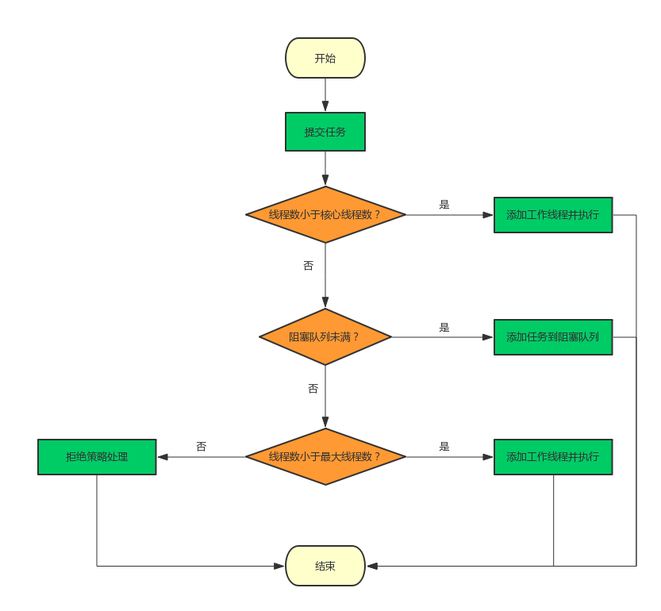
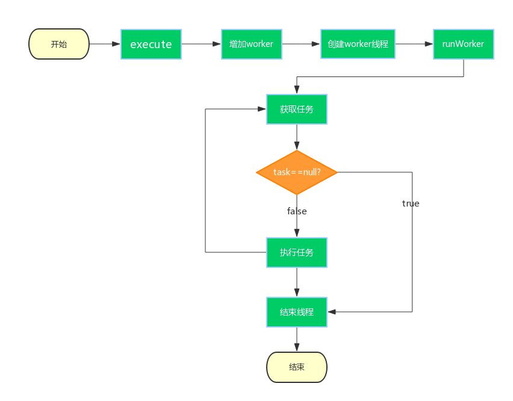

#Executor框架

如果并发的请求数量非常多，但每个线程执行的时间很短，这样就会**频繁的创建和销毁线程，如此一来会大大降低系统的效率**。可能出现服务器在为每个请求创建新线程和销毁线程上花费的时间和消耗的系统资源要比处理实际的用户请求的时间和资源更多.

什么时候使用线程池？

* 单个任务处理时间比较短
* 需要处理的任务数量很大

线程池优势

* 重用存在的线程，**减少线程创建**，消亡的开销，提高性能
* 提高**响应速度**。当任务到达时，任务可以不需要的**等到线程创建就能立即执行**
* 提高线程的**可管理性**。线程是稀缺资源，如果无限制的创建，不仅会消耗系统资源，还会降低系统的稳定性，使用线程池可以进行统一的分配，调优和监控

> 线程创建需要用户态-->内核态   消耗性能

HotSpot VM线程模型中，java线程是一对一映射到本地操作系统中。

Executor框架控制的是上层调度。将java线程分解的若干任务映射为固定的线程(用户级线程)

在底层，操作系统内核将这些线程映射到硬件处理器上。

### 线程的创建

1.Thread

2.Runnable

3.CallTask

```java
FutureTask ft = new FutureTask<String>(new CallTask());
Thread t = new Thread(ft);
t.start();
```



###Executor

```java
public interface Executor {
    void execute(Runnable command);
}
```


####ExecutorService

ExecutorService继承了Executor

* execute（Runnable command）：履行Ruannable类型的任务,
* submit（task）：可用来**提交Callable或Runnable任**务，并返**回代表此任务的Future对象**
* shutdown（）：在完成已提交的任务后封闭办事，不再接管新任务,
* shutdownNow（）：停止所有正在履行的任务并封闭办事。
* isTerminated（）：测试是否所有任务都履行完毕了。
* isShutdown（）：测试是否该ExecutorService已被关闭。

### Executors来创建线程池：ExecutorService 

`ExecutorService executor = Executors.newFixedThreadPool(5)`

本质使用: **ThreadPoolExecutor**

```java
	public static ExecutorService newFixedThreadPool(int nThreads, ThreadFactory threadFactory) {
    return new ThreadPoolExecutor(nThreads, nThreads,
                                  0L, TimeUnit.MILLISECONDS,
                                  new LinkedBlockingQueue<Runnable>(),
                                  threadFactory);
	}

   public static ExecutorService newSingleThreadExecutor() {
        return new FinalizableDelegatedExecutorService
            (new ThreadPoolExecutor(1, 1,
                                    0L, TimeUnit.MILLISECONDS,
                                    new LinkedBlockingQueue<Runnable>()));
    }
	//无界队列
	public static ExecutorService newFixedThreadPool(int nThreads) {
        return new ThreadPoolExecutor(nThreads, nThreads,
                                      0L, TimeUnit.MILLISECONDS,
                                      new LinkedBlockingQueue<Runnable>());
    }	
.....
```

###execute工作原理

1.corePool创建线程

2.放入队列

3.创建非核心线程+优先执行**非**队列里面的任务。

4.拒接策略

线程池大小   maximumPoolSize = 核心线程5 + 非核心线程5 = 10  BlockingQueue的大小

拒绝策略：剩余的任务。抛出异常。

例如：默认AbortPolicy





###线程池重点属性

####CTL

ctl：线程池的**运行状态**和线程池中**有效线程的数量**

两部分详细：线程池的**运行状态(runState)** + 有效**线程数量**

32位  = runState(3位) + workerCount(低29位)

workerCount 大约5亿

###ctl的方法:

* runStateOf：获取运行状态；
* workerCountOf：获取活动线程数；
* ctlOf：获取**运行状态和活动线程数的值**。

```java
private static int runStateOf(int c) { return c & ~CAPACITY; }
private static int workerCountOf(int c) { return c & CAPACITY; }
private static int ctlOf(int rs, int wc) { return rs | wc; }
```

####线程池存在5种运行状态：

 

```java
  RUNNING = 1        << COUNT_BITS; //高3位为111
  SHUTDOWN = 0    << COUNT_BITS; //高3位为000
  STOP = 1                << COUNT_BITS; //高3位为001
  TIDYING = 2           << COUNT_BITS; //高3位为010
  TERMINATED = 3  << COUNT_BITS; //高3位为01
```

1、**RUNNING**
(1) 状态说明：线程池处在RUNNING状态时，能够接收新任务，以及对已添加的任务进行处理。
(02) 状态切换：线程池的初始化状态是RUNNING。换句话说，线程池被一旦被创建，就处于RUNNING状态，并且线程池中的任务数为0！
2、 **SHUTDOWN**
(1) 状态说明：线程池处在SHUTDOWN状态时，**不接收新任务，但能处理已添加的任务。**
(2) 状态切换：调用线程池的shutdown()接口时，线程池由RUNNING -> SHUTDOWN。
3、**STOP**
(1) 状态说明：线程池处在STOP状态时，**不接收新任务，不处理已添加的任务**，并且会**中断正在处理的任务**。
(2) 状态切换：调用线程池的shutdownNow()接口时，线程池由(RUNNING or SHUTDOWN ) -> STOP。

4、**TIDYING**
(1) 状态说明：当所有的任务已终止，**ctl记录的”任务数量”为0**，线程池会变为**TIDYING**状态。当线程池变为TIDYING状态时，会执行钩子函数**terminated**()。terminated()在ThreadPoolExecutor类中是空的，若用户想在线程池变为TIDYING时，进行相应的处理；可以通过重载terminated()函数来实现。
(2) 状态切换：当线程池在SHUTDOWN状态下，阻塞队列为空并且线程池中执行的任务也为空时，就会由 SHUTDOWN -> TIDYING。 当线程池在STOP状态下，线程池中执行的任务为空时，就会由STOP -> TIDYING。

5.**Terminnated**



####线程池(ThreadPoolExecutor)属性：

* workers:   worker的set集合

```java
private static final int COUNT_BITS = Integer.SIZE - 3;
private static final int CAPACITY   = (1 << COUNT_BITS) - 1;
private final ReentrantLock mainLock = new ReentrantLock();
	//worker的set集合
	private final HashSet<Worker> workers = new HashSet<Worker>();
    //历史最大线程数  在addWorker()方法中统计
    private int largestPoolSize;
    private volatile long keepAliveTime;
	//true 如果运行核心线程超时，核心非核心都需要结束生命周期
    private volatile boolean allowCoreThreadTimeOut;
    private volatile int corePoolSize;
    private volatile int maximumPoolSize;

    private final BlockingQueue<Runnable> workQueue;
```

线程的大小(maximumPoolSize) = 核心线程(corePoolSize) + 非核心线程

1.**corePoolSize**： 线程池中的核心线程数，当提交一个任务时，线程池创建一个新线程执行任务，直到当前线程数等于corePoolSize；

如果当前线程数为corePoolSize，继续提交的任务被保存到阻塞队列中，等待被执行；如果执行了线程池的prestartAllCoreThreads()方法，线程池会提前创建并启动所有核心线程。
**2.maximumPoolSize**：线程池中允许的最大线程数。如果当前阻塞队列满了，且继续提交任务，则创建新的线程执行任务，前提是当前线程数小于maximumPoolSize；
**3.keepAliveTime**：线程池维护线程所允许的空闲时间。当线程池中的线程数量大于corePoolSize的时候，如果这时没有新的任务提交，核心线程外的线程不会立即销毁，而是会等待，直到等待的时间超过了keepAliveTime； 
**4.workQueue**：保存任务(实现Runnable接口的任务) ， `BlockingQueue<Runnable> workQueue;`
 阻塞队列：
	1、**ArrayBlockingQueue**：基于数组结构的**有界阻塞队**列，按FIFO排序任务；
	2、**LinkedBlockingQuene**：基于**链表结构的阻塞队列**，按FIFO排序任务，吞吐量通常要高于ArrayBlockingQuene；

​	3、**SynchronousQuene**：一个**不存储元素的阻塞队列**，每个插入操作必须等到另一个线程调用移除操作，否则插入操作一直处于阻塞状态，吞吐量通常要高于LinkedBlockingQuene；
​	4、**priorityBlockingQuene**：具有**优先级的无界阻塞队列**；
**5.threadFactory**
它是ThreadFactory类型的变量，用来**创建新线程**。默认使用Executors.defaultThreadFactory() 来创建线程。使用默认的ThreadFactory来创建线程
时，会使新创建的线程具有相同的NORM_PRIORITY优先级并且是非守护线程，同时也设置了线程的名称。
**6.handler**
线程池的饱和策略，当阻塞队列满了，且没有空闲的工作线程，如果继续提交任务，必须采取一种策略处理该任务，线程池提供了4种策略：
1、AbortPolicy：**直接抛出异常**，默认策略；
2、CallerRunsPolicy：用**调用者所在的线程来执行任务**；
3、DiscardOldestPolicy：**丢弃阻塞队列中靠最前的任务**，并执行当前任务；
4、DiscardPolicy：**直接丢弃任务；**
上面的4种策略都是ThreadPoolExecutor的内部类。当然也可以根据应用场景实现RejectedExecutionHandler接口，自定义饱和策略，如记录日志或持久化存储不能处理的任务。

####execute()源码

步骤：

1.

2.满足running状态(新填加任务)

3.

源码:

```java
    public void execute(Runnable command) {
        if (command == null)
            throw new NullPointerException();
        /*
         * clt记录着runState和workerCount
         */
        int c = ctl.get();
        /*
         * workerCountOf方法取出低29位的值，表示当前活动的线程数；
         * 如果当前活动线程数小于corePoolSize，则新建一个线程放入线程池中；
         * 并把任务添加到该线程中。
         */
        if (workerCountOf(c) < corePoolSize) {
            /*
            * addWorker中的第二个参数表示限制添加线程的数量是根据corePoolSize
            来判断还是maximumPoolSize来判断；
            * 如果为true，根据corePoolSize来判断；
            * 如果为false，则根据maximumPoolSize来判断
            */
            if (addWorker(command, true))
                return;
            /*
             * 如果添加失败，则重新获取ctl值
             */
            c = ctl.get();
        }
        /*
         * 如果当前线程池是运行状态并且任务添加到队列成功
         */
        if (isRunning(c) && workQueue.offer(command)) {
            // 重新获取ctl值
            int recheck = ctl.get();
            // 再次判断线程池的运行状态，如果不是运行状态，由于之前已经把comman 添加到workQueue中了，
            // 这时需要移除该command
            // 执行过后通过handler使用拒绝策略对该任务进行处理，整个方法返回
            if (!isRunning(recheck) && remove(command))
                reject(command);
               /*
               * 获取线程池中的有效线程数，如果数量是0，则执行addWorker方法
               * 这里传入的参数表示：
               * 1. 第一个参数为null，表示在线程池中创建一个线程，但不去启动；
               * 2. 第二个参数为false，将线程池的有限线程数量的上限设置为maximumPoolSize，添加线程时根据maximumPoolSize来判断；
               * 如果判断workerCount大于0，则直接返回，在workQueue中新增的 command会在将来的某个时刻被执行。
               */
            else if (workerCountOf(recheck) == 0)
                addWorker(null, false);//创建一个新工作线程，去执行队列中任务
        }
        /*
        * 如果执行到这里，有两种情况：
        * 1. 线程池已经不是RUNNING状态；
        * 2. 线程池是RUNNING状态，但workerCount >= corePoolSize并且 workQueue已满。
        * 这时，再次调用addWorker方法，但第二个参数传入为false，将线程池的有限线程数量的上限设置为maximumPoolSize；
        * 如果失败则拒绝该任务
        */
        else if (!addWorker(command, false))
            reject(command);
    }
```

注意：

当队列满了，创建Worker执行command任务。第三个  else if (workerCountOf(recheck) == 0)



####addWorker()方法

* 线程启动：t.start()

```java

  private boolean addWorker(Runnable firstTask, boolean core) {
        retry:
        for (;;) {
            int c = ctl.get();
            int rs = runStateOf(c);
            if (rs >= SHUTDOWN &&
                ! (rs == SHUTDOWN &&
                   firstTask == null &&
                   ! workQueue.isEmpty()))
                return false;

            for (;;) {
                int wc = workerCountOf(c);
                // 如果wc超过CAPACITY，也就是ctl的低29位的最大值（二进制是29个1），返回false；
				// 这里的core是addWorker方法的第二个参数，如果为true表示根据corePoolSize来比较，
				// 如果为false则根据maximumPoolSize来比较。
                if (wc >= CAPACITY ||
                    wc >= (core ? corePoolSize : maximumPoolSize))
                    return false;
               // 尝试增加workerCount，如果成功，则跳出第一个for循环
                if (compareAndIncrementWorkerCount(c))
                    break retry;
                c = ctl.get();  // Re-read ctl
                if (runStateOf(c) != rs)
                    continue retry;
                // else CAS failed due to workerCount change; retry inner loop
            }
        }

        boolean workerStarted = false;
        boolean workerAdded = false;
        Worker w = null;
        try {
            // 根据firstTask来创建Worker对象 是继承AQS
            w = new Worker(firstTask);
            // 每一个Worker对象都会创建一个线程 
            final Thread t = w.thread;
            if (t != null) {
                final ReentrantLock mainLock = this.mainLock;
                mainLock.lock();
                try {
                    // Recheck while holding lock.
                    // Back out on ThreadFactory failure or if
                    // shut down before lock acquired.
                    int rs = runStateOf(ctl.get());

                    if (rs < SHUTDOWN ||
                        (rs == SHUTDOWN && firstTask == null)) {
                        if (t.isAlive()) // precheck that t is startable
                            throw new IllegalThreadStateException();
                        workers.add(w);
                        int s = workers.size();
                        // largestPoolSize记录着线程池中出现过的最大线程数量
                        if (s > largestPoolSize)
                            largestPoolSize = s;
                        //添加成功
                        workerAdded = true;
                    }
                } finally {
                    mainLock.unlock();
                }
                if (workerAdded) {
                    //启动线程,执行worker的run()方法，调用了runWorker();
                    t.start();
                    workerStarted = true;
                }
            }
        } finally {
            if (! workerStarted)
                addWorkerFailed(w);
        }
        return workerStarted;
    }
```

####Worker继承AQS实现Runnable，每个thread与worker绑定

```java
private final class Worker  extends AbstractQueuedSynchronizer  implements Runnable
 {
//正在运行的线程
final Thread thread;
//要运行的初始任务
Runnable firstTask;
//当前线程完成的任务数
volatile long completedTasks;
		//worker的资源数量state是-1，
 		Worker(Runnable firstTask) {
            setState(-1);  
            this.firstTask = firstTask;
            this.thread = getThreadFactory().newThread(this);//传入的是Worker对象，worker是继承了Runnable的
        }
```

State为什么是-1?

当state - 1不能响应中断。当w.unlock()以后可以中断。

是因为AQS中默认的state是0，如果刚创建了一个Worker对象，还没有执行任务时，这时就不应该被中断，看一下tryAquire方法：

```java
protected boolean tryAcquire(int unused) {
	//cas修改state，不可重入
	if (compareAndSetState(0, 1)) {
		setExclusiveOwnerThread(Thread.currentThread());
		return true;
	}
	return false;
}
protected boolean tryRelease(int unused) {
            setExclusiveOwnerThread(null);
            setState(0);
            return true;
}
```

####runWorker()方法:

* addWorker(command, true) ： 小于核心线程
* addWorker(null, false) ： 大于核心线程，创建thread，从队列中取出任务

```java
     final void runWorker(Worker w) {
        Thread wt = Thread.currentThread();
         // 获取第一个任务
        Runnable task = w.firstTask;
        w.firstTask = null;
        // 允许中断，
        w.unlock();  
        boolean completedAbruptly = true;
        try {
            // 如果task为空，则通过getTask来获取任务
            while (task != null || (task = getTask()) != null) {
                w.lock();
                if ((runStateAtLeast(ctl.get(), STOP) ||
                     (Thread.interrupted() &&
                      runStateAtLeast(ctl.get(), STOP))) &&
                    !wt.isInterrupted())
                    wt.interrupt();
                try {
                    beforeExecute(wt, task);
                    Throwable thrown = null;
                    try {
                        task.run();
                    } catch (RuntimeException x) {
                        thrown = x; throw x;
                    } catch (Error x) {
                        thrown = x; throw x;
                    } catch (Throwable x) {
                        thrown = x; throw new Error(x);
                    } finally {
                        afterExecute(task, thrown);
                    }
                } finally {
                    task = null;
                    w.completedTasks++;
                    w.unlock();
                }
            }
            completedAbruptly = false;
        } finally {
            processWorkerExit(w, completedAbruptly);
        }
    }
```

线程池中执行任务分两种情况：

1. execute()方法中创建一个线程时，会让这个线程执行当前任务

2. 这个线程执行完任务，会反复从BlockingQueue获取任务来执行。

#### getTask() 从阻塞队列中取出任务

` boolean timed = allowCoreThreadTimeOut || wc > corePoolSize;`

timed: 

* allowCoreThreadTimeOut : 核心线程
*  wc > corePoolSize，表示当前线程池中的线程数量大于核心线程数量
  

 如果为 false（默认），核心线程即使在**空闲时也保持活动状态**。 如果为 true，则**核心线程使用 keepAliveTime 超时等待工作**

```
allowCoreThreadTimeOut
```

```java
private Runnable getTask() {
    boolean timedOut = false; // Did the last poll() time out?

    for (;;) {
        int c = ctl.get();
        int rs = runStateOf(c);
		//如果线程池状态rs >= SHUTDOWN，也就是非RUNNING状态，再进行以下判断
        //1. rs >= STOP，线程池是否正在stop；
        //2. 阻塞队列是否为空。
        if (rs >= SHUTDOWN && (rs >= STOP || workQueue.isEmpty())) {
            decrementWorkerCount();
            return null;
        }

        int wc = workerCountOf(c);

        // wc > corePoolSize，表示当前线程池中的线程数量大于核心线程数量
        //对于超过核心线程数量的这些线程，需要进行超时控制
        boolean timed = allowCoreThreadTimeOut || wc > corePoolSize;
		//接下来判断，如果有效线程数量大于1，或者阻塞队列是空的，那么尝试将workerCount减1；
        if ((wc > maximumPoolSize || (timed && timedOut))
            && (wc > 1 || workQueue.isEmpty())) {
            if (compareAndDecrementWorkerCount(c))
                return null;
            continue;
        }

        try {
           
			// 根据timed来判断，如果为true，则通过阻塞队列的poll方法进行超时控制，
            // 如果在keepAliveTime时间内没有获取到任务，则返回null；
             //否则通过take方法，如果这时队列为空，则take方法会阻塞直到队列不为空。
            Runnable r = timed ?
                workQueue.poll(keepAliveTime, TimeUnit.NANOSECONDS) :
                workQueue.take();//阻塞获取
            // 如果 r == null，说明已经超时，timedOut设置为true
            if (r != null)
                return r;
            timedOut = true;
        } catch (InterruptedException retry) {
            timedOut = false;
        }
    }
```

#### processWorkerExit()

* 更新完成任务数completedTaskCount
* 从workers的set集合中移除w

```java
//processWorkerExit方法
private void processWorkerExit(Worker w, boolean
        completedAbruptly) {
    // 如果completedAbruptly值为true，则说明线程执行时出现了异常，需要将workerCount减1；
    // 如果线程执行时没有出现异常，说明在getTask()方法中已经已经对workerCount进行了减1操作，这里就不必再减了。
    if (completedAbruptly) // If abrupt, then workerCount wasn't adjusted
    decrementWorkerCount();
    final ReentrantLock mainLock = this.mainLock;
    mainLock.lock();
    try {
        //统计完成的任务数
        completedTaskCount += w.completedTasks;
        // 从workers中移除，也就表示着从线程池中移除了一个工作线程
        workers.remove(w);
    } finally {
        mainLock.unlock();
    }
    // 根据线程池状态进行判断是否结束线程池
    tryTerminate();
    int c = ctl.get();
    /*
    * 当线程池是RUNNING或SHUTDOWN状态时，如果worker是异常结束，那么会直接addWorker；
    * 如果allowCoreThreadTimeOut=true，并且等待队列有任务，至少保留一个worker；
    * 如果allowCoreThreadTimeOut=false，workerCount不少于corePoolSize。
    */
    if (runStateLessThan(c, STOP)) {
        if (!completedAbruptly) {
            int min = allowCoreThreadTimeOut ? 0 : corePoolSize;
            if (min == 0 && ! workQueue.isEmpty())
                min = 1;
            if (workerCountOf(c) >= min)
                return; // replacement not needed
        }
        addWorker(null, false);
    }
}
```

processWorkerExit执行完之后，工作线程被销毁，以上就是整个工作线程的生命周期.



### Worker

```java
private final class Worker extends AbstractQueuedSynchronizer  implements Runnable
```

Worker 继承了 AQS  实现了 Runnable接口

属性：

```java
//线程Thread
final Thread thread;
//第一个任务
Runnable firstTask;
//当前线程完成了任务数量
volatile long completedTasks;
```

构造器：

>  传入的是(this),所以必然执行worker

```java
Worker(Runnable firstTask) {
    //设置成state = -1
    setState(-1);  
    this.firstTask = firstTask;
    //线程工厂创建新线程
    this.thread = getThreadFactory().newThread(this);
}x
```

run方法：

```java
public void run() {
    //runWoker()是ThreadPoolExecutor方法
    runWorker(this);
}
```

线程池参数设置

* 计算密集型任务比较占cpu，线程数 = cpu+1
* I/O型任务主要时间消耗在 IO等待上，cpu压力并不大，所以线程数一般设置较大。
  * 2*CPU核心数 *
  * *线程数 = （（线程等待时间+线程CPU时间）/线程CPU时间 ）* CPU数目


##线程池的生命周期：


###总结:

   1.分析了线程的创建，任务的提交，状态的转换以及线程池的关闭；这里通过execute 方法来展开线程池的工作流程， execute 方法通过corePoolSize，maximumPoolSize以及阻塞队列的大小来判断决定传入的任务应该被立即执行，还是应该添加到阻塞队列中，还是应该拒绝任务。

2. 介绍了线程池关闭时的过程，也分析了shutdown方法与getTask方法存在竞态条件；在获取任务时，要通过线程池的状态来判断应该结束工作线程还是阻塞线程等待新的任务，也解释了为什么关闭线程池时要中断工作线程以及为什么每一个worker都需要lock。

 

##什么是 Fork/Join 框架？

Fork/Join 框架是 Java7 提供了的一个用于并行执行任务的框架， 是一个把大任务分割成若干个小任务，最终汇总每个小任务结果后得到大任务结果的框架。
Fork 就是把一个大任务切分为若干子任务并行的执行

Join 就是合并这些子任务的执行结果，最后得到这个大任务的结果。

比如计算1+2+.....＋10000，可以分割成 10 个子任务，每个子任务分别对 1000 个数进行求和，最终汇总这 10 个子任务的结果。


* RecursiveAction：用于没有返回结果的任务。
* RecursiveTask ：用于有返回结果的任务。

**ForkJoinPool** ：**ForkJoinTask** 需要通过 **ForkJoinPool** 来执行，任务**分割出的子任务会添加到当前工作线程所维护的双端队列中**，进入队列的头部。当一个工作线程的队列里暂时没有任务时，它会随机从其他工作线程的队列的尾部获取一个任务。

###如何利用多核cpu，计算大数组的所有整数的和？


###大数组排序？


分治思想

分治法中：递归调用，可能会造成OOM错误。

* Fork 就是把一个大任务切分为若干子任务并行的执行

* Join 就是合并这些子任务的执行结果，最后得到这个大任务的结果。
