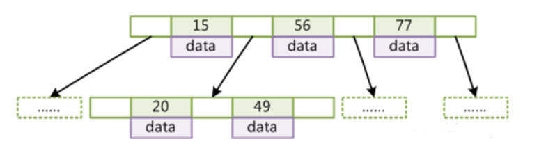
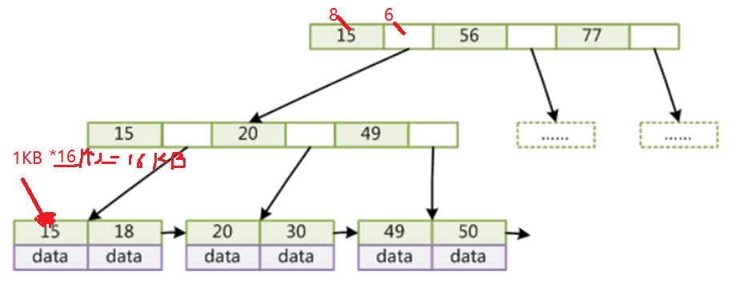
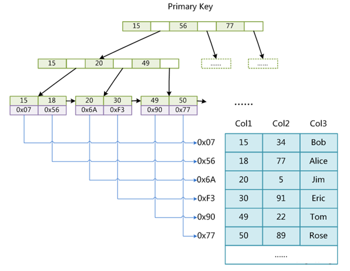
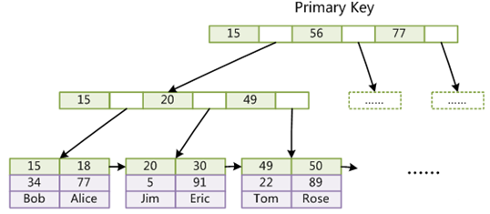
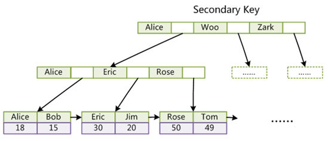
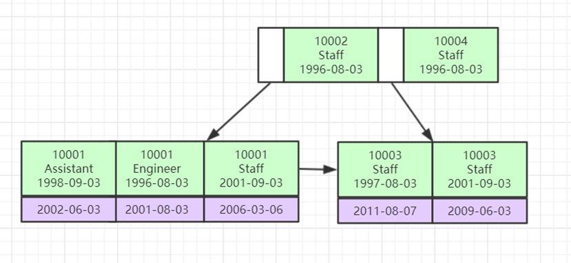

索引是帮助MySQL高效获取数据的**排好序的数据结构**

为什么需要索引？

> 全表扫描时候，每一行比较需要I/O一次,浪费性能

mysql 5.7.26 

##索引数据结构

select * from t  where t.col2 = 89   索引：两次找到。根据物理地址去取数据。

* 二叉树
* 红黑树
* Hash表
* B-Tree

**哈希索引**：**快速精准的查询**，但**不支持范围查询**

二叉树：容易形成斜树

**AVL二叉树**：有顺序，支持范围查询,但树太高，**io次数多**。

B树：

* 叶节点具有相同的深度，叶节点的指针为空
* 所有**索引元素不重复**
* 节点中的数据索引**从左到右递增排列**

B+树：

* **非叶子节点不存储data**，只存储**索引(冗余)**，可以放更多的索引
* 叶子节点**包含所有索引**字段
* **叶子节点用指针连接**，提高区间访问的性能

> 默认页 16KB  所以一个节点也是16KB ：   16KB/(8+6)B = 1170  ; 1170 * 1170 *16 = 2千多万

##Mysql中存储引擎中索引的区别：

存储引擎：**是修饰表的**。innodb,myisam,archive,csv

.assets/image-20210530210851377.png)

###1.MyISAM的索引文件和数据文件是分离的**(非聚集)**

###2.InnoDB索引实现(**聚集**) 

####聚集(族)索引/非聚集(簇)索引

* 聚集索引：将索引与数据放在一起(InnoDB)

* 非聚集索引：MyISAM:**MYI(索引表**),**MYD(数据表)**

系列问题： 

####1.表数据文件本身就是按B+Tree组织的一个索引结构文件?

####2.聚集索引-叶节点包含了完整的数据记录?

####3.为什么InnoDB表必须有主键，并且推荐使用整型的自增主键？

* 整形:因为索引比较大小时，**整型容易比较大小**,同时相比uuid，能节省空间
* 自增主键：自增每次插入时，才能向后插入，减少**页分裂**和**自平衡**(满足B树的平衡)

####4.为什么**非主键索引**结构叶子节点存储的是**主键值**？(**一致性**和**节省存储空间**)

**非主键索引的data存储的是id.**

为什么这样索引呢？

如果data存储的是所有列，那么插入的时候，会**维护多个索引表**，这样会有**数据一致性**的考虑。

主键索引：

非主键索引:data存储的是id

联合索引的底层存储结构长什么样？

