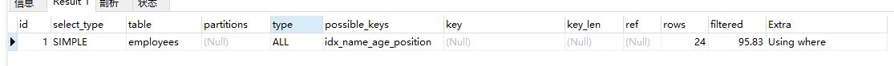

##Mysql如何选择合适的索引

`EXPLAIN select * from employees where name > 'Jun';`



**分析：全表扫描；因为如果走索引，需要根据id进行回表操作，成本比全表扫描高。**

如果用name索引需要遍历**name字段联合索引树**，然后还需要根据遍历出来的主键值去**主键索引树里再去查出最终数据**，成本比全表扫描还高，可以用**覆盖索引优化**，这样只需要遍历name字段的联合索引树就能拿到所有结果，如下：

---

`EXPLAIN select name,age,position from employees where name > 'a' ;`


**分析：走索引。使用覆盖索引，无需回表，效率高。**

---

`EXPLAIN select * from employees where name > 'zzz' ;`


**分析：走索引，rows少，回表数量少。**

对于上面这两种 name>'a' 和 name>'zzz' 的执行结果，mysql最终是否选择走索引或者一张表涉及多个索引，mysql最终如何选择索引，我们可以用trace工具来一查究竟，开启**trace工具会影响mysql性能**，所以只能临时分析sql使用，用完之后立即关闭

##trace工具用法

>  mysql是否走索引，与表的记录值...等等相关，可以通过trace工具来分析sql是否走索引													


cost：是本sql里的相对值。

分析:

```json
set session optimizer_trace="enabled=on",end_markers_in_json=on; #开启trace
EXPLAIN select name,age,position from employees where name > 'a' ;
SELECT * FROM information_schema.OPTIMIZER_TRACE; 


"analyzing_range_alternatives": { ‐‐分析各个索引使用成本

                                 "range_scan_alternatives": [
{
 "index": "idx_name_age_position",
 "ranges": [
 "a < name" ‐‐索引使用范围
]
  "index_dives_for_eq_ranges": true,
  "rowid_ordered": false, ‐‐使用该索引获取的记录是否按照主键排序
  "using_mrr": false,
  "index_only": false, ‐‐是否使用覆盖索引
  "rows": 5061, ‐‐索引扫描行数
  "cost": 6074.2, ‐‐索引使用成本
  "chosen": false, ‐‐是否选择该索引
  "cause": "cost"
}

"best_access_path": { ‐‐最优访问路径
"considered_access_paths": [ ‐‐最终选择的访问路径
```

面试：一般分析sql索引的时候，结合B+树分析，如果分析不出来，可以说，我以前看过trace工具，可以分析各个索引的使用成本，cost字段，这样我就可以进行优化一些SQL。


#常见sql深入优化

### 

sql Order by语法：

> SELECT *column_name*,*column_name* FROM *table_name* 
>
> ORDER BY *column_name1*,*column_name2* ASC|DESC;

Order By 后面的列顺序，有它的含义，在column_name1相等的情况下，第二列排序


Case 4：

 Case5:

 

分析：
与Case 4对比，在Extra中并未出现Using filesort，因为**age为常量**，在排序中被优化，所以索引未颠倒，
不会出现Using filesort。

Case6:

   

分析：

结合索引树，只有 

1、MySQL支持两种方式的排序**filesort**和**index**，Using index是指MySQL**扫描索引本身完成排序**。index
效率高，filesort效率低。
2、order by满足两种情况会使用Using index。

1) order by语句使用索引最左前列。
2) 使用where子句与order by子句**条件列组合满足索引最左前列**。
3、尽量在索引列上完成排序，遵循索引建立（索引创建的顺序）时的最左前缀法则。
4、如果order by的条件**不在索引列上**，就会产生**Using filesort。**
5、能用覆盖索引尽量用覆盖索引
6、group by与order by很类似，其实质是**先排序后分组**，遵照索引创建顺序的最左前缀法则。对于group
by的优化如果不需要排序的可以加上**order by null禁止排序**。注意**，where高于having**，能写在where中
的限定条件就不要去having限定了。 

##Using filesort文件排序原理详解

filesort文件排序方式：

* 单路排序：是**一次性取出满足条件行的所有字段**，然后在sort buffer中进行排序；用trace工具可以看到sort_mode信息里显示< s ort_key, additional_fields >或者< sort_key,packed_additional_fields >
* 双路排序（又叫**回表排序模式**）：是首先根据相应的**条件取出相应的排序字段**和**可以直接定位行数据的行 ID**，然后在 sort buffer 中进行排序，排序完后需要再次取回其它需要的字段；用trace工具可以看到sort_mode信息里显示< sort_key, rowid >

如何选择哪一种排序方式？

MySQL 通过比较系统变量 max_length_for_sort_data(默认1024字节) 的大小和需要查询的字段总大小来
判断使用哪种排序模式。

* 如果 max_length_for_sort_data 比查询字段的总长度**大**，那么使用 **单路排序模式**；
* 如果 max_length_for_sort_data 比查询字段的**总长度小**，那么使用 双路排序模式。

```sql
"filesort_summary": { ‐‐文件排序信息
24 "rows": 10000, ‐‐预计扫描行数
25 "examined_rows": 10000, ‐‐参数排序的行
26 "number_of_tmp_files": 3, ‐‐使用临时文件的个数，这个值如果为0代表全部使用的sort_buffer内存排序，否则使用的
磁盘文件排序
27 "sort_buffer_size": 262056, ‐‐排序缓存的大小
28 "sort_mode": "<sort_key, packed_additional_fields>" ‐‐排序方式，这里用的单路排序
```


设置 max_length_for_sort_data

set max_length_for_sort_data = 10; ‐‐employees表所有字段长度总和肯定大于10字节

```sql
"filesort_summary": {
58 "rows": 10000,
59 "examined_rows": 10000,
60 "number_of_tmp_files": 2,
61 "sort_buffer_size": 262136,
62 "sort_mode": "<sort_key, rowid>" ‐‐排序方式，这里用的双路排序
```


我们先看单路排序的详细过程：

1. 从索引name找到第一个满足 name = ‘zhuge’ 条件的主键 id
2. 根据主键 id 取出整行，取出所有字段的值，存入 sort_buffer 中
3. 从索引name找到下一个满足 name = ‘zhuge’ 条件的主键 id
4. 重复步骤 2、3 直到不满足 name = ‘zhuge’
5. 对 sort_buffer 中的数据按照字段 position 进行排序
6. 返回结果给客户端

我们再看下双路排序的详细过程：

1. 从索引 name 找到第一个满足 name = ‘zhuge’ 的主键id
2. 根据主键 id 取出整行，把排序字段 position 和主键 id 这两个字段放到 sort buffer 中
3. 从索引 name 取下一个满足 name = ‘zhuge’ 记录的主键 id
4. 重复 3、4 直到不满足 name = ‘zhuge’
5. 对 sort_buffer 中的字段 position 和主键 id 按照字段 position 进行排序
6. 遍历排序好的 id 和字段 position，按照 id 的值回到原表中取出 所有字段的值返回给客户端

两个模式对比：

单路排序会把所有需要查询的字段都放到 sort buffer 中

双路排序只会把主键和需要排序的字段放到 sort buffer 中进行排序，然后再通过主键回到原表查询需要的字段。

如果 MySQL 排序内存配置的比较小并且没有条件继续增加了，可以适当把 max_length_for_sort_data 配
置小点，让优化器选择使用双路排序算法，可以在sort_buffer 中一次排序更多的行，只是需要再根据主键
回到原表取数据。
如果 MySQL 排序内存有条件可以配置比较大，可以适当增大 max_length_for_sort_data 的值，让优化器
优先选择全字段排序(单路排序)，把需要的字段放到 sort_buffer 中，这样排序后就会直接从内存里返回查
询结果了。


#注意

 EXPLAIN select * from employees WHERE name in ('LiLei','JunJie') ORDER BY age,position ;

使用filesort,原理：in就是范围查询，使用索引树，拍不了序


 EXPLAIN select * from employees WHERE name = 'LiLei' ORDER BY age,position ;

使用索引排序

 EXPLAIN select * from employees WHERE name > 'a' ORDER BY name;
优化后： EXPLAIN **select name,age,position** from employees WHERE name > 'a' ORDER BY name;

