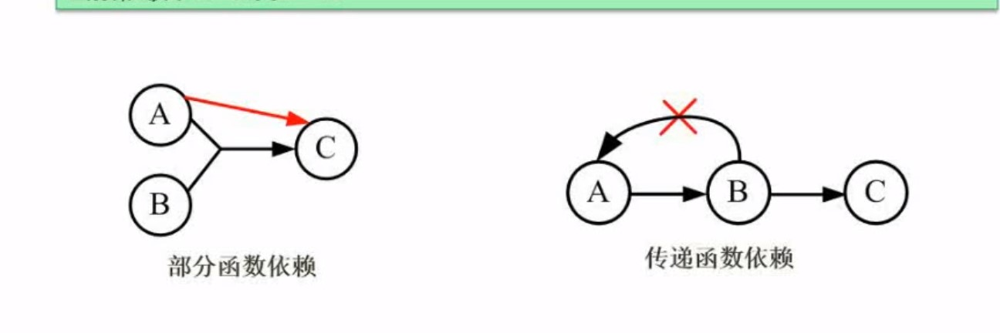

##三范式



超码(键)：唯一标识元组,且**可能存在冗余属性**

候选键：无冗余属性。
主键：一个，候选键多个
外键：其他关系的主键
主属性与非主属性：包含在一个候选键中的属性称为主属性。

###求候选键：

1.将依赖用图示表达出来
 2.找出**入度为0**的节点。


###第一范式（1NF）

```
 属性不可分
```

属性皆为原子值！

###第二范式

在1NF基础上，**非主**属性**不存在部分函数依赖**

ex: 订单编号和商品编号作为数据库表的联合主键

非主属性：商品名称、单位、商品价格等信息 只与**商品编号**相关


拆分：


###第三范式

**在2NF上**，**非主**属性**不存在传递依赖**

学号--> 所在院校 --> (院校地址，院校电话)

拆分成两张表：

学号，姓名，年龄，性别，所在院校）--（所在院校，院校地址，院校电话）

###BCNF

**消除主属性对候选键的传递依赖**
判断BCNF:
1.画出全部函数依赖
2.左边全是候选键

https://www.cnblogs.com/linjiqin/archive/2012/04/01/2428695.html

##视图

视图是一种基于数据表的一种**虚表**

- （1）视图是一种虚表
- （2）视图建立在已有表的基础上, 视图赖以建立的这些表称为基表
- （3）**向视图提供数据内容的语句为 SELECT 语句,可以将视图理解为存储起来的 SELECT 语句**
- （4）视图向用户提供基表数据的另一种表现形式
- （5）视图没有存储真正的数据，真正的数据还是存储在基表中
- （6）程序员虽然操作的是视图，但最终视图还会转成操作基表
- （7）一个基表可以有0个或多个视图

**视图就是基于查询的一种虚表，也就是说，视图可以将查询出来的数据进行封装。。。那么我们在使用的时候就会变得非常方便**

## MyISAM与Innodb对比：

MyISAM 引擎:不支持事务；InnoDB支持是引擎。

聚集索引：将索引与数据放在一起(InnoDB) ，非聚集索引：MyISAM:**MYI(索引表**),**MYD(数据表)**

MyISAM不支持行锁

MyISAM引擎没有crash-safe能力，redo log 是 InnoDB 引擎特有的日志。

