Redis单线程    10万/秒

##Redis五种数据结构

* 字符串String
* 哈希hash
* 列表list
* 集合set
* 有序集合zset

---

## 1.String应用场景

常用操作：

```sql
SET key value  //存入字符串键值对

MSET key value [key value ...]  //批量存储字符串键值对

SETNX key value  //存入一个不存在的字符串键值对

GET key  //获取一个字符串键值

MGET key [key ...]   //批量获取字符串键值

DEL key [key ...]  //删除一个键

EXPIRE key seconds  //设置一个键的过期时间(秒)

INCR key  //将key中储存的数字值加1

DECR key  //将key中储存的数字值减1

INCRBY key increment  //将key所储存的值加上increment

DECRBY key decrement  //将key所储存的值减去decre

```


###1.1单值缓存

SET key value  

GET key  

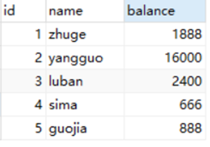

###1.2对象缓存

```sql
1) SET  user:1  value(json格式数据)
2) MSET  user:1:name  zhuge   user:1:balance  1888
    MGET  user:1:name   user:1:balance 
```

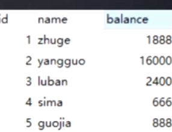

###1.3分布式锁

```java
SETNX product:10001 true  //返回1代表获取锁成功

SETNX product:10001 true  //返回0代表获取锁失败

。。。执行业务操作

DEL product:10001 //执行完业务释放锁


SET product:10001 true ex 10 nx //防止程序意外终止导致死锁

```


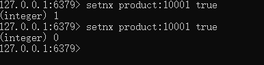

###1.4计数器

INCR article:readcount:{文章id}  

GET article:readcount:{文章id} 

###1.5Web集群session共享

spring session + redis实现session共享

###1.6分布式系统全局序列号 

INCRBY orderId 1000 //redis批量生成序列号提升性能

挂了就浪费一点id。

> 如果是分布式系统，主键自增就不行 

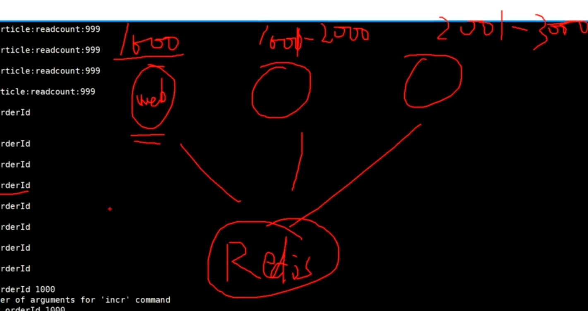

## 2.Hash应用场景

###Hash常用操作

**HSET key field value**  //存储一个哈希表key的键值

HSETNX key field value  //存储一个不存在的哈希表key的键值

HMSET key field value [field value ...]  //在一个哈希表key中存储多个键值对

HGET key field  //获取哈希表key对应的field键值

HMGET key field [field ...]  //批量获取哈希表key中多个field键值

HDEL key field [field ...]  //删除哈希表key中的field键值

HLEN key //返回哈希表key中field的数量

HGETALL key //返回哈希表key中所有的键值

HINCRBY key field increment  //为哈希表key中field键的值加上增量increment

###2.1对象缓存

```sql
HMSET user {userId}:name zhuge {userId}:balance 1888

HMSET user 1:name zhuge 1:balance 1888
hmset user 1:name ljj 1:balance 123456
HMGET user 1:name 1:balance  
```


### 2.2购物车

* key     用户id

* field   商品id

* value 商品数量


•购物车操作

1)添加商品------->h**set** cart:1001 10088 1

2)增加数量------>h**incrby** cart:1001 10088  增加数值

3)商品总数------>h**len** cart:1001

4)删除商品----->h**del** cart:1001 10088

5)获取购物车所有商品------->h**getall** cart:1001

## 3.List

###3.1List常用操作

```sql
LPUSH key value [value ...]  //将一个或多个值value插入到key列表的表头(最左边)

RPUSH key value [value ...]   //将一个或多个值value插入到key列表的表尾(最右边)

LPOP key //移除并返回key列表的头元素

RPOP key //移除并返回key列表的尾元素

LRANGE key start stop //返回列表key中指定区间内的元素，区间以偏移量start和stop指定
```

常用数据结构

Stack(栈) = LPUSH + LPOP àFILO

Queue(队列）= LPUSH + RPOP

Blocking MQ(阻塞队列）= LPUSH + **BRPOP**

B**LPOP** key [key ...] timeout //从key列表表头弹出一个元素，若列表中没有元素，**阻塞等待 timeout秒**,如果timeout=0,一直阻塞等待

B**RPOP** key [key ...] timeout  //从key列表表尾弹出一个元素，若列表中没有元素，阻塞等待 timeout秒,如果timeout=0,一直阻塞等待

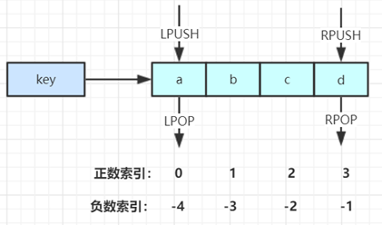

### 3.2微博消息和微信公号消息

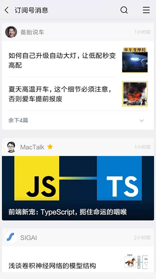

诸葛老师关注了MacTalk，备胎说车等大V

1. MacTalk发微博，消息ID为10018  

   **LPUSH** msg:{诸葛老师-ID} 10018   //推送给所有关注者

2. 备胎说车发微博，消息ID为10086

   LPUSH msg:{诸葛老师-ID} 10086

3. 查看最新微博消息

   LRANGE msg:{诸葛老师-ID} 0 5

## 4.set

###Set常用操作

```sql

SADD key member [member ...] //往集合key中存入元素，元素存在则忽略，

 若key不存在则新建

Srem key member [member ...] //从集合key中删除元素

SMEMBERS key //获取集合key中所有元素

SCARD key //获取集合key的元素个数

SISMEMBER key member //判断member元素是否存在于集合key中

SRANDMEMBER key [count] //从集合key中选出count个元素，元素不从key中删除

SPOP key [count] //从集合key中选出count个元素，元素从key中删除
```

### 集合运算操作

```sql
SINTER  key  [key ...] 				//交集运算
SUNIONSTORE  destination  key  [key ...]		//将并集结果存入新集合destination中
SDIFF  key  [key ...] 				//差集运算
SDIFFSTORE  destination  key  [key ...]		//将差集结果存入新集合destination中
```


### 4.1抽奖

•微信抽奖小程序

1）点击参与抽奖加入集合

`SADD key {userlD}`

2）查看参与抽奖所有用户

`SMEMBERS key  `

3）抽取count名中奖者

`SRANDMEMBER key [count] `

4）抽几等奖 

将抽完将的删除  `SPOP key [count]`

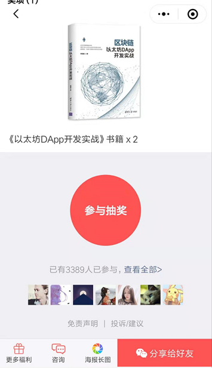

###4.2微信微博点赞，收藏，标签

1) 点赞

SADD like:{消息ID} {用户ID}

2) 取消点赞

SREM like:{消息ID} {用户ID}

3) 检查用户是否点过赞

SISMEMBER like:{消息ID} {用户ID}

4) 获取点赞的用户列表

SMEMBERS like:{消息ID}

5) 获取点赞用户数 

SCARD like:{消息ID}

### 

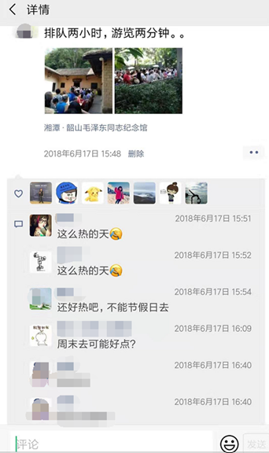

###4.3集合操作实现微博微信关注模型

1) 诸葛老师关注的人: 

`zhugeSet-> {yangguo, sima, luban}`

2) 杨过老师关注的人:

` yangguoSet--> {zhuge, sima, luban,guojia}`

3) 司马老师关注的人: 

`simaSet-> {zhuge, yangguo, guojia, luban, xunyu)`

4) 我和杨过老师共同关注: 

`SINTER zhugeSet yangguoSet--> {sima, luban}`

5) **我关注的人也关注他(杨过老师):** 

`SISMEMBER simaSet yangguo `

`SISMEMBER lubanSet yangguo`

6) 我可能认识的人: 

`SDIFF yangguoSet zhugeSet->(zhuge, guojia}  //差集  关注的人 -  我关注的人`

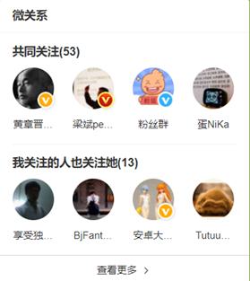

### 4.4集合操作实现电商商品筛选

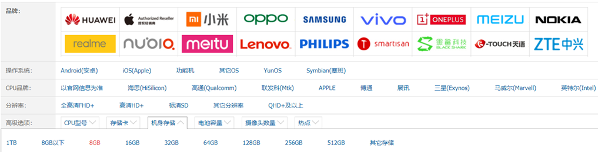

SADD brand:huawei P30

SADD brand:xiaomi mi-6X

SADD brand:iPhone iphone8

SADD os:android P30 mi-6X

SADD cpu:brand:intel P30 mi-6X

SADD ram:8G P30 mi-6X iphone8

SINTER os:android cpu:brand:intel ram:8G à {P30，mi-6X}

## 5.ZSet

####ZSet常用操作

```sql
ZADD key score member [[score member]…] //往有序集合key中加入带分值元素

ZREM key member [member …] //从有序集合key中删除元素

ZSCORE key member  //返回有序集合key中元素member的分值

ZINCRBY key increment member //为有序集合key中元素member的分值加上increment 

ZCARD key //返回有序集合key中元素个数

ZRANGE key start stop [WITHSCORES] //正序获取有序集合key从start下标到stop下标的元素

ZREVRANGE key start stop [WITHSCORES] //倒序获取有序集合key从start下标到stop下标的元素
```

Zset集合操作

```sql
ZUNIONSTORE destkey numkeys key [key ...]  //并集计算
ZINTERSTORE destkey numkeys key [key …] //交集计算
```


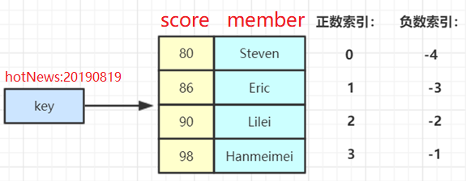

### ZSet集合操作实现排行榜

•Zset集合操作实现排行榜

1）点击新闻

`ZINCRBY hotNews:20190819 1 守护香港`

2）展示当日排行前十

**ZREVRANGE** hotNews:20190819 0 10 WITHSCORES 

3）七日搜索榜单计算

ZUNIONSTORE hotNews:20190813-20190819 7  hotNews:2019081 hotNews:20190814...

**Z union store 会将相同member的score会累加起来。**

4）展示七日排行前十

ZREVRANGE hotNews:20190813-20190819 0 10 WITHSCORES

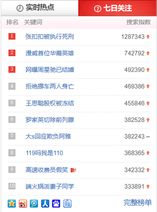

