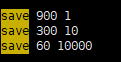
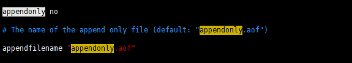
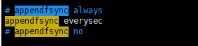
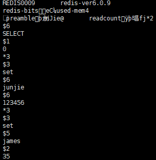
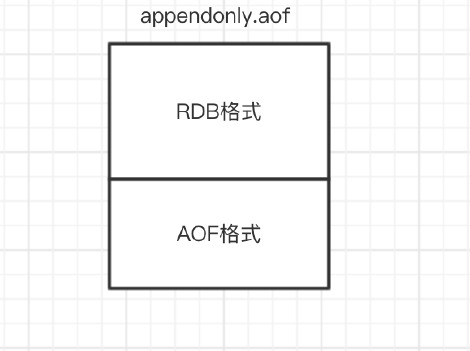
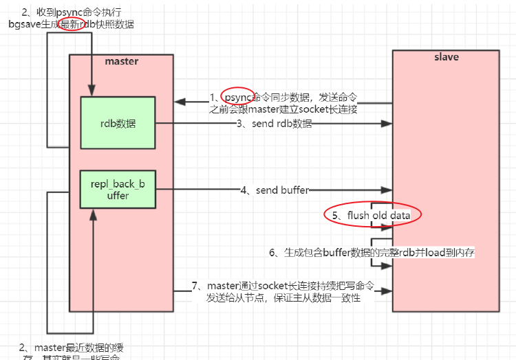
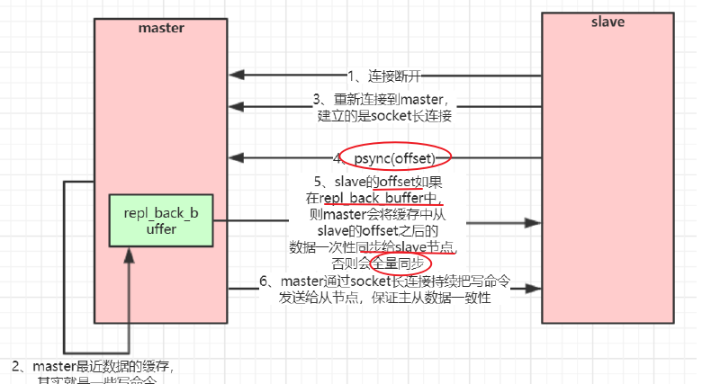
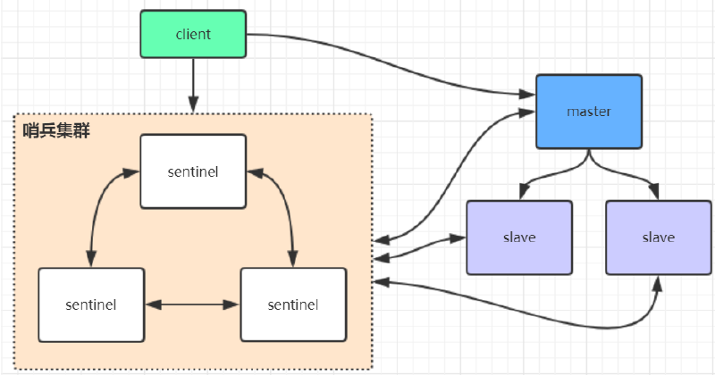

# 一.Redis核心原理

Redis的单线程和高性能

###Redis 单线程为什么还能这么快？
因为

* 它所有的数据都在**内存**中，所有的运算都是内存级别的运算，
* **单线程避免了多线程的切换性**.能损耗问题。

注意：

因为 Redis 是单线程，所以要小心使用 Redis 指令，对于那些耗时的指令(比如keys)，一定要谨慎使用，一不小心就可能会导致 Redis 卡顿。

###Redis 单线程如何处理那么多的并发客户端连接？
Redis的IO多路复用：redis利用**epoll来实现IO多路复用**

## 1.RDB快照（snapshot）

在默认情况下， Redis 将内存数据库快照保存在名字为 **dump.rdb 的二进制**文件中。
你可以对 Redis 进行设置， 让它在“ N 秒内数据集至少有 M 个改动”这一条件被满足时， 自动保存一次数据集。
比如说， 以下设置会让 Redis 在满足“ 60 秒内有至少有 1000 个键被改动”这一条件时， 自动保存一次数据集：



`save 60 1000`

关闭RDB只需要将所有的save保存策略注释掉即可还可以手动执行命令生成RDB快照，

* 进入redis客户端执行**命令save**或**bgsave**可以生成**dump.rdb文件，**每次命令执行都会将所有redis内存快照到一个新的rdb文件里，并覆盖原有rdb快照文件。

* save是同步命令，**bgsave是异步**命令，bgsave会从redis**主进程fork（fork()是linux函数**）出一个子进程专门用来生rdb快照文件

###1.1save与bgsave对比

| 命令                  | save             | bgsave                                     |
| --------------------- | ---------------- | ------------------------------------------ |
| IO类型                | 同步             | 异步                                       |
| 是否阻塞redis其他命令 | 是               | 否(在生成子进程调用fork函数时会有短暂阻塞) |
| 复杂度                | O(n)             | O(n)                                       |
| 优点                  | 不会消耗额外内存 | 不阻塞客户端命令                           |
| 缺点                  | 阻塞客户端命令   | 需要fork子进程，消耗内存                   |


###1.2RDB的缺点：

快照功能并不是非常耐久（durable）： 如果 Redis 因为某些原因而造成**故障停机**， 那么**服务器将丢失**最近写入、且仍未保存到快照中的那些数据。从 1.1 版本开始， Redis 增加了一种完全耐久的持久化方式： **AOF 持久化，将修改的每一条指令记录进文件appendonly.aof中**

## 2.AOF

AOF 持久化，将修改的每一条**指令记录**进文件appendonly.aof中

`appendonly yes`





AOF方式数据恢复： 程序就可以通过重新执行 AOF 文件中的**命令**来达到重建数据集的目的。

###2.1恢复策略

* appendfsync **always**：每**次有新命令追加到 AOF** 文件时就执行**一次 fsync** ，非常慢，也非常安全。
  
* appendfsync **everysec**：**每秒 fsync 一次**，足够快（和使用 RDB 持久化差不多），并且在故障时只会丢失 1 秒钟的数据。
  
* appendfsync **no**：从不 fsync ，将数据交给操作系统来处理。更快，也更不安全的选择

###2.2AOF重写

>  AOF文件里可能有太多的没用的指令，所以AOF会定期根据**内存的最新数据**生成aof文件

重写前：

```sql
1 127.0.0.1:6379> incr readcount
2 (integer) 1
3 127.0.0.1:6379> incr readcount
4 (integer) 2
5 127.0.0.1:6379> incr readcount
6 (integer) 3
7 127.0.0.1:6379> incr readcount
8 (integer) 4
9 127.0.0.1:6379> incr readcount
10 (integer) 5
```

重写后：

```sql
1 *3
2 $3
3 SET
4 $2
5 readcount
6 $1
7 5
```


aof格式：$6--代表6个字符   *2:代表:

####2.2.1配置控制AOF重写频率:

* auto-aof-rewrite-min-size 64mb        //aof文件至少要**达到64M**才会自动重写，文件太小恢复速度本来就很快，重写的意义不大

* auto-aof-rewrite-percentage 100        //aof文件自上一次重写后文件大小**增长了100%**则再次触发重

写

* 手动AOF重写:redis客户端执行**命令bgrewriteaof**重写AOF
  * AOF重写redish**会fork一个子进程**去做，不会对redis有太多

####RDB和AOF，我应该应该哪一个？

如果既有aof文件又有rdb文件，会**优先选择aof文件**，数据更安全

| 命令       | RDB        | AOF          |
| ---------- | ---------- | ------------ |
| 启动优先级 | 低         | 高           |
| 体积       | 小         | 大           |
| 恢复速度   | 快         | 慢           |
| 数据安全性 | 容易丢数据 | 根据策略决定 |

缺点：AOF宕机后，恢复速度慢。

##Redis 4.0 混合持久化

> RDB 1.容易丢失数据     2.持久化速度慢         AOF:1.重放日志性能慢。

持久化配置:`aof-use-rdb-preamble yes`


**AOF在重写时**,这**一刻之前的内存做RDB快照处理**，并且将**RDB快照内容**和**增量的AOF**修改内存数据的**命令**存在一起，都写入新的AOF文件。

混合持久化文件结构：RDB+AOF







# 二.Redis主从架构

## Redis主从工作原理

###1.全量复制

1.slave发送psync命令，建立socket长连接

2.master收到命令，bgsave生成最新rdb快照数据

3.send rdb数据

4.在bgsave过程中的数据放入buffer中，master--rdb->slave，合并rdb



###2.部分复制---增量复制

1.slave重新连接master，发送psync(offset)

2.master判断offest在buffer中，发送offset之后的数据；否则全量同步

3.master通过socket长连接持续发送写命令给从节点。保证主从数据一致性



如果slave的offset(偏移量) 与 Master中的buffer中的偏移量相差特别大，会触发一次全量同步.ex

> buffer固定的大小，一般不会大。ex:1M

# 三.Redis哨兵架构

## sentinel哨兵

* sentinel哨兵是**特殊的redis服务**，不提供读写服务，主要用来**监控redis实例节点。**

* 哨兵架构下client端**第一次从哨兵找出redis的主节点**

* 后续就**直接访问redis的主节点**，不会每次都通过sentinel**代理访问redis的主节点**.

* Redis的主master挂机了，哨兵会选择一个新的选举一个master。

高可用




##StringRedisTemplate与RedisTemplate

区别：

| StringRedisTemplate | RedisTemplate         |
| ------------------- | --------------------- |
| String的序列化策略  | 是**JDK**的序列化策略 |
| 服务器查看不会乱码  | 乱码                  |
| 继承RedisTemplate   | ..                    |


Redis客户端命令对应的RedisTemplate中的方法列表：

---

手动搭建主从和哨兵集群，使用jedis已经springboot封装好的redis工具类。

