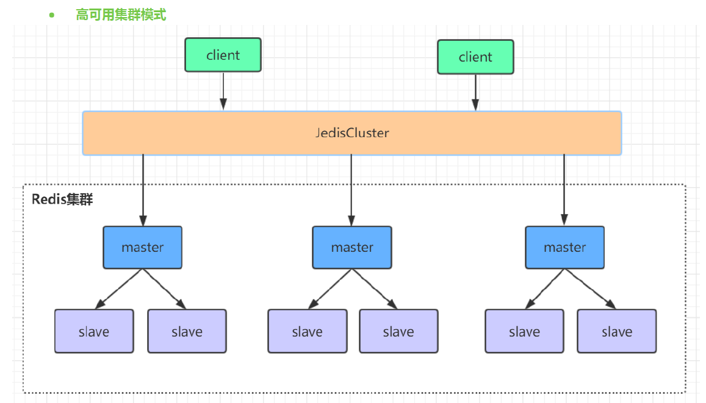
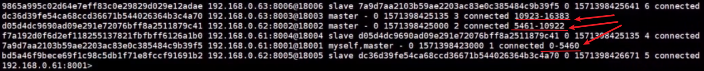
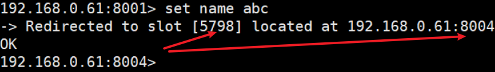

###为什么选择集群？

主从模式的缺点：

* 只**有一个master 写操作**。最多10万QPS,高并发下，必须扩容。

* 当master节点异常，则会**主从切换瞬间存在访问瞬断**情况。

* master的**内存不宜设置太大**。否则**持久化文件过大**，影响**重启和主从复制的效率**。

key的数据分片的。可以水平扩容，

## Redis集群

定义：是由多个**主从节点群组成的分布式服务群**，它具有**复制，高可用，分片**特性。

### 搭建redis集群

>  搭建很简单，所见即所得。

至少有三个主从群。

查看命令：redis-cli -h  (学会自己查看linux命令)。

cluster info 查看集群信息。

cluster node 查看节点信息。

##Redis集群原理分析

> 数据分片的原理

Redis cluster将所有数据划分为：**16384个(slots)槽位**，每一个节点负责其中一部分想槽位。槽位的信息分配到每个节点中。

>  这些槽位是虚拟的，对应一个master(写)

### 槽位定位算法

Cluster 默认会对 key 值使用 **crc16 算法**进行 **hash 得到一个整数值**，然后用这个整数值对 **16384 进行取模**来得到具体槽位。

* HASH_SLOT = **CRC16(key) mod 16384**

####跳转重定位
当客户端向一个错误的节点发出了指令，该**节点会发现指令的 key 所在的槽位**并不归自己管理，这时它会向客户端发送一个特殊的跳转指令携带目标操作的节点地址，告诉客户端去连这个节点去获取数据。客户端收到指令后除了**跳转到正确的节点上去操作**，还会同步更新纠正本地的槽位映射表缓存，后续所有 key 将使用新的槽位映射表。

##Redis集群节点间的通信机制

维护集群的元数据有两种方式：

* 集中式
* gossip

**redis cluster节点**间**采取gossip协议**进行通信。

### gossip

> gossip节点通信端口：	服务端口+10000 ex：7001 --> 17001

### 网络抖动引发主从切换

clusternodetimeout：某个节点持续 timeout 的时间失联时，才可以认定该节点出现故障，需要进行主从切换

* 不能设置太短。

###Redis集群选举原理分析

当slave发现自己的master变为FAIL状态时，便尝试进行Failover，以期成为新的master。由于挂掉的master可能会有多个slave，从而存在多个slave竞争成为master节点的过程， 其过程如下：
1.slave发现自己的master变为FAIL
2.将自己记录的集群**currentEpoch**加1，并广播**FAILOVER_AUTH_REQUEST** 信息
3.其他节点收到该信息，只有**主节点master响应**，并且未发送过ack，因为一个主节点只能发送一次ack，所以发送FAILOVER_AUTH_ACK。
4.尝试failover的slave收集master返回的FAILOVER_AUTH_ACK

5.slave收到超过**半数master的ack 大于等于(N/2+1)张支持票**后变成新Master(这里解释了集群为什么**至少需要三个主节点**，如果只有两个，当其
中一个挂了，只剩一个主节点是不能选举成功的)
6.广播**Pong消息**通知其他集群节点。

###Redis集群为什么至少需要三个master节点，并且推荐节点数为奇数？
* 选举成功的条件 >= N/2+1
* 奇数的master节点更多的是从节省机器资源角度出发说的
  *  ex:  3**个节点  4个节点  同时挂两个**   **3节点，4节点都不能用**。还不如5个。

因为新master的选举需要大于半数的集群master节点同意才能选举成功，如果只有两个master节点，当其中一个挂了，是达不到选举新master的条件的。
奇数个master节点可以在满足选举该条件的基础上节省一个节点，比如三个master节点和四个master节点的集群相
比，大家如果都挂了一个master节点都能选举新master节点，如果都挂了两个master节点都没法选举新master节点
了，所以。奇数的master节点更多的是从节省机器资源角度出发说的

###哨兵leader选举流程-

> 与集群中master选集相似

当一个master服务器被某sentinel视为客观下线状态后，该sentinel会与其他sentinel协商选出sentinel的leader进行故
障转移工作。每个发现master服务器进入客观下线的sentinel都可以要求其他sentinel选自己为sentinel的leader，选举
是先到先得。同时每个sentinel每次选举都会**自增配置纪元(选举周期)**，每个纪元中只会选择一个sentinel的leader。如
果所有**超过一半的sentinel选举某sentinel作为leader**。之后该sentinel进行故障转移操作，从存活的slave中选举出新
的master，这个选举过程跟集群的master选举很类似。
哨兵集群只有一个哨兵节点，redis的主从也能正常运行以及选举master，如果master挂了，那唯一的那个哨兵节点就
是哨兵leader了，可以正常选举新master。
不过为了高可用一般都推荐**至少部署三个哨兵节点**。为什么推荐奇数个哨兵节点原理跟集群奇数个master节点类似。
