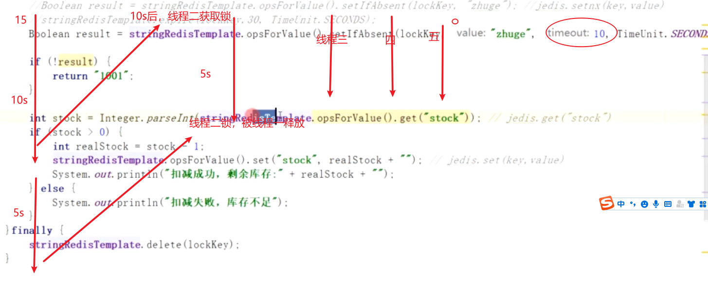
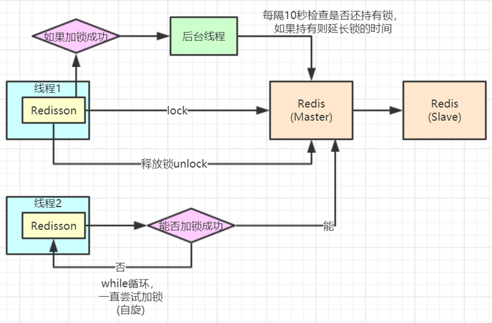

# 分布式锁

> synchronize在单体架构下没问题，分布式环境下出现错误

redis设置分布式锁思想：

问题:

###1.如果宕机，锁不能释放

设置超时时间

```java
/Boolean result = stringRedisTemplate.opsForValue().setIfAbsent(lockKey, clientId, 30, TimeUnit.SECONDS); //超时时间
对应：jedis.setnx(key,value)
```

result -- true ：表示没有重复          false：表示重复

### 2.锁失效

* 一个线程执行timeout时间，锁失效。

* 第二个线程进入，获取锁，执行一半，第一个线程释放第二个线程的锁。

* 后序线程进入，不能同步



#### 解决---锁失效

redis: setIfAbsent(lockKey,UUID，10...)

释放锁时，加入判断，自己的锁，自己释放。

```java
if (clientId.equals(stringRedisTemplate.opsForValue().get(lockKey))){
        stringRedisTemplate.delete(lockKey);
}
```

如果在判断if以后，宕机。 

####解决--锁续命


redisson：java客户端，针对分布式场景下的解决方案。

redission:底层使用lua脚本语言。

* redissonLock.lock();  --- 不会疯狂自旋，会判断超时时间。
* redissonLock.unlock();

```java
@Autowired
private Redisson redisson;
@Autowired
private StringRedisTemplate stringRedisTemplate;

@RequestMapping("/deduct_stock")
public String deductStock() throws InterruptedException {
    String lockKey = "product_001";
    //String clientId = UUID.randomUUID().toString();
    RLock redissonLock = redisson.getLock(lockKey);
    try {
        // 加锁，实现锁续命功能
        redissonLock.lock();
        int stock = Integer.parseInt(stringRedisTemplate.opsForValue().get("stock")); // jedis.get("stock")
        if (stock > 0) {
            int realStock = stock - 1;
            stringRedisTemplate.opsForValue().set("stock", realStock + ""); // jedis.set(key,value)
            System.out.println("扣减成功，剩余库存:" + realStock + "");
        } else {
            System.out.println("扣减失败，库存不足");
        }
    }finally {
        redissonLock.unlock();//释放锁。
    }
    return "end";
}
```



## LUA脚本

Redis在2.6推出了脚本功能，允许开发者使用Lua语言编写脚本传到Redis中执行。使用脚本的好处如下:

* 1、**减少网络开销**：本来5次网络请求的操作，可以用一个请求完成，原先5次请求的逻辑放在redis服务器
  上完成。使用脚本，减少了网络往返时延。这点跟管道类似。
* 2、**原子操作**：Redis会将整个脚本作为一个整体执行，中间不会被其他命令插入。管道不是原子的，不过
  redis的批量操作命令(类似mset)是原子的。
* 3、**替代redis的事务功能**：redis自带的事务功能很鸡肋，报错不支持回滚，而redis的lua脚本几乎实现了常规的事务功能，支持报错回滚操作，官方推荐如果要使用redis的事务功能可以用redis lua替代。
  官网文档上有这样一段话：

```java
33 String script = " local count = redis.call('get', KEYS[1]) " +
34 " local a = tonumber(count) " +
35 " local b = tonumber(ARGV[1]) " +
36 " if a >= b then " +
37 " redis.call('set', KEYS[1], count‐b) " +
38 " return 1 " +
39 " end " +
40 " return 0 ";
41 Object obj = jedis.
```

##### LUA脚本缺点：

Lua脚本中出现**死循环和耗时的运算**，否则**redis会阻塞**，将不接受其他的命令

#### 问题

如果对一个商品进行秒杀，cluster集群就无用，全对应与一个master节点。

解决：分段锁思想，对库存分段，水平扩容到其他master