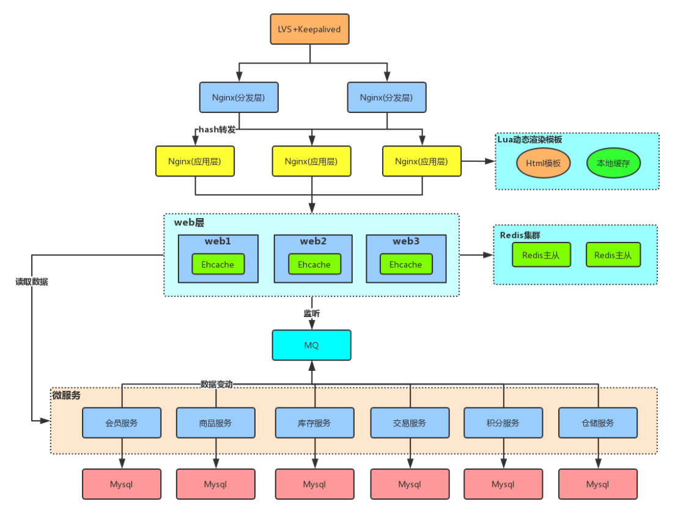
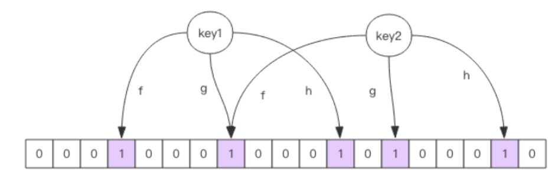

## 多级缓存架构



## 缓存穿透

####1.解释：

是指查询一个根本不存在的数据， 缓存层和存储层都不会命中

####2.问题：

缓存穿透将**导致不存在的数据每次请求都要到存储层去查询**， 失去了**缓存保护后端存储**的意义。到时数据库压力过大。

####3.场景：

造成缓存穿透的基本原因有两个：

* 第一， 自身业务代码或者数据出现问题。
* 第二， 一些恶意攻击、 爬虫等造成大量空命中

####4.解决

##### 缓存空对象

```java
String get(String key) {
2 // 从缓存中获取数据
3 String cacheValue = cache.get(key);
4 // 缓存为空
5 if (StringUtils.isBlank(cacheValue)) {
6 // 从存储中获取
7 String storageValue = storage.get(key);
8 cache.set(key, storageValue);
9 // 如果存储数据为空， 需要设置一个过期时间(300秒)
```

##### 布隆过滤器

当布隆过滤器说某个值**存在时**，这个值**可能不存在**；当它说**不存在，就一定不存在。**



* 添加key是，适用多个hash函数对key进行hash运算 % length。
* 将多个hash函数，的位置为1
* 查询是，进行hash算法。只要有一个为0，不存在。全为1，可能存在

适用：

适用于数据**命中不高、 数据相对固定、 实时性低**（通常是数据集较大） 的应用场景， 代码维护较为复杂， 但是缓存空间占用很少

##缓存失效

> 在秒杀前，将热点数据放入缓存中，设置了失效时间。如果所有的都设置相同的过期时间，超时时间过，缓存数据全部失效

解决：

热点商品，设置随机过期时间

## 缓存雪崩

解释：由于**redis缓存崩溃**，导致所有请求直接发放到存储层，直接干崩。

解决：

* 1） **保证缓存层服务高可用性**，比如使用哨兵Redis Sentinel或集群Redis Cluster。
* 2） 依赖隔离组件为**后端限流并降级**。比如使用Hystrix限流降级组件。
* 3） 提前演练。 在项目上线前， 演练缓存层宕掉后， 应用以及后端的负载情况以及可能出现的问题， 在此基础上做一些预案设定。

## redis缓存key重建优化(缓存并发)

解释：

* 重建缓存：从数据库获取新值

###问题

“缓存+过期时间”的问题：

* **当前key是一个热点key**（例如一个热门的娱乐新闻），并发量非常大。
* **重建缓存非常耗时**， 可能是一个复杂计算， 例如复杂的SQL、 多次IO、 多个依赖等。非常

* 在缓存失效的瞬间， 有大量线程来重建缓存， 造成后端负载加大

###解决

利用互斥锁来解决，此方法只允许**一个线程重建缓存**，其他线程等待重建缓存的线程执行完， **重新从缓存获取数据**即可。

多大的并发，只用一个线程重建缓存。

```java
  String get(String key) {
         // 从Redis中获取数据
         String value = redis.get(key);
         // 如果value为空， 则开始重构缓存
         if (value == null) {
            // 只允许一个线程重建缓存， 使用nx， 并设置过期时间ex
            String mutexKey = "mutext:key:" + key;
            if (redis.set(mutexKey, "1", "ex 180", "nx")) {
               // 从数据源获取数据
                value = db.get(key);
                // 回写Redis，  并设置过期时间
                redis.setex(key, timeout, value);
                // 删除key_mutex
                redis.delete(mutexKey);
                }// 其他线程休息50毫秒后重试
             else {
               Thread.sleep(50);
               get(key); //重缓存中获取数据
               }
             }
          return value;
}
```

# 开发规范和和性能调优

## 一.键值设计

### key名设计

* 可读性和可管理性
  * 以业务名(或数据库名)为前缀(防止key冲突)，用冒号分隔，比如业务名:表名:id
* 简洁性
  * 控制key的长度，节省内存 
* 不包含特殊字符，不包含：空格、换行、单双引号以及其他转义字符

### value设计

#### 拒绝bigkey

(防止网卡流量、慢查询)

bigkey:

1. 字符串类型：它的big体现在**单个value值很大**，一般认为超过10KB就是bigkey。
2. 非字符串类型：哈希、列表、集合、有序集合，它们的**big体现在元素个数太多**

#####bigkey危害：

1.导致redis阻塞
2.网络拥塞

* 获取时产生的网络流量较大，影响吞吐量。

3.过期删除

* 当它过期后，会被删除，如果没有使用Redis 4.0的过期**异步删除**(lazyfree-lazyexpire yes)，就会存在阻塞Redis的可能性。

#####如何优化bigkey?

* 拆

big list： list1、list2、...listN

2.【推荐】：禁用命令
禁止线上使用keys、flushall、flushdb等，通过redis的rename机制禁掉命令，或者使用scan的方式渐进式处理。
3.【推荐】合理使用select
redis的多数据库较弱，使用数字进行区分，很多客户端支持较差，同时多业务用多数据库实际还是单线程处理，会有干扰。
4.【推荐】使用批量操作提高效率

* 1 原生命令：例如mget、mset。
* 2 非原生命令：可以使用pipeline提高效

pipline不一定是原子的。