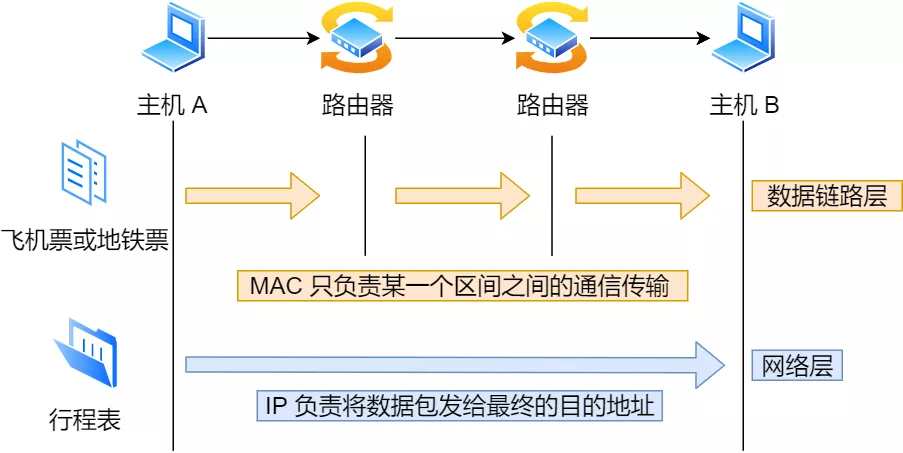

# 计算机网络

利用通信线路将地理上分散的，具有独立功能的计算机系统和通信设备按不同的形式连接起来，以功能完善的网络软件和协议实现**资源共享和信息传递**的系统。

ISO-----7层模型

IEEE----TCP/IP

## OSI 7层模型

 

OSI无实际可行方案  --- 无人使用

## TCP/IP协议簇

事实上都使用tcp/ip协议

## 五层协议

> 授课时讲述

物理层 -- 数据链路层--网络层--传输层--应用层

### 1.网络为什么要分层？

因为不同的层次之间有不同的沟通方式，这个叫作协议。

**只要是在网络上跑的包，都是完整的。可以有下层没上层，绝对不可能有上层没下层。**

**对 TCP 协议来说，三次握手也好，重试也好，只要想发出去包，就要有 IP 层和 MAC 层，不然是发不出去的。**

####ip地址类型

A:0.0.0.0 - 127.255.255.255

B:128.0.0.0 - 191.255.255.255

c: 192.0.0.0 - 223.255.255.255

####无类型域间选路（CIDR）

为什么需要？A,B,C分类时，c类254，b类65534，相差太大

Ip = 网络号 + 主机号。

10.100.122.2/**24**：网络号：前24位；主机号：后8位

- 广播地址：网络号 + 主机号（位都是1）
- 子网掩码：网络号(位都是1) + (主机号)0
- 网络号 = 子网掩码 And(按位与) ip地址

例子：16.158.165.91/**22** 求第一个地址，子网掩码，广播地址。

/22 不是 8 的整数倍，不好办，只能先变成二进制来看。16.158 的部分不会动，它占了前 16 位。中间的 165，变为二进制为‭10100101‬。除了前面的 16 位，还剩 6 位。所以，这 8 位中前 6 位是**网络号**，**16.158.<101001>**，而 **<01>.91** 是机器号。

* 第一个地址是 16.158.<101001><00>.1，即 16.158.164.1。

* 子网掩码：255.255.<111111><00>.0，即 255.255.252.0。

* 广播地址:   16.158.<101001><11>.255，即 16.158.167.255。

####IP与mac的区别

故事：

吴签去某商业街碧宾馆扎美竹，但它不知道美竹(MAC)在哪儿，所以它需要定位(IP)到商业街宾馆，然后大喊美竹(MAC)，才能扎到人。

MAC地址：网卡自生产出来，就带着这个地址。------美竹的身份证

**源IP地址和目标IP地址在传输过程中是不会变化的，只有源 MAC 地址和目标 MAC 一直在变化**

* IP 是地址，**有定位功能**。

* MAC 是身份证，无定位功能，但**唯一标识**，出厂

## DHCP

###ip地址的设定

####自己设定不合法的ip案例：

同一个交换机上的 ip是192.168.1.6 就在你这台机器的旁边，你把机器的地址设为了 16.158.23.6。

1. 判断地址和我是一个网段的吗？或者网卡是同一网段的吗？只有是一个网段的，它才会发送 ARP 请求，获取 MAC 地址。如果发现不是呢？将包发送到网关。
2. 网关配置一定不成功，因为网关要和当前的网络至少一个网卡是同一个网段的，怎么可能 16.158.23.6 的网关是 192.168.1.6 呢？

#### DHCP-动态主机配置协议

> 自己配置ip不方便

1. DHCP Discover：请求IP  目标MAC和IP:  广播

2. DHCP Offer : 返回ip
3. B[\
4. 'OPKJMIO;L: 选择i
0;/L.P知ack'