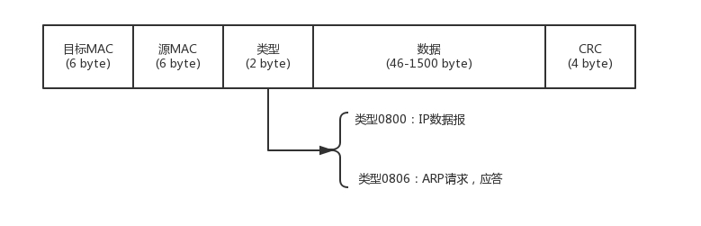

##1.第一层(物理层)

双绞线，光纤..

**Hub(集线器)**:集线器与交换机不同。它将**收到的数据都转发到其他端口**上。广播模式

##2.第二层(数据链路层)

* **ARP 协议**：已知 IP 地址，求 MAC 地址的协议。

* 交换机：使用**转发表（端口对应的MAC**），记住**端口对应的MAC**。不会所有的都转发(广播)了。

由hub引发的问题：

1.这个包是发给谁的？谁应该接收？

2.大家都在发，会不会产生混乱？有没有谁先发	的规则？

3.如果发送的时候出现了错误，怎么办？

### 2.1MAC地址

决第一个问题：需要物理地址，用到**链路层地址，MAC**地址。

数据链路层将数据封装成帧：MAC帧

MTU:最大传输单元..

###2.2MAC(Medium Access Control)媒体访问控制。（与MAC地址无关系)

解决第二个问题：控制数据发送的顺序，防止混乱。

多路访问：

- 信道划分
- 轮流协议
- 随机接入协议

### 2.3CRC:循环冗余检测

解决第三个问题：如果发送的时候出现了错误，怎么办？

### STP解决环路问题

