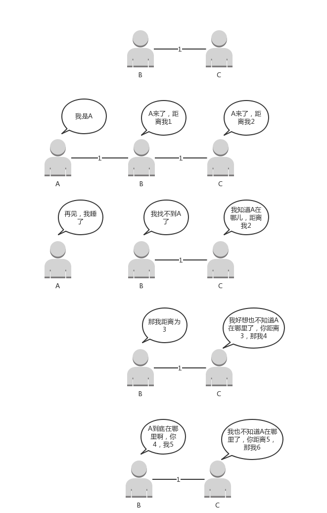

## Ping

Ping基于ICMP协议工作的。常用的**ping 就是查询报文，是一种主动请求，并且获得主动应答的 ICMP 协议。**

### ICMP

**ICMP**全称**Internet Control Message Protocol**，就是**互联网控制报文协议**。

ICMP 报文是封装在 IP 包里面的：

类型：主动请求 8，主动请求应答 0.

###两种类型：

#### 1.查询报文类型

 **标识符+序号** 

#####1.1查询报文类型的使用ping：

ping 就是查询报文，是一种**主动请求，并且获得主动应答的 ICMP 协议。**目的：判断网络是否通畅

两种类型：主动请求和主动请求回答

ping 还会存放发送请求的时间值，来计算往返时间。

####2.差错报文类型

5种类型：

* **第一种是终点不可达**

* **第二种是源站抑制**，也就是让**源站放慢发送速度**
* **第三种是时间超时**，也就是**超过网络包的生存时间还是没到**。 
* **第四种是路由重定向**，也就是让**下次发给另一个路由器**。 

**终点不可达为 3，源抑制为 4，超时为 11，重定向为 5**

#####2.1差错报文类型的使用：Traceroute

应用：Traceroute 的第一个作用就是故意**设置特殊的 TTL**，**来追踪去往目的地时沿途经过的路由器**

ex：设置TTL=1，找到第一个路由器。

# 网络层

IP头部占用：**20字节。**

MAC头部：1**4字节：**

## ip

这些头部，保证ip分片和重组

协议类型：说明是IP 协议

总长度：**受到数据链路层中MTU(最大传送单元)影响**。

标识：**长度超过MTU后必须分片**，具有**相同标识字段的值的数据报能够正确的重装成为原来的数据报**

标志：

* MF = 1 还有分片  MF = 0 最后分片
* DF = 0 允许分片

片偏移：相对于用户数据字段的起点，该片从何时开始。是8字节的整数倍。

TTL:  **IP数据包在计算机网络中的存在的时间。**

协议：该数据报是什么数据，ex:TCP，UDP...

## 路由

访问服务器，**如果不是同一网段**：发往默认网关。

**网关往往是一个路由器，是一个三层转发的设备**，但路由器不是网关，**路由器是一台设备，它有五个网口或者网卡，相当于有五只手，分别连着五个局域网。每只手的 IP 地址都和局域网的 IP 地址相同的网段，每只手都是它握住的那个局域网的网关。**

>  ip和mac哪些变，哪些不变？

MAC地址是一个局域网内才有效的地址。

**转发网关：** 不改变 IP 地址

**NAT 网关**：改变 IP 地址的网关

###静态路由

转发网关

**静态路由，其实就是在路由器上，配置一条一条规则。**

这些规则包括：

* 想访问 BBS 站（它肯定有个网段），从 2 号口出去，下一跳是 IP2；

* 想访问教学视频站（它也有个自己的网段），从 3 号口出去，下一跳是 IP3，然后保存在路由器里。

###动态路由

NAT网关：更改ip地址。

需要将私有ip net转换成 公网ip。

## 路由协议

### 路由表

>  包含多条路由规则

路由规则（至少含三项）:

- 目的网络：这个包想去哪儿？
- 出口设备：将包从哪个口扔出去？
- 下一跳网关：下一个路由器的地址。

###策略路由

根据需求配置哪个网段使用的路由表

### 动态路由算法

> 手动配置麻烦

#### 1.距离矢量路由算法

> 基于 Bellman-Ford 算法的。

思路：

每过几秒，路由器从邻居哪里更新消息，ex：目标距离X  ,距离邻居：M

我的目标距离M + X

路由表：

每一行包含 两部分信息：

1. 目标路由器的出口
2. 目标路由器的距离。 

好处与坏处：

1.**第一个问题就是好消息传得快，坏消息传得慢**

2.**每次发送的时候，要发送整个全局路由表**

bug:路由器挂了，麻烦

####2.链路状态路由算法

> 基于 Dijkstra 算法。

思路：

1. 计算邻居与自己距离

2. 更新或改变了拓扑结构，更新广播消息。

###动态路由协议

#### 基于链路状态路由算法的 OSPF

**内部网关协议**: (主要用在数据中心内部，用于路由决策，因而称为**Interior Gateway Protocol**，简称**IGP**）。

####基于距离矢量路由算法的 BGP

**外网路由协议**（**Border Gateway Protocol**，简称**BGP**）。

---

问题：

1.当在你家里要访问 163 网站的时候，你的包需要 NAT 成为公网 IP，返回的包又要 NAT 成你的私有 IP，返回包怎么知道这是你的请求呢？它怎么能这么智能的 NAT 成了你的 IP 而非别人的 IP 呢？

 conntrack : 记录了 SNAT 一去一回的对应关系。记录了客户端ip和客户端port。

可以通过 nf_conntrack_tuple_hash 找到外面的连接跟踪记录 nf_conn，通过这个可以找到来方向的那个 nf_conntrack_tuple_hash，

{源 IP：**客户端 IP，源端口：客户端 port**，目标 IP：服务端 IP，目标端口：服务端 port}，这样就能够找到客户端的 IP 和端口，从而可以 NAT 回去。

