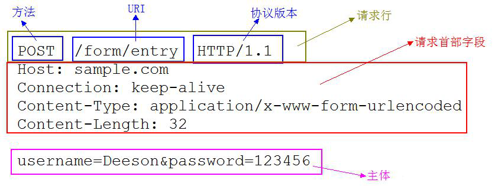
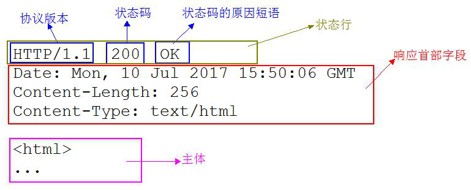
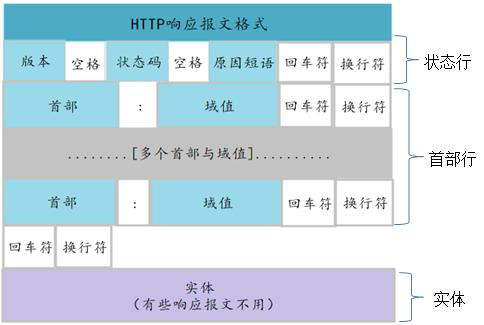
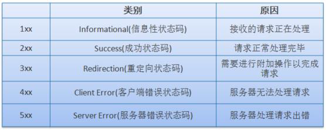

# HTTP
HTTP 协议是Hyper Text Transfer Protocol（**超文本传输协议**）的缩写,是用于从万维网（WWW:World Wide Web ）服务器传输超文本到本地浏览器的传送协议。

##HTTP 协议

我们使用http 来访问Web 上某个资源，比如html/文本、word、avi 电影、其他资源。
官方协议网站：https://tools.ietf.org/html/rfc2608
HTTP 使用统一资源标识符（Uniform Resource Identifiers, URI）来传输数据和建立连接。
URL 是一种特殊类型的URI，包含了用于查找某个资源的足够的信息。
URL，全称是UniformResourceLocator, 中文叫统一资源定位符,是互联网上用来标识某一
处资源的地址。
###URI 和URL 的区别：
​	URI 是个纯粹的句法结构，用于指定标识Web 资源的字符串的各个不同部分。URL 是URI 的一个特例，它包含了定位Web 资源的足够信息。其他URI，比如
mailto：cay@horstman.com则不属于定位符，因为根据该标识符无法定位任何资源。

	* URI 是**统一资源标识符**，而URL 是统一资源定位符。因此，笼统地说，每个URL 都是URI，但不一定每个URI 都是URL。这是因为URI 还包括一个子类，即统一资源名称(URN)，它命名资源但不指定如何定位资源。上面的mailto 就是一个URN 的示例。

* URL 是uniform resource locator，**统一资源定位器**，它是一种具体的URI，即URL 可以用来标识一个资源，而且还指明了如何locate 这个资源。

###一次完整http 请求的过程

* 1、首先进行DNS 域名解析（本地浏览器缓存、操作系统缓存或者DNS 服务器），首先会搜索浏览器自身的DNS 缓存（缓存时间比较短，大概只有1 分钟，且只能容纳1000 条缓存）	
  * b）如果浏览器自身的缓存里面没有找到，那么浏览器会搜索系统自身的DNS 缓存
  * c）如果还没有找到，那么尝试从hosts 文件里面去找
  * d）在前面三个过程都没获取到的情况下，就去域名服务器去查找，

* 2、三次握手建立TCP 连接
  在HTTP 工作开始之前，客户端首先要通过网络与服务器建立连接，HTTP 连接是通过TCP 来完成的。HTTP 是比TCP 更高层次的应用层协议，根据规则，只有低层协议建立之后，才能进行高层协议的连接，因此，首先要建立TCP 连接，一般TCP 连接的端口号是80；

* 3、客户端发起HTTP 请求

* 4、服务器响应HTTP 请求

* 5、客户端解析html 代码，并请求html 代码中的资源浏览器拿到html 文件后，就开始解析其中的html 代码，遇到js/css/image 等静态资源时，就向服务器端去请求下载.

* 6、客户端渲染展示内容

* 7、关闭TCP 连接

如果客户端或者服务器在其**头信息**加入了这行代码**Connection:keep-alive** ，TCP 连接在发送后将仍然保持打开状态。

###请求报文结构

* 请求行—— 包含用于请求的**方法、请求URI 和HTTP 版本**。
* 请求头—— 包含表示请求的各种条件和属性的各类首部。（通用首部、请求首部、实体首部以及RFC 里未定义的首部如Cookie 等）
* 请求体

###响应报文结构

* 状态行—— 包含表明响应结果的状态码、原因短语和HTTP 版本。
* 首部字段—— 包含表示请求的各种条件和属性的各类首部。（通用首部、响应首部、实体首部以及RFC 里未定义的首部如Cookie 等）

状态码：

