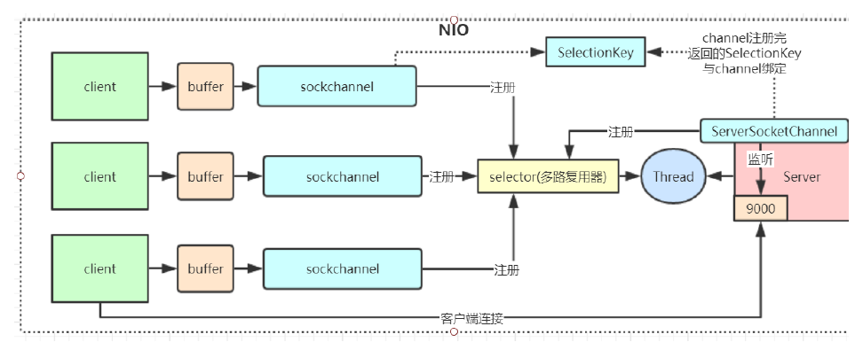

#IO

## BIO

同步阻塞模型，一个客户端连接对应一个处理线程
###缺点：
1. IO代码里read操作是**阻塞操作**，如果连接**不做数据读写操作会导致线程阻塞**，浪费资源。
2. 如果线程很多，会导致**服务器线程太多，压力太大。**


###Server端--单线程

阻塞操作：

* Socket socket = serverSocket.accept(); ----等待客户端连接

* int read = socket.getInputStream().read(bytes);-------等待客户端发送消息

```java
ServerSocket serverSocket = new ServerSocket(9000);
//1.阻塞方法
Socket socket = serverSocket.accept();
byte[] bytes = new byte[1024];
//2.接收客户端的数据，阻塞方法，没有数据可读时就阻塞
int read = socket.getInputStream().read(bytes);
```

###Server端--多线程

优点：主线程不会阻塞，后序client可以请求。

缺点：产生大量线程，消耗资源。

```java
public static void main(String[] args) throws IOException {
    ServerSocket serverSocket = new ServerSocket(9000);
    while (true) {
        System.out.println("等待连接。。");
        //阻塞方法
        Socket socket = serverSocket.accept();
        System.out.println("有客户端连接了。。");
        new Thread(new Runnable() {
            @Override
            public void run() {
                try {
                    handler(socket);
                } catch (IOException e) {
                    e.printStackTrace();
                }
            }
        }).start();
    }
}
```

### Client端

阻塞代码：

* socket.getInputStream().read(bytes);----等待服务端发送消息。

```java
Socket socket = new Socket("127.0.0.1", 9000);
//向服务端发送数据，如果不发送，服务端阻塞在read()。
socket.getOutputStream().write("HelloServer".getBytes());
socket.getOutputStream().flush();
byte[] bytes = new byte[1024];
//接收服务端回传的数据 --- 如果服务端不发送信息 会阻塞。
socket.getInputStream().read(bytes);
```

## NIO

同步**非阻塞**，服务器实现模式为**一个线程可以处理多个请求(连接)**，客户端发送的连接请求都会注册到**多路复用器selector**上，多路复用器轮询到连接有IO请求就进行处理。

I/O多路复用底层一般用的Linux API（select，poll，epoll）来实现，他们的区别如下表：


epoll：事件通知方式。--类似观察者。

不用轮询，当channel数量多时，节省资源。

###应用场景：
NIO方式适用于**连接数目多，时间短**（轻操作） 的架构， 比如聊天服务器， 弹幕系统， 服务器间通讯，编程比较复杂， JDK1.4 开始支持


### NIO核心组件

channel(通道)， Buffer(缓冲区)，Selector(选择器)

1、channel 类似于流，每个 channel 对应一个 buffer缓冲区，buffer 底层就是个数组
2、channel 会注册到 selector 上，由 selector 根据 channel 读写事件的发生将其交由某个空闲的线程处理
3、selector 可以对应一个或多个线程
4、NIO 的 **Buffer 和 channel 都是既可以读也可以写，双向的**



### Server端

事件：

1.连接注册    2.读    3.写

阻塞：

1. selector.select();   -----阻塞，后台轮询sockchannel，有事件不阻塞。

2. SocketChannel sc = ssc.accept(); ----if(key.isAcceptable())  判断client有连接  ，所以不会阻塞。

3. int len = sc.read(buffer);--  //NIO非阻塞体现:首先read方法不会阻塞，其次这种事件响应模型，当调用到read方法时肯定是发生了客户端发送数据的事件

SelectionKey selectionKey = ssc.register(selector, SelectionKey.OP_ACCEPT);    ---------服务器注册时生成对应的key

#### main

```java
public static void main(String[] args) throws IOException {
    // 创建一个在本地端口进行监听的服务Socket通道.并设置为非阻塞方式
    ServerSocketChannel ssc = ServerSocketChannel.open();
    //必须配置为非阻塞才能往selector上注册，否则会报错，selector模式本身就是非阻塞模式
    ssc.configureBlocking(false);
    ssc.socket().bind(new InetSocketAddress(9000));
    // 创建一个选择器selector
    Selector selector = Selector.open();
    // 把ServerSocketChannel注册到selector上，并且selector对客户端accept连接操作感兴趣
    ssc.register(selector, SelectionKey.OP_ACCEPT);

    while (true) {
        System.out.println("等待事件发生。。");
        // 轮询监听channel里的key，select是阻塞的，accept()也是阻塞的
        int select = selector.select();
        System.out.println("有事件发生了。。");
        // 有客户端请求，被轮询监听到
        Iterator<SelectionKey> it = selector.selectedKeys().iterator();
        while (it.hasNext()) {
            SelectionKey key = it.next();
            //删除本次已处理的key，防止下次select重复处理
            it.remove();
            handle(key);
        }
    }
}
```

####handle

```java
 private static void handle(SelectionKey key) throws IOException {
     	//1.通过服务端channel 拿到 客户端sockchannel 并注册到selector中
        if (key.isAcceptable()) {
            System.out.println("有客户端连接事件发生了。。");
            ServerSocketChannel ssc = (ServerSocketChannel) key.channel();
            //NIO非阻塞体现：此处accept方法是阻塞的，但是这里因为是发生了连接事件，所以这个方法会马上执行完，不会阻塞
             //处理完连接请求不会继续等待客户端的数据 发送
            SocketChannel sc = ssc.accept(); // 获取client端的socketChannel
            sc.configureBlocking(false);
            //通过Selector监听Channel时对读事件感兴趣
            sc.register(key.selector(), SelectionKey.OP_READ);
        } else if (key.isReadable()) {
            System.out.println("有客户端数据可读事件发生了。。");
            SocketChannel sc = (SocketChannel) key.channel();
            ByteBuffer buffer = ByteBuffer.allocate(1024);
            //NIO非阻塞体现:首先read方法不会阻塞，其次这种事件响应模型，当调用到read方法时肯定是发生了客户端发送数据的事件
            int len = sc.read(buffer);
            if (len != -1) {
                System.out.println("读取到客户端发送的数据：" + new String(buffer.array(), 0, len));
            }
            ByteBuffer bufferToWrite = ByteBuffer.wrap("HelloClient".getBytes());
            sc.write(bufferToWrite);
            key.interestOps(SelectionKey.OP_READ | SelectionKey.OP_WRITE);
        } else if (key.isWritable()) {
            SocketChannel sc = (SocketChannel) key.channel();
            System.out.println("write事件");
            // NIO事件触发是水平触发
            // 使用Java的NIO编程的时候，在没有数据可以往外写的时候要取消写事件，
            // 在有数据往外写的时候再注册写事件
            key.interestOps(SelectionKey.OP_READ);
            //sc.close();
        }
    }
```

####SessionKey的4种事件

```
public static final int OP_READ = 1 << 0;

public static final int OP_WRITE = 1 << 2;

public static final int OP_CONNECT = 1 << 3;//客户端

public static final int OP_ACCEPT = 1 << 4;//服务端

```

#### 思考

为什么需要短连接？

连接处理数据时间长。


### 优化NIO--handle()

将handle()放入线程池中运行。 ---使用多线程，不简单，出现并发问题。

## AIO

## AIO

**异步非**阻塞， 由**操作系统完成后回调通知服务端程序启动线程去处理**， 一般适用于**连接数量多,时间长**的应用
应用场景：
AIO方式适用于连接数目多且连接比较长（重操作） 的架构，JDK7 开始支持

## 概念

BIO：同步阻塞。

NIO：同步非阻塞。

AIO: 异步非阻塞，是将nio进行封装。

同步：需要等待该方法执行完。

异步：不需要等待该方法执行完。直接执行主函数，不需要等该方法执行完。

阻塞：accept() 等待客户端连接，阻塞

非阻塞：非阻塞，nio，selector中有事件，进行执行。


同步异步与阻塞非阻塞(段子)
老张爱喝茶，废话不说，煮开水。
出场人物：老张，水壶两把（普通水壶，简称水壶；会响的水壶，简称响水壶）。
1 老张把水壶放到火上，立等水开。（同步阻塞）
老张觉得自己有点傻
2 老张把水壶放到火上，去客厅看电视，时不时去厨房看看水开没有。（同步非阻塞）
老张还是觉得自己有点傻，于是变高端了，买了把会响笛的那种水壶。水开之后，能大声发出嘀~~~~的噪音。
3 老张把响水壶放到火上，立等水开。（异步阻塞）
老张觉得这样傻等意义不大
4 老张把响水壶放到火上，去客厅看电视，水壶响之前不再去看它了，响了再去拿壶。（异步非阻塞）
老张觉得自己聪明了。
所谓同步异步，只是对于水壶而言。
普通水壶，同步；响水壶，异步。
虽然都能干活，但响水壶可以在自己完工之后，提示老张水开了。这是普通水壶所不能及的。
同步只能让调用者去轮询自己（情况2中），造成老张效率的低下。
所谓阻塞非阻塞，仅仅对于老张而言。
立等的老张，阻塞；看电视的老张，非阻塞。

## 零拷贝

将client端的数据放入直接内存，jvm使用直接内存。

节省了操作系统缓冲区 ---> jvm缓冲区的过程，没有用户态--->内核态的转变。

