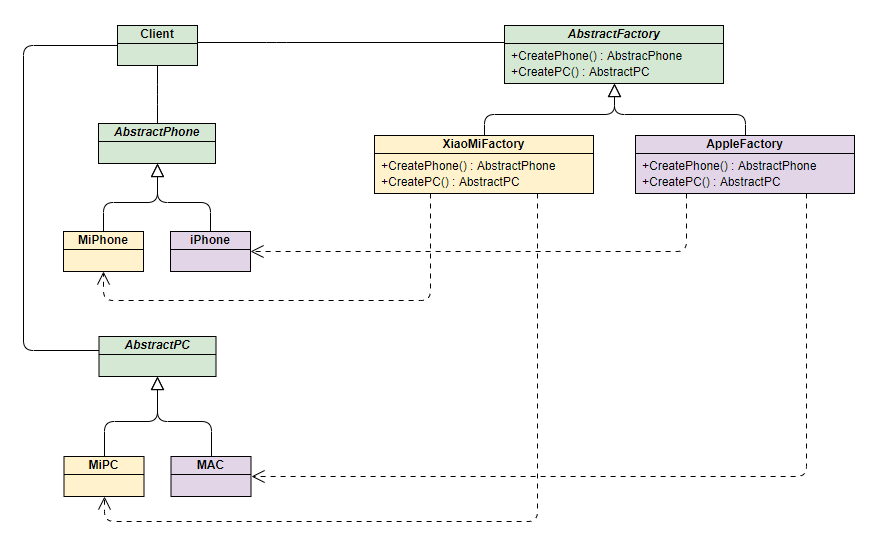

工厂顾名思义就是创建产品，根据产品是具体产品还是具体工厂可分为简单工厂模式和工厂方法模式，根据工厂的抽象程度可分为工厂方法模式和抽象工厂模式。该模式用于封装和管理对象的创建，是一种创建型模式。本文从一个具体的例子逐步深入分析，来体会三种工厂模式的应用场景和利弊。

### 1. 简单工厂模式

> 如果有一个Product1和product2实现抽象product类，factory根据传入参数判断，创建什么类。
>
> 缺点：如果新增product3，需要修改Factory类，硬编码，不适合扩展。


下面我们使用手机生产来讲解该模式：

**Phone类**：手机标准规范类(AbstractProduct)

```
public interface Phone {
    void make();
}
```

 **MiPhone类**：制造小米手机（Product1）

[](javascript:void(0);)

```
public class MiPhone implements Phone {
    public MiPhone() {
        this.make();
    }
    @Override
    public void make() {
        // TODO Auto-generated method stub
        System.out.println("make xiaomi phone!");
    }
}
```

[](javascript:void(0);)

**IPhone类**：制造苹果手机（Product2）

[](javascript:void(0);)

```
public class IPhone implements Phone {
    public IPhone() {
        this.make();
    }
    @Override
    public void make() {
        // TODO Auto-generated method stub
        System.out.println("make iphone!");
    }
}
```

[](javascript:void(0);)

**PhoneFactory类**：手机代工厂（Factory）

[](javascript:void(0);)

```
public class PhoneFactory {
    public Phone makePhone(String phoneType) {
        if(phoneType.equalsIgnoreCase("MiPhone")){
            return new MiPhone();
        }
        else if(phoneType.equalsIgnoreCase("iPhone")) {
            return new IPhone();
        }
        return null;
    }
}
```

[](javascript:void(0);)

 **演示：**

[](javascript:void(0);)

```
public class Demo {
    public static void main(String[] arg) {
        PhoneFactory factory = new PhoneFactory();
        Phone miPhone = factory.makePhone("MiPhone");            // make xiaomi phone!
        IPhone iPhone = (IPhone)factory.makePhone("iPhone");    // make iphone!
    }
}
```

### 2. 工厂方法模式(Factory Method)

和简单工厂模式中工厂负责生产所有产品相比，工厂方法模式将生成具体产品的任务分发给具体的产品工厂，其UML类图如下：

> 定义一个抽象工厂类，仅给一个的抽象接口，具体的创建交给具体工厂去实现。这样新增一种类型时，只需要实现接口。

优点：如果新增产品，只需实现接口即可，扩展方便。


也就是定义一个**抽象工厂**，其定义了产品的生产接口，但不负责具体的产品，将生产任务交给不同的派生类工厂。这样不用通过指定类型来创建对象了。

接下来继续使用生产手机的例子来讲解该模式。

其中和产品相关的Phone类、MiPhone类和IPhone类的定义不变。

**AbstractFactory类**：生产不同产品的工厂的抽象类

```
public interface AbstractFactory {
    Phone makePhone();
}
```

**XiaoMiFactory类**：生产小米手机的工厂（ConcreteFactory1）

```
public class XiaoMiFactory implements AbstractFactory{
    @Override
    public Phone makePhone() {
        return new MiPhone();
    }
}
```

**AppleFactory类**：生产苹果手机的工厂（ConcreteFactory2）

```
public class AppleFactory implements AbstractFactory {
    @Override
    public Phone makePhone() {
        return new IPhone();
    }
}
```

**演示：**

[](javascript:void(0);)

```
public class Demo {
    public static void main(String[] arg) {
        AbstractFactory miFactory = new XiaoMiFactory();
        AbstractFactory appleFactory = new AppleFactory();
        miFactory.makePhone();            // make xiaomi phone!
        appleFactory.makePhone();        // make iphone!
    }
}
```

### 3. 抽象工厂模式(Abstract Factory)

> 优点：可以生产多个产品簇
>
> 具体：可以在抽象工厂中增加一个新产品簇的抽象方法。并交个具体工厂去实现新加产品的创建。举例：普通工厂模式，只能生产一种产品，现在有新需求，生产手机和电脑。在抽象类中写个电脑生产的抽象方法，交给具体公司去实现，比如mi就生产mi PC, huawei生产华为PC。

上面两种模式不管工厂怎么拆分抽象，都只是针对一类产品**Phone**（AbstractProduct），如果要生成另一种产品PC，应该怎么表示呢？

最简单的方式是把2中介绍的工厂方法模式完全复制一份，不过这次生产的是PC。但同时也就意味着我们要完全复制和修改Phone生产管理的所有代码，显然这是一个笨办法，并不利于扩展和维护。

抽象工厂模式通过在AbstarctFactory中**增加创建产品的接口**，并在**具体子工厂中实现新加产品的创建**，当然前提是子工厂支持生产该产品。 

其UML类图如下：


具体：



**PC类**：定义PC产品的接口(AbstractPC)

```
public interface PC {
    void make();
}
```

**MiPC类**：定义小米电脑产品(MIPC)

[](javascript:void(0);)

```java
public class MiPC implements PC {
    public MiPC() {
        this.make();
    }
    @Override
    public void make() {
        // TODO Auto-generated method stub
        System.out.println("make xiaomi PC!");
    }
}
```

[](javascript:void(0);)

**MAC类**：定义苹果电脑产品(MAC)

[](javascript:void(0);)

```
public class MAC implements PC {
    public MAC() {
        this.make();
    }
    @Override
    public void make() {
        // TODO Auto-generated method stub
        System.out.println("make MAC!");
    }
}
```

[](javascript:void(0);)

下面需要修改工厂相关的类的定义：

**AbstractFactory类**：增加PC产品制造接口

```
public interface AbstractFactory {
    Phone makePhone();
    PC makePC();
}
```

**XiaoMiFactory类**：增加小米PC的制造（ConcreteFactory1）

[](javascript:void(0);)

```
public class XiaoMiFactory implements AbstractFactory{
    @Override
    public Phone makePhone() {
        return new MiPhone();
    }
    @Override
    public PC makePC() {
        return new MiPC();
    }
}
```

[](javascript:void(0);)

**AppleFactory类**：增加苹果PC的制造（ConcreteFactory2）

[](javascript:void(0);)

```
public class AppleFactory implements AbstractFactory {
    @Override
    public Phone makePhone() {
        return new IPhone();
    }
    @Override
    public PC makePC() {
        return new MAC();
    }
}
```

[](javascript:void(0);)

**演示：**

[](javascript:void(0);)

```java
public class Demo {
    public static void main(String[] arg) {
        AbstractFactory miFactory = new XiaoMiFactory();
        AbstractFactory appleFactory = new AppleFactory();
        miFactory.makePhone();            // make xiaomi phone!
        miFactory.makePC();                // make xiaomi PC!
        appleFactory.makePhone();        // make iphone!
        appleFactory.makePC();            // make MAC!
    }
}
```