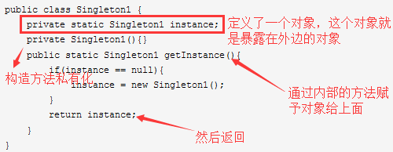
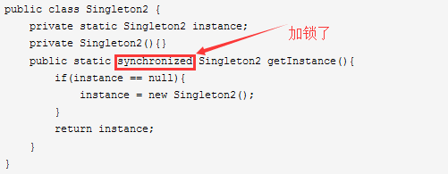
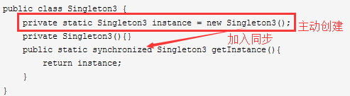
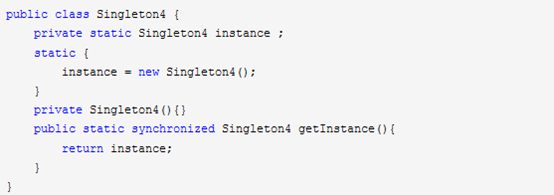
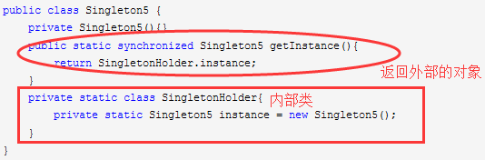
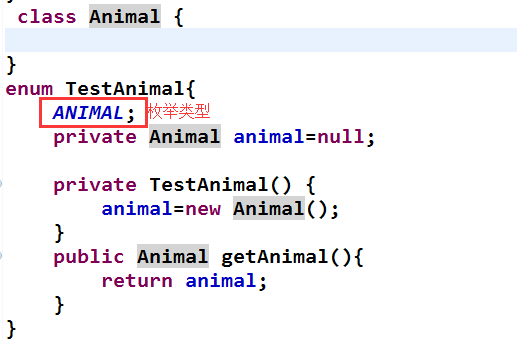
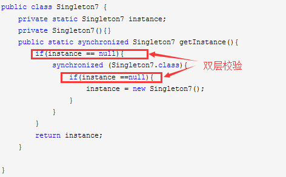

# 单例模式

## 1.懒汉式

>懒汉式就是不在系统加载时就创建类的单例，而是在第一次使用实例的时候再创建。

1.1线程不安全

1.2线程安全

线程安全，但是效率极其低下

## 2.饿汉模式-线程安全

这种方式基于classloder机制避免了多线程的同步问题，不过，instance在类装载时就实例化，这时候初始化instance显然没有达到单例的效果。不推荐。

##3.懒汉模式-线程安全

##4.静态内部类---线程安全

5.使用枚举类---线程安全

6.双重校验模式---线程安全

多线程下加上volatile修饰保证 有序性。

