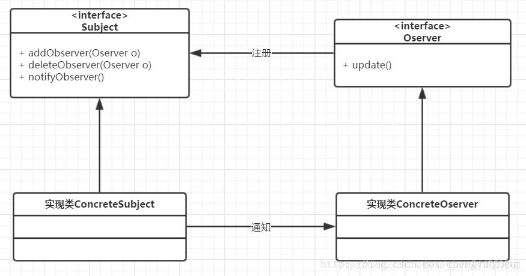

#观察者模式

> 在对象之间定义了一对多的依赖，当一个对象改变状态，依赖它的对象会收到通知并自动更新。



- Subject  **被观察者**或者被订阅对象。**当`Subject`(被观察者)有变动，就会通知到每一个`Observer(观察者)`。**
- Observer 观察者或者**订阅者对象**。

* ConcreteSubject 具体被观察者
* 具体观察者角色

```java
/**
 * 观察者主题对象
 */
public interface Subject {

    /**
     * 订阅操作
     */
    void attach(Observer observer);

    /**
     * 取消订阅操作
     */
    void detach(Observer observer);

    /**
     * 通知变动
     */
    void notifyChanged();
}

```

观察者：

```java
/**
  * 观察者订阅人对象
  */
 public interface Observer {

     /**
      * 接收变动通知
      */
     void update();
 }

```

具体被观察者：

```java
public static class RealSubject implements Subject {
 private List<Observer> observerList = new ArrayList<>();

@Override
public void attach(Observer observer) {
    observerList.add(observer);
}

@Override
public void detach(Observer observer) {
    observerList.remove(observer);
}

@Override
public void notifyChanged() {
    for (Observer observer : observerList) {
        observer.update();
    }
}

```

具体观察者：

```java
public static class RealObject implements Observer {
    @Override
    public void update() {
        System.out.println("接收到了通知");
    }
}
```

java实现的工具：

**Observable**: 被观察者

**Observer**： 观察者

notifyObservers();

```java
public static class RealSubject extends Observable {

   public void makeChanged() {
      setChanged();
      notifyObservers();
   }
}

public static class RealObserver implements Observer {

   @Override
   public void update(Observable o, Object arg) {
      System.out.println("调用了-->");
   }
}
@Test
public void test(){
   RealSubject subject = new RealSubject();
   RealObserver observer = new RealObserver();
   subject.addObserver(observer);
   subject.makeChanged();
}
```

