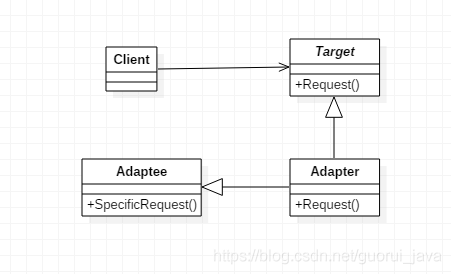
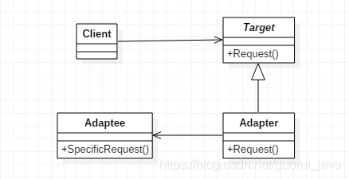
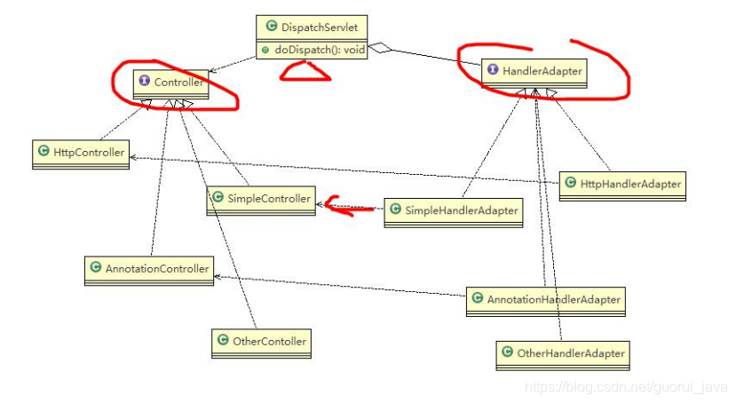

https://blog.csdn.net/guorui_java/article/details/106584559


https://www.jianshu.com/p/43bfb4516dd8

##一、基本介绍

Adapter适配器模式：**将一个类的接口转换成客户希望的另外一个接口**。

使原本由于接口不兼容而不能一起工作的那些类可以一起工作了。

1. 类适配器：通过继承
2. 对象适配器：通过组合

##二、适配器模式的结构
1、**目标（**Target）

定义一个客户端使用的特定接口。
2、**客户端**（Client）

使用目标接口，与和目标接口一致的对象合作。
3、**被适配者**（Adaptee）

一个现存需要适配的接口。
4、**适配器**（Adapter）

负责将**Adaptee的接口转换为Target的接口**。适配器是一个具体的类，这是该模式的核心。
 ##三、适配器模式的优缺点
1、优点

    * 可以让任何两个没有关联的类一起运行；
    * 增加了类的透明性；
    * 提高了类的复用度；
    * 灵活性非常好；

2、缺点

    ＊　过多使用适配器会使系统非常凌乱；
    ＊　由于java是单继承的，所以只能适配一个适配器类，而且目标类必须是抽象的；
    ＊　只有碰到无法改变原有设计和代码的情况下，才会考虑适配器模式；
## 四、适配器模式的使用场景

1、系统需要**使用现有的类，**从而**类的接口不符合系统的需要**。

2、想建立一个可以重复使用的类，用于一些彼此之间没有太大关联的一些类。

3、通过**接口转换，将一个类插入另一个类中。**

## 五.类适配器

> 使用继承



1、Target

Target目标角色，该角色定义把其它类转换成期望接口，通常情况下是一个接口或一个抽象类，一般不会是实现类。

```java
public interface Target {   
    public void request();
}
```

2、Adaptee

Adaptee源角色，想把谁转换为目标角色，这个“谁”就是源角色，它是已经存在的、运行良好的类或对象。

```java
public class Adaptee {
    public void specificRequest() {
        System.out.println("特殊请求");
    }
}
```

3、Adapter

Adapter适配器角色，是适配器模式的核心角色，它的职责是通过继承或类关联的方式把源角色转换成目标角色。

```java
public class Adapter extends Adaptee implements Target {
    @Override
    public void request() {
        super.specificRequest();
    }
}
```

4、ConcreteTarget

```java
package designMode.adapter.sxn;
 
public class ConcreteTarget implements Target {
    @Override
    public void request() {
        System.out.println("普通请求");
    }
}
```

5、测试类

```java
package designMode.adapter.sxn;
 
public class Client {
    public static void main(String[] args) {
        //原有业务逻辑
        Target target = new ConcreteTarget();
        target.request();
 
        //增加适配器后的业务逻辑
        Target target2 = new Adapter();
        target2.request();
    }
}
```
————————————————
版权声明：本文为CSDN博主「哪 吒」的原创文章，遵循CC 4.0 BY-SA版权协议，转载请附上原文出处链接及本声明。
原文链接：https://blog.csdn.net/guorui_java/article/details/106584559

## 六.对象适配器

> 使用 关联关系



1、Target

客户所期待的接口。目标可以是具体的或抽象的类，也可以是接口。

```java
package designMode.adapter.sxn;
 
public class Target {
    public void request() {
        System.out.println("普通请求");
    }
}
```

2、Adaptee

需要适配的类。

```java
package designMode.adapter.sxn;
 
public class Adaptee {
    public void specificRequest() {
        System.out.println("特殊请求");
    }
}
```

3、Adapter

通过在内部包装一个Adaptee对象，把源接口转换成目标接口。

```java
package designMode.adapter.sxn;
 
public class Adapter extends Target{
    private Adaptee adaptee = new Adaptee();
 
    @Override
    public void request() {
        adaptee.specificRequest();
    }
}
```

4、测试类

```java
package designMode.adapter.sxn;
 
public class Client {
    public static void main(String[] args) {
        Target target = new Adapter();
        target.request();
    }
}
```

5、控制台输出

##七.SpingMVC框架中的应用

###1、SpringMVC中的HandlerAdapter使用了适配器模式；
###2、使用HandlerAdapter的原因分析

可以看到处理器的类型不同，有多重实现方式，那么调用方式就不是确定的。

如果需要直接调用controller方法，需要调用的时候就得不断使用ifelse来进行判断是哪一种子类然后执行。

那么如果后面要扩展controller，就得修改原来的代码，违背了开闭原则。

###3、SpringMVC通过适配器模式获取对应的controller步骤




* Spring定义了一个适配接口，使得每一种controller有一种对应的适配器实现类

* 适配器代替controller执行相应的方法

* 扩展controller时，只需要**增加一个适配器类就完成了SpringMVC的扩展**;

伪代码：

####HandlerAdapter处理器适配器

```java
package com.guor.adapter;
 
public interface HandlerAdapter {
    public boolean supports(Object handler);
    public void handle(Object handler);
}
 
// 多种适配器类
class SimpleHandlerAdapter implements HandlerAdapter {
    public ModelAndView handle(Object handler) {
        ((SimpleController) handler).doSimplerHandler();
    }
 
    public boolean supports(Object handler) {
        return (handler instanceof SimpleController);
    }
}
 
class HttpHandlerAdapter implements HandlerAdapter {
    public ModelAndView handle(Object handler) {
        ((HttpController) handler).doHttpHandler();
    }
 
    public boolean supports(Object handler) {
        return (handler instanceof HttpController);
    }
}
 
class AnnotationHandlerAdapter implements HandlerAdapter {
    public ModelAndView handle(Object handler) {
        ((AnnotationController) handler).doAnnotationHandler();
    }
 
    public boolean supports(Object handler) {
        return (handler instanceof AnnotationController);
    }
}
```

####DispatchServlet前端控制器

```java
package com.guor.adapter;
 
import java.util.ArrayList;
import java.util.List;
 
public class DispatchServlet {
    public static List<HandlerAdapter> handlerAdapters = new ArrayList<HandlerAdapter>();
 
    public DispatchServlet() {
        handlerAdapters.add(new AnnotationHandlerAdapter());
        handlerAdapters.add(new HttpHandlerAdapter());
        handlerAdapters.add(new SimpleHandlerAdapter());
    }
 
    public void doDispatch() {
        // 此处模拟SpringMVC从request取handler的对象，
        // 适配器可以获取到希望的Controller
        HttpController controller = new HttpController();
        // AnnotationController controller = new AnnotationController();
        //SimpleController controller = new SimpleController();
        // 得到对应适配器
        HandlerAdapter adapter = getHandler(controller);
        // 通过适配器执行对应的controller对应方法
        adapter.handle(controller);
    }
 
    public HandlerAdapter DispatchServlet(Controller controller) {
        //遍历：根据得到的controller(handler), 返回对应适配器
        for (HandlerAdapter adapter : this.handlerAdapters) {
            if (adapter.supports(controller)) {
                return adapter;
            }
        }
        return null;
    }
 
    public static void main(String[] args) {
        new DispatchServlet().doDispatch(); // http...
    }
}
```

