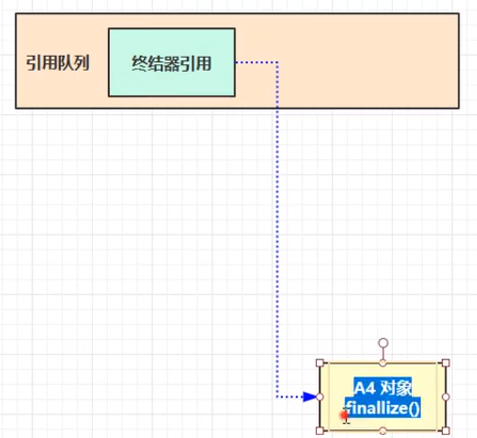
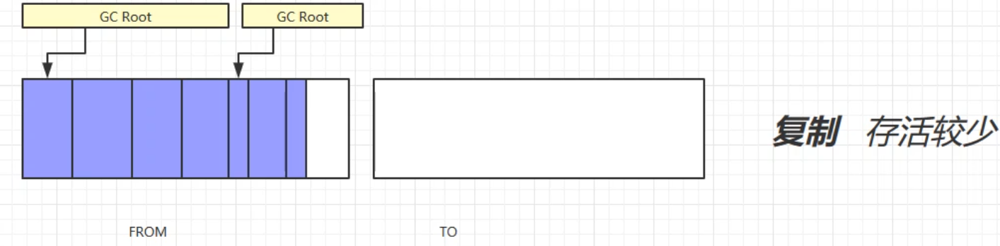
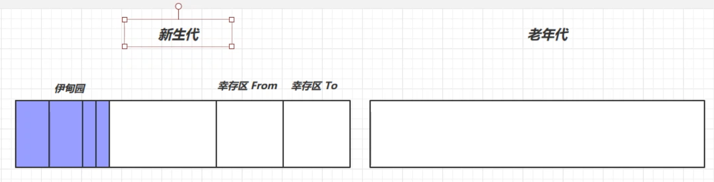

# 1 对象已死？

## 1.1引用计数法: 

问题：循环引用： 引用计数 ！= 0，无法回收

##1.2可达性分析算法

- Java 虚拟机中的垃圾回收器采用**可达性分析**来探索所有存活的对象
- 扫描堆中的对象，看是否能够沿着 **GCRoots根对象** 为起点的**引用链**找该对象；找不到，表示可以回收。

MAT：可视化工具

###GC Roots包括：

- **虚拟机栈**中**局部变量**表中的引用的对象。
- **本地方法栈**中 JNI(Native) 引用对象
- 在**方法区**中**类静态属性引用**的对象ex: 引用**类型静态变量** 和 **常量引用的对象**。ex:字符串常量池(StringTable)里的引用。
- **jvm内部引用**,ex**:基本数据类型对应的Class对象**，**异常对象**(OutOfMemory)，**系统类加载器**。
- 被**同步锁(synchronize)持有的对象** :Busy     Monitor 

##五种引用

1.  强引用

类似于：Object obj = new Object();的引用关系。只有**所有 GC Roots 对象**都不通过【强引用】引用该对象，该对象才能被垃圾回收. 

2. 软引用（SoftReference）

描述一些**有用，但非必须的**。只被软引用关联者的对象，在第一次垃圾回收后，**内存仍不足时第二次发出垃圾回收**， 如果内存不足，发生内存溢出异常。

3. 弱引用（WeakReference）

描述**非必须**的对象。仅有弱引用引用该对象时，在垃圾回收时，**无论内存是否充足，都会回收只被弱引用关联的对象**。

4. 虚引用（PhantomReference）

最弱的引用关系，**无法通过虚引用来取得一个对象实例**，使用它的目的能在这个**被收集器回收时收到一个系统通知**。

ex：ByteBuffer 类内部，使用了 Cleaner （虚引用）来监测 ByteBuffer 对象，一旦ByteBuffer 对象被垃圾回收，那么就会由 ReferenceHandler 线程通过 Cleaner 的 clean 方法调用 freeMemory ()来释放直接内存 

5. 终结器引用（FinalReference）

无需手动编码，但其内部配合**引用队列F-Queue**使用，在垃圾回收时，**终结器引用入队**（被引用对象暂时没有被回收），再由 **Finalizer 线程**通过终结器引用找到被**引用对象并调用它的 finalize方法**，第二次 GC 时才能回收被引用对象。

##对象死亡？

Finalize()方法，对象的自救条件:

> 重新与引用链上对象建立关联 

- Finalize()只**能执行一次** 
- 必须**覆盖Object中的finalize()方法。**

```java
@Overrid
protected void finalize(){
    super.finalize();
    Demo.Save_hook = this;// 重新与引用链上对象建立关联
}
```




# 2 垃圾回收算法

## 2.1标记清除算法(Mark-Sweep)

###步骤：

1.**标记**出所有需要回收的对象

2.**统一回收**被标记的对象

###优缺点:

优点：**速度快**

缺点：

*  **执行效率低**(大量标记清除动作虽对象数量增加而降低)

* **内存空间碎片化**问题

## 2.2标记-复制算法

描述: 将内存分成大小相等的**两块内存**：FROM与TO 区

###步骤：

1.标记

2.将**存活对象**复制到——>TO区

3.**清除from区**

4.交换FROM区与TO区

###优缺点:

优点：不会有空间碎片

缺点：

* 浪费空间。开辟两块相等内存

* 存活对象多时，复制操作多，效率低




##2.3标记整理算法

标记整理是**移动式回收算法**。标记清除是 非移动式回收算法

###步骤：

1.标记

2.整理：将**存活对象->内存空间**一端移动，直接清除边界以外的内存。**移动对象时，暂停用户应用程序 才能进行(STOP The World)**

###优缺点：

优点：没有内存碎片，省内存空间

缺点：效率低（当存活对象多时，会改变去引用地址），同时会暂停用户应用程序才能进行（STW）。

## 2.4 分代回收

* 新生代(new generation)：
  * 伊甸园 (Eden)，幸存区(Survivor)From和TO  8:1:1 所以可用内存空间90%
* 老年代( tenured generation )：

###步骤：

1.对象首先分配到Eden区，

2.新生代空间不足，触发minor gc,**Eden区和from存活的对象c**opy复制到**to区**中，**存活对象年龄加1并且交换from与to区**

3.minor gc会引发stop the world

4.当对象寿命**超过阈值**时，会晋升到老年代，最大寿命是15(4bit)

5.当老年代空间不足，会尝试出发minor Gc,如果之后空间仍不足，那么触发 full gc，STW的时间更长

如果full gc 后空间任然不足，则抛出 java.lang.OutOfMemoryError: Java heap space

- Minor GC（新生代收集）：
- Major GC(老年代收集)：CMS收集器会单独收集老年代
- Full GC(整堆收集)




大对象OOM:

##大对象直接晋升——>老年代中

##一个线程的OutOfMemoryError 不会影响进程的结束

当前线程抛出OOM异常后，它所占据的内存资源会全部被释放掉，从而不会影响其他线程的运行。

https://blog.csdn.net/srs1995/article/details/109203174

# 3.垃圾回收器

1. 串行

- 单线程
- 堆内存较小，适合个人电脑

2. 吞吐量优先

- 多线程，**多核 cpu**
- 让单位时间内，STW 的时间最短 0.2 0.2 = 0.4，垃圾回收时间占比最低，这样就称吞吐量高  
- 多食-少餐-堆大 ， 收集次数少

3. 响应时间优先

- 多线程
- 堆内存较大，多核 cpu，尽可能让单次 STW (Stop the World)的时间最短 0.1 0.1 0.1 0.1 0.1 = 0.5   
- 少食多餐--堆小，收集次数多，速度快。

## 3.1串行-Serial

> 单线程收集器

* Serial(新生代): 采用 **标记-复制**
* Serial Old(老年代): **标记-整理**

-XX:+UseSerialGC = Serial + SerialOldC

###优点：

**简单而高效**（与其他收集器的单线程相比），另一种用途是作为**CMS收集器的后备方案。**

##3.2吞吐量优先--Parallel Scavenge

Parallel Scavenge : 

* 吞吐量优先
* 基于**标记-复制**算法
* **并行收集**的**多线程**收集器。（**会停止用户线程**）
* 新生代收集器

Parallel Old 收集器: **标记-整理** ----老年代

- -XX:+UseParallelGC ~ -XX:+UseParallelOldGC  
- 自适应调整策略 -XX:+**UseAdaptiveSizePolicy** （-XX:SurviorRatio：Eden和Survivor比例 -XX:+PretenureSizeThreshold：阈值 ）
- 吞吐量大小：-**XX:GCTimeRatio**=ratio  吞吐量默认**ration = 19,** 最大垃圾回收时间占总时间的 5% 公式：1/(1+ratio)
- 最大垃圾收集停顿时间 -**XX:MaxGCPauseMillis**=ms  
- 线程数量  -XX:**ParallelGCThreads**=n  

###优缺点:

优点：

采用**自适应调节策略**，不必关心新生代：Eden,Survior,老年代晋升阈值等信息。

缺点：

1.stop the word

2.不能同时**满足吞吐量**与**停顿时间**

吞吐量大----堆大--->不经常垃圾收集      停顿时间小----堆小-----吞吐量小


##3.3响应时间--CMS

CMS(Concurrent Mark Sweep)收集器：

* 响应时间优先的

* 基于**标记-清除**的**并发的**收集器。

*  作为**老年代收集器**与**新生代ParNew(标记-复制算法)**并行多线程的收集器搭配。

* 获取**最短回收停顿时间**。垃圾回收线程和用户线程同时进行，所以停顿时间短

步骤

1. **初始**标记: 标记GC Roots 能直接关联到的对象，速度很快 （STW）
2. **并发**标记:遍历整个对象图，与垃圾收集线程同时进行。
3. **重新**标记:修正并发标记期间，因**用户程序继续运作导致标记产生变动的那一部分对象的标记**。**增量更新**算法     （STW）
4. **并发**清除: 清除标记已经死亡的对象。

###缺点：

1.占用cpu资源 ---回收线程多

2.产生浮动垃圾，可能出现**并发失败**。 ---- 并发失败后，启动Serial Old收 集器重新进行老年代收集，**导致停顿时间长**。

3.内存碎片增多。--- 基于标记清除的，碎片增多可能会FUll GC。

**并发失败**：预留的内存无法满足分配新新对象的需求,达到阈值会清除。

**浮动垃圾：**并发执行中，标记-清理过程中，用户线程产生新的垃圾对象(**消亡->存活**)

产生内存碎片->进行一次SerialOld

* -XX:+UseConcMarkSweepGC ~ -XX:+UseParNewGC ~ SerialOld

* -XX:ParallelGCThreads=n ~ -XX:ConcGCThreads=threads  n = cup个数 threads = **1/4*cpu个数**

* 设置出发CMS触发百分比(占内存的) : -XX:CMSInitiatingOccupancyFraction=percent ： 

* -XX:+CMSScavengeBeforeRemark

## 3.4G1

#### (1).概念

解释：G1将堆内存分成多个**大小相等的独立Region区域**，每个Region根据需要，分成Eden，Survivor，old。

JDK9后不建议CMS收集器 

G1整体上看是"标记-整理"，从局部看是'标记-复制'；

#### (2).阶段：

G1垃圾回收的阶段：

1. 初始标记:标记GC Roots 能直接关联到的对象  ，与Minor GC同步完成，没有额外的停顿。
2. 并发标记: GCRoots开始对堆中对象进行可达性分析。
3. **最终**标记:STW，短暂的用户暂停，处理STAB（**原始快照**）
4. **筛选**回收: STW
   1. 对Region根据**回收价值排序**，指定回收计划，将多个Region构成回收集。将Region存活对象--->空的Region中，清除掉旧Region的全部空间。
   2. 回收的存活对象移到空的Region区域中，清理旧回收集。

回收价值：时间短，释放内存多，价值高。

**Humongous**区域：使用**连续的**Region存储**大对象**（当超过RegionSize一半）

###优缺点： 

优点：**用户可以指定期望**停顿时间 (Max GCPauseMillis) ，来制定回收计划(各个Region区域的回收价值和成本进行排序）

缺点：

* 内存占用：多个Region，多个卡表，维护卡表占堆容量20%多。

* 执行负载大：写屏障多，消耗更多的计算源。
  * 写后屏障：**维护卡表** ； 
  * 写前屏障：**维护原始快照**，跟踪并发是的指针变化情况。

## 参数：

-XX:G1HeapRegionSiz: 设置Region的大小

-XX:MaxGCPauseMillis:  收集停顿时间

## 4.HotSpot算法细节实现:

###  4.1根节点枚举：

因为：根节点集合对象引用关系不断变化。根节点与整理内存碎片会遇到STW问题。

>  为了使得扫描时间短，直接得到哪些地方存放着对对象引用。

OopMap（数据结构）：记录**栈和寄存器内哪些位置是引用**，存放偏移量….等直接得到哪些地方放着对象引用。

### 4.2安全点(Safepoint)

>  每一条指令生成OopMap，浪费空间。

它特定位置上记录信息。必须到达安全点后，才可以开始垃圾收集。

1.抢先式

- 先将全部用户线程中断，然后恢复未在安全点上的线程，直到安全点

2.主动中断

- 设置标志位，让线程轮询标志位，真——>主动中断挂起

### 4.3安全区域

>  等待挂起(未分配处理器)的线程无法响应虚拟机的中断请求

定义：确保某一段代码片段中，引用关系不会发生变化

### 4.4记忆集与卡表

> 避免每次YGC 时扫描整个老年代，减少扫描区域，提高效率。

所有**区域收集行为**的垃圾收集器，都会遇到**跨代引用**问题。Ex:Minor GC

记忆集：用于记录从**非收集区域**指向收**集区域的指针集合**的抽象数据结构。

比如：Minor Gc中**老年代** --> **新生代**.

记忆集的具体实现是**卡表**:

**卡表**标识对应内存区域中的**内存块(卡页)**

卡页内存在跨代指针 ---> 卡表 值标识 **1 **

将卡表值为1的加入GCRoots中一并扫描。


### 4.5写屏障

>  卡表如何变脏?如何维护？

1.在引用类型字段赋值那一刻，变脏。

2.维护：写屏障:虚拟机对"引用类型字段赋值"这个动作的AOP切面

### 4.6并发的可达性分析

在根枚举，会用户线程停顿（STW）,堆越大，时间越久。

白：未访问

灰: 访问过,但**至少存在一个引用没扫描**

黑：已经访问过。

用户线程与GC Roots并发执行问题：

- 消亡对象——>存活
- 存活对象——>消亡(致命的对象消失)

**对象消失**，当且仅当以下两个条件满足：

1. **插入**一条或多条**黑色对象到白色**对象的新引用。
2. **删除全部从灰色到该白色**对象的直接或间接引用


办法：

| 增量更新: | 黑色为根，重新扫描。将黑色对象->灰色 (破坏条件1)           CMS |
| --------- | ------------------------------------------------------------ |
| 原始快照: | 以以前记录的灰色为根，重新扫描，记录对象图快照(破坏条件1)。 G1 |

##并行与并发：

并行：同一时刻，多个程序同时运行

并发：同一时间间隔内，同时运行，微观串行，宏观并行。

而jvm的垃圾收集器知识中，我们认为：

* 并行：描述多个垃圾回收线程之间关系，这是默认用户线程是等待状态的

* 并发：描述垃圾回收线程和用户线程之间的关系。用户线程不会冻结。

