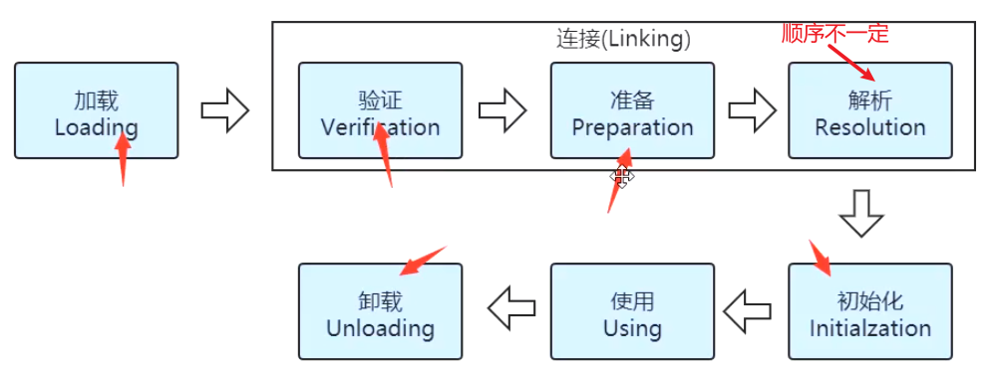
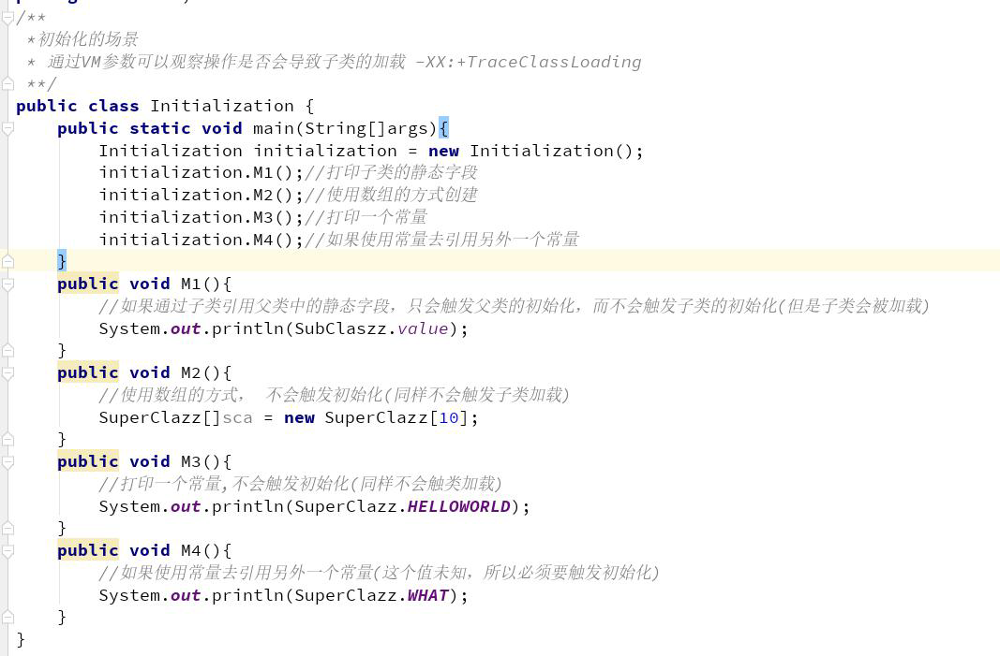
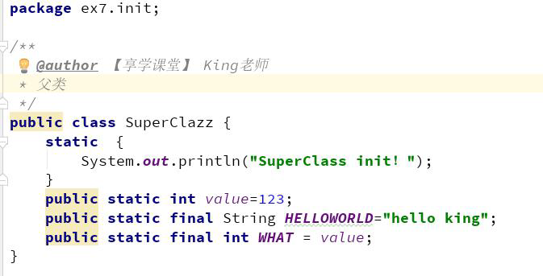
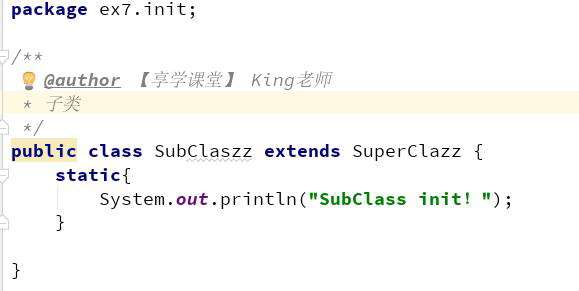
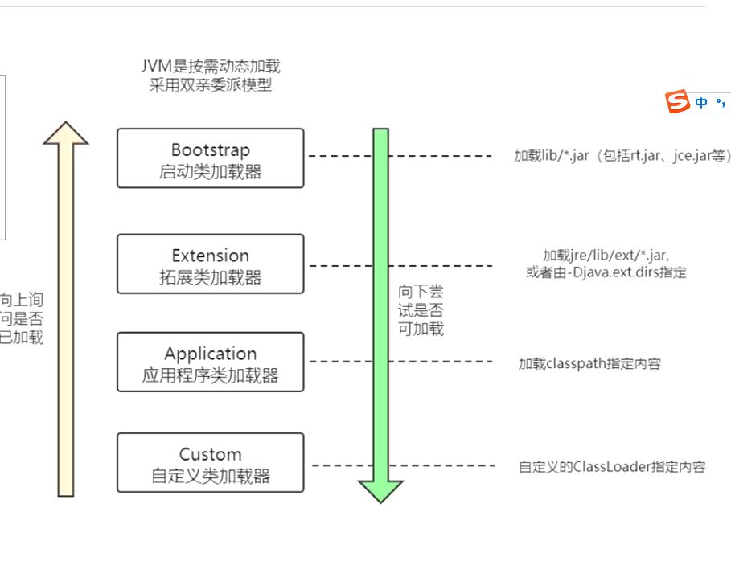
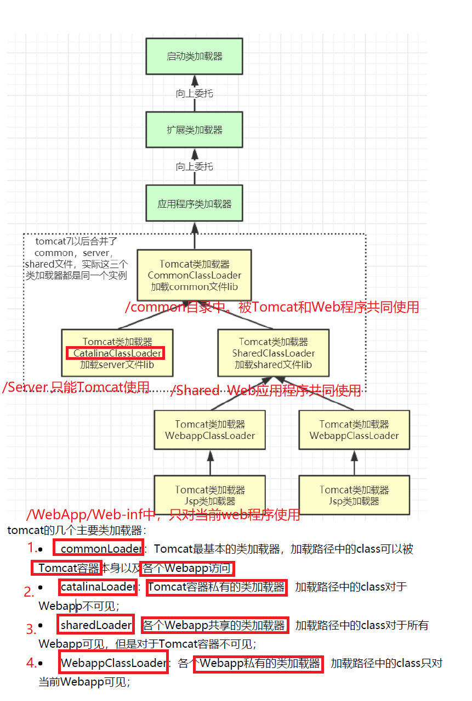
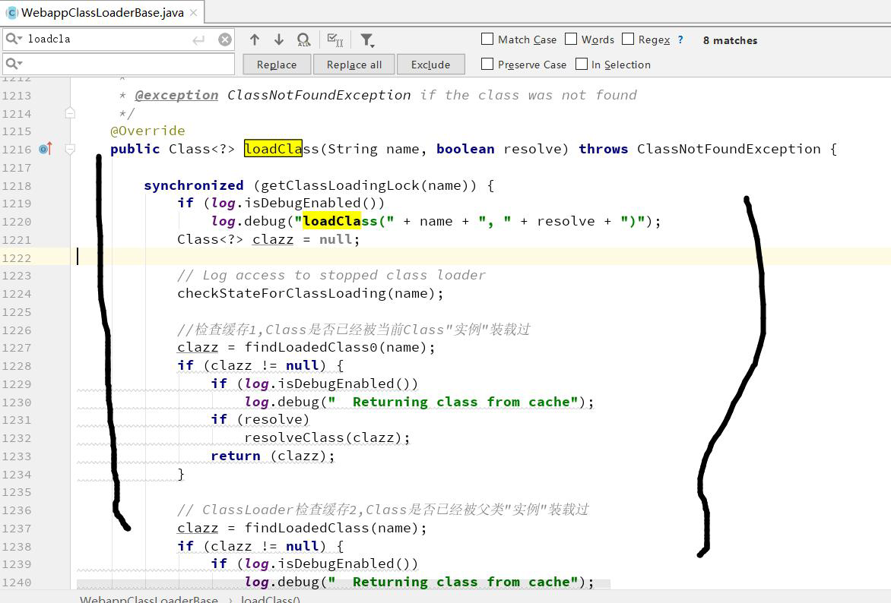

#类加载

**加载** **>>** **验证** **>>** **准备** **>>** **解析** **>>** **初始化** **>>** **使用** **>>** 卸载



##加载

加载完成后创建一个class对象。

1）通过一个类的全限定名来获取定义此类的二进制字节流。
2）将这个字节流所代表的静态存储结构转化为方法区的运行时数据结构。
3）在内存中生成一个代表这个类的java.lang.Class 对象，作为方法区这个类的各种数据的访问入口。

class文件的解释:

1.表示java中的类或接口。

2.并非特指具体磁盘中的文件，而可能是一串二进制字节流。网络，内存，…

类已经加载进入了方法区，成为了方法区的运行时结构。

## 验证

> 目的是为了确保Class 文件的字节流中包含的信息符合当前虚拟机的要求，并且不会危害虚拟机自身的安全

ex:java代码无法访问数组下标以外的数据，编译器会报异常，但有人直接修改class二进制文件，非法访问。

* 文件格式验证: 查看是否符合Class文件格式。比如：魔术0xCAFEBABE
* 元数据验证：语义校验
* 节码验证：
* 符号引用验证:

##准备

为**类变量分配内存**，设置类变量初始值。分配在方法区中。

public static int value=123；
类变量value 在准备阶段过后的**初始值为0** 而不是123，因为这时候尚未开始执行任何Java 方法，而把value 赋值为123 是类初始化阶段，<clinit>（）方法中的putstatic指令。

## 解析

解析阶段是JVM 将常量池内的**符号引用**替换为**直接引用**的过程

## 初始化

> <Clinit>()编译器自动 收集类中所有类变量的赋值动作和静态语句块(static{}块)中合并产生的。

初始化主要是对一个class 中的**static{}语句**进行操作（对应字节码就是clinit 方法）。

＜clinit＞（）方法对于类或接口来说并不是必需的，如果一个类中没有静态语句块，也没有对变量的赋值操作，那么编译器可以不为这个类生成＜clinit＞（）方法。

###初始化的六种情况:

1）遇到**new、getstatic、putstatic 或invokestatic** 这4 条字节码指令时，如果类没有进行过初始化，则需要先触发其初始化。生成这4 条指令的最常见的
Java 代码场景是：

* 使用**new 关键字实例化对象**的时候。
*  读取或设置一个**类的静态字段**（**被final 修饰、已在编译期把结果放入常量池的静态字段除外**）的时候 ----M3()
*  调用一个**类的静态方法**的时候。

2）使用java.lang.reflect 包的方法对类进行**反射调用的时候**，如果类没有进行过初始化，则需要先触发其初始化。
3）当初始化一个类的时候，如果发现其**父类还没有进行过初始化**，则需要**先触发其父类的初始化**。
4）当虚拟机启动时，用户需要指定一个要执行的主类（包含main（）方法的那个类），虚拟机会先初始化这个主类。
5）当使用JDK 1.7 的动态语言支持时，如果一个java.lang.invoke.MethodHandle 实例最后的解析结果REF_getStatic、REF_putStatic、REF_invokeStatic 的方法
句柄，并且这个方法句柄所对应的类没有进行过初始化，则需要先触发其初始化。
6）当一个接口中定义了JDK1.8 新加入的默认方法（被default 关键字修饰的接口方法）时，如果这个接口的实现类发生了初始化，那该接口要在其之前
被初始化。

* static{} <cliit>()方法多线程下能被同步加锁。多个线程初始化类，只会有其中一个执行这个类。

M3()：为什么不会触发类加载，因为在编译的时候，常量数据已经进入自己类的常量池

M4():如果使用常量去引用另外一个常量(这个**值编译时无法确定**，所以必须要触发初始化)







# 类加载器与双亲委派

##类加载器：

实现类的加载动作

* Bootstrap ClassLoader 启动类加载器
  这是加载器中的扛把子，任何类的加载行为，都要经它过问。它的作用是**加载核心类库**，也就是**rt.jar、resources.jar、charsets.jar** 等。当然这些jar 包的路径是可以指定的，-Xbootclasspath 参数可以完成指定操作。这个加载器是C++ 编写的，随着JVM 启动。
* Extention ClassLoader  拓展类加载器 
  扩展类加载器，主要用于加载**lib/ext** 目录下的jar 包和.class 文件。同样的，通过系统变量java.ext.dirs 可以指定这个目录。这个加载器是个Java 类，继承自URLClassLoader。
* Application ClassLoader  应用程序类加载器
  这是我们写的Java 类的默认加载器，有时候也叫作System ClassLoader。一般用来**加载classpath 下的其他所有jar 包和.class 文件**，我们写的代码，会首先尝试使用这个类加载器进行加载。
* Custom ClassLoader   自定义类加载器
  自定义加载器，支持一些个性化的扩展功能。


##双亲委派

1.避免类的重复加载

2.安全。防止核心类被篡改。ex：自己写的String类，不能被加载运行。启动类会去加载。




loadClass源码：

```java
protected Class<?> loadClass(String name, boolean resolve)
    throws ClassNotFoundException
{
    synchronized (getClassLoadingLock(name)) {
        // First, check if the class has already been loaded
        Class<?> c = findLoadedClass(name);
        if (c == null) {
            long t0 = System.nanoTime();
            try {
                if (parent != null) {
                    c = parent.loadClass(name, false); //向上委派
                } else {
                    c = findBootstrapClassOrNull(name);
                }
            } catch (ClassNotFoundException e) {
            }

            if (c == null) {
             
                long t1 = System.nanoTime();
                c = findClass(name);

                // this is the defining class loader; record the stats
                sun.misc.PerfCounter.getParentDelegationTime().addTime(t1 - t0);
                sun.misc.PerfCounter.getFindClassTime().addElapsedTimeFrom(t1);
                sun.misc.PerfCounter.getFindClasses().increment();
            }
        }
        if (resolve) {
            resolveClass(c);
        }
        return c;
    }
}
```

### 破坏双亲委派

* CommonClassLoader ：/common 目录下，**对所以web和Tomcat可见**
* CatalinaClassLoader：/server ，**对Tomcat可见。**
* SharedClassLoader :    /shared，**对所有应用程序可见**
* WebAppClassLoader : **/webApp/Web-inf/** ，**对web当前应用程序可见**

对于一些**需要加载的非基础类， WebAppClassLoader 的类加载器在 /webApp/Web-inf/优先加载**。等它加载不到的时候，再交给上层的ClassLoader 进行加载。
这个加载器用来隔绝不同应用的.class 文件**，比如你的两个应用，可能会依赖同一个第三方的不同版本，它们是相互没有影响的。**

**webappClassLoaderBase没有向上委派。**


​	



### SPI和OSGI

SPI破坏了双亲委派

SPI全称Service Provider Interface，被第三方实现，扩展的接口，它可以用来**启用框架扩展和替换组件**。 SPI的作用就是为这些**被扩展的API寻找服务实现。**

java.sql.DriverManager是由BootStrapClassLoader加载，启动类加载com.mysql.cj.jdbc.Driver，而第三方依赖原则上来说是应该由AppClassLoader来加载的，用BootStrapClassLoader就会加载不到。

使用线程上下文加载器，**父类加载器去请求子类加载器**完成类加载的行为。

ServiceLoad.load()	


spi机制:

实现接口

https://www.cnblogs.com/jy107600/p/11464985.html
