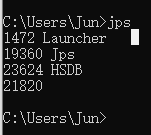
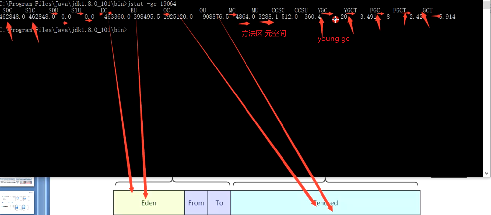
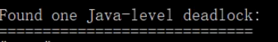
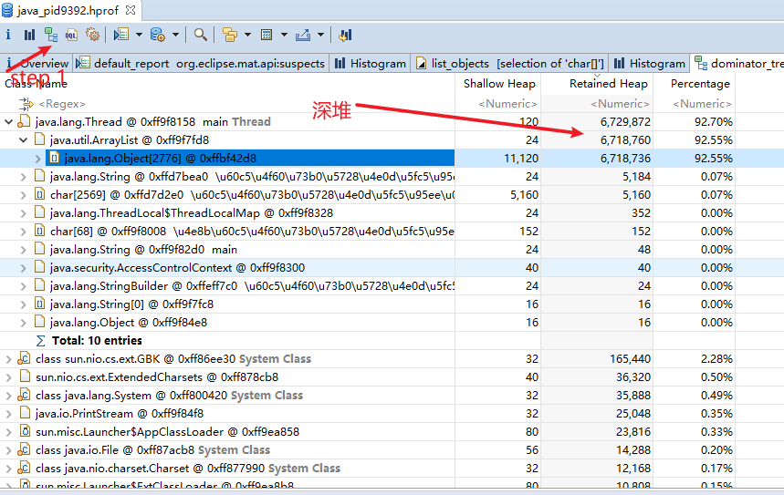

#jdk工具

## JHSDB

启动： D:\4_mine\jdk1.8.0_271\lib> java -cp .\sa-jdi.jar sun.jvm.hotspot.HSDB

## Jps

列出当前机器上正在运行的虚拟机进程，JPS 从操作系统的临时目录上去找（所以有一些信息可能显示不全）。

q :仅仅显示进程，
-m:输出主函数传入的参数. 下的hello 就是在执行程序时从命令行输入的参数
-l: 输出应用程序主类完整package 名称或jar 完整名称.
-v: 列出jvm 参数, -Xms20m -Xmx50m 是启动程序指定的jvm 参数

## jstat

jstat -gc 进程号  时间 次数

查看gc情况:

##jinfo

java配置信息工具

**开启配置信息**：jinfo - flag +PrintGC  进程号

## Jmap

java内存映像工具

Dump 日志:堆转出快照文件。

jmap -heap

jmap -histo 16192 ： 查看对象 占用内存

jmap -histo:live 16192 ： 查看存活对象 占用内存

jmap -dump:live,format=b,file=heap.bin <pid>

## jstack

查看死锁

## mat

对dump下的文件进行分析。

可以排查那部分出现内存泄漏。

###MAT 中的浅堆与深堆
浅堆（shallow heap）代表了**对象本身的内存占用**，包括对象自身的内存占用，以及“为了引用”其他对象所占用的内存。
深堆（Retained heap）是一个统计结果，会循环计算引用的具体对象所占用的内存。但是深堆和“对象大小”有一点不同，**深堆指的是一个对象被垃圾回**
**收后，能够释放的内存大小**，这些被释放的对象集合，叫做保留集（Retained Set)

