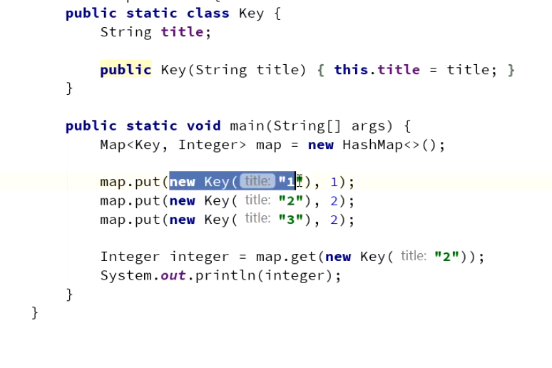
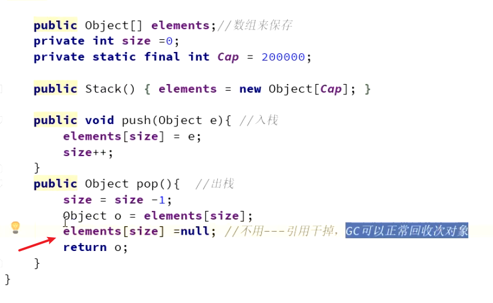
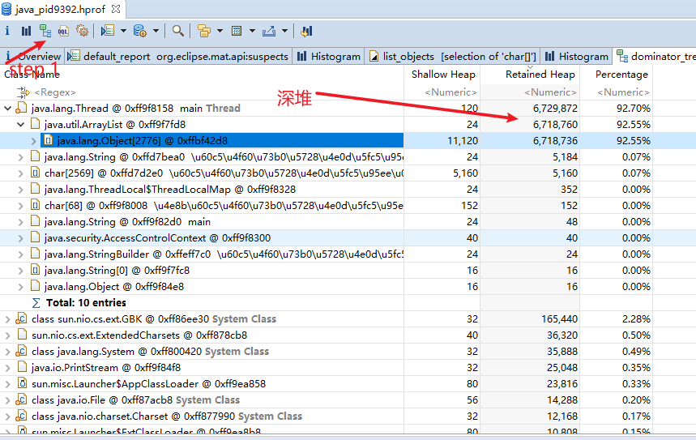

# oom

* 栈深度大，StackOverflowError；如果栈可以动态扩展，抛出OOM
* 堆无法扩展oom
* 运行时常量池（堆中）无法再申请到内存，抛出OOM
* 忘掉**直接内存**，各个内存区域总和 > 物理内存限制。 -Xmx设置过大

堆导致OOM

1.内存泄漏

对象通过GC Roots 引用链，导致gc无法回收他们。

2.内存溢出

https://blog.csdn.net/srs1995/article/details/109203174

内存溢出（重点）

## 种类

* 栈溢出

* 堆溢出

* 方法区溢出

* 本机直接内存溢出

内存泄漏:

堆空间：

方法区：

直接内存：

## 内存泄漏案例

* 长生命周期对象持有短生命周期对象的引用
* 连接未关闭 -- 数据库连接
* Hash值改变

## 内存泄漏和内存溢出

内存泄漏和内存溢出辨析
内存溢出：实实在在的内存空间不足导致；
内存泄漏：该释放的对象没有释放，常见于使用容器保存元素的情况下。
**如何避免：**
内存溢出：检查代码以及设置足够的空间
内存泄漏：一定是代码有问题
**往往很多情况下，内存溢出往往是内存泄漏造成的。**

## Jvm优化的思路

1. 程序优化，效果通常非常大；
2. 扩容，如果金钱的成本比较小，不要和自己过不去； 泄漏，重启
3. 参数调优，在成本、吞吐量、延迟之间找一个平衡点。

## 项目中的oom排查

> 描述问题：
>
> 无响应，查看发现oom。

目的表现出自己有排查问题的能力，逻辑清晰。

长生命周期对象持有短生命周期对象的引用，导致无法GC

解决： 

服务器是一个两核一G。

1.我通过jinfo  查看堆参数，堆大小:  512MB。

2.添加参数: -XX:+HeapDumpOnOutOfMemoryError 将出现oom时Dump出当前的堆内存转储快照。

3.用mat分析dump文件，发现是main线程中的，某个类中的ArrayList 堆比较大，里面包含大量String。

之后我查看代码，

代码为一个拆词方法 ，里面有一个循环，for循环会往一个 ArrayList 里加一个 String 对象， 在某些特定的参数下，就会不停的重置循环计数器 i，导致一个死循环。所以问题出现在这里。

总结
在JVM 出现性能问题的时候。（表现上是CPU100%，内存一直占用）
1、如果CPU 的100%，要从两个角度出发，一个有可能是业务线程疯狂运行，比如说想很多死循环。还有一种可能性，就是GC 线程在疯狂的回收，因为JVM 中垃圾回收器主流也是多线程的，所以很容易导致CPU 的100%。
2、在遇到内存溢出的问题的时候，一般情况下我们要查看系统中哪些对象占用得比较多，我的是一个很简单的代码，在实际的业务代码中，找到对应的
对象，分析对应的类，找到为什么这些对象不能回收的原因，就是我们前面讲过的可达性分析算法，JVM

