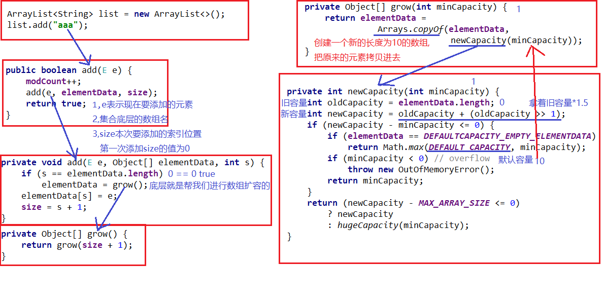

# 集合

## Collection

> 为什么要用迭代器?

三种循环的使用场景：

* 如果需要操作索引，使用普通for循环
* 如果在遍历的过程中需要**删除**元素，使用迭代器
* 如果仅仅想**遍历**，那么使用增强for
  * 增强for不能**修改/删除**元素   拷贝值

# ArrayList


扩容：1.5倍

```java
int newCapacity = oldCapacity + (oldCapacity >> 1);
```

# LinkedList集合功能

特有方法

| public void addFirst(E e) | 在该列表开头插入指定的元素       |
| ------------------------- | -------------------------------- |
| 方法名                    | 说明                             |
| public void addLast(E e)  | 将指定的元素追加到此列表的末尾   |
| public E getFirst()       | 返回此列表中的第一个元素         |
| public   E getLast()      | 返回此列表中的最后一个元素       |
| public E removeFirst()    | 从此列表中删除并返回第一个元素   |
| public   E removeLast()   | 从此列表中删除并返回最后一个元素 |