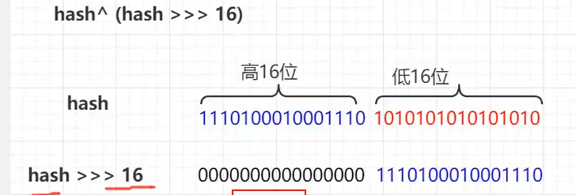

> https://blog.csdn.net/mxw2552261/article/details/91349677
>
> 导入

1.什么是Hash函数和Hash表？

`存储位置 = f(关键字)`

Hash函数: 存储位置与关键字之间的对应关系f.

Hash表：采用散列技术将记录存储在一块连续的存储空间中。

2.Hash函数构造？

* 直接定址法 f(key) =a*key + b
* 数字分析法 
* 平方取中法
* 折叠法
* 除留余数法 f(key) = key mod p (p <=m)
* 随机数法

解决冲突的方式？

* 1.开放地址法 一旦发生冲突，寻找下一个空的散列地址
  * 1.1 线性探测法    1.2二次探测法     1.3 随机探测法
* 2.再散列函数法
* 3.链地址法

##1.数组下标

数组下标 =  Hash & (n - 1)     (n: 数组长度)    一次解决。速度快。

为什么不是 Hash % n 取模。                           多次运算

**n值:2的整数次方**

| 数组下标方法       | 区别     |                        |
| ------------------ | -------- | ---------------------- |
| **Hash & (n - 1)** | 一次运算 | **n必须是2的整数次方** |
| Hash % n           | 多次运算 |                        |

问题：hash不一致，但下标一致。

**所以为了避免hash冲突，加入前面的hash值的运算。**让**前16位**参与进来。

引入：hash ^ (hash >>> 16)

> HashMap中根据hash值找到对应的下标去存储元素

为了避免hash冲突，使用hash算法和数组定位。

##2.hash算法

> int 4字节 32位         hashCode()是一个native方法

hash ^ (hash >>> 16):  高位与低位进行 ^ 运算。

```java
    static final int hash(Object key) {
    int h;
    return (key == null) ? 0 : (h = key.hashCode()) ^ (h >>> 16);
}
    static final int hash2(Object key){
        if(key == null) return 0;
        int h = key.hashCode();
        int temp = h >>> 16;
        return  h ^ temp;
    }
```



####为什么是^运算？

因为它的 0  1  的概率分别是50%


##3.put方法

解释：

**modCount**：修改次数，因为HashMap是线程不安全，如果在迭代的过程中HashMap被其他线程修改了,modCount的数值就会发生变化, 这个时候expectedModCount和ModCount不相等, 迭代器就会抛出ConcurrentModificationException()异常。

**threshold**：capacity * loadFactory，当size > threshold时，会扩容

###3.1Node节点

```java
    static class Node<K,V> implements Map.Entry<K,V> {
        final int hash;
        final K key;
        V value;
        Node<K,V> next;
        ...
        public final int hashCode() {
            return Objects.hashCode(key) ^ Objects.hashCode(value);
        }
        
        public final boolean equals(Object o) {
            if (o == this)
                return true;
            if (o instanceof Map.Entry) {
                Map.Entry<?,?> e = (Map.Entry<?,?>)o;
                if (Objects.equals(key, e.getKey()) &&
                    Objects.equals(value, e.getValue()))
                    return true;
            }
            return false;
        }
    }
```

###3.2TreeNode（红黑树节点）

```java
static final class TreeNode<K,V> extends LinkedHashMap.Entry<K,V> {
        TreeNode<K,V> parent;  // red-black tree links
        TreeNode<K,V> left;
        TreeNode<K,V> right;
        TreeNode<K,V> prev;     
        boolean red;
```

###3.3put方法:

```java
public V put(K key, V value) {
    return putVal(hash(key), key, value, false, true);
}
```

Hashmap的初始化在put()方法里


 有Hash冲突

* 重复key时， put() 返回旧值
* key不用，hash相同。尾插法

* 树化

```java
		if (e != null) { // 重复key e != null
                V oldValue = e.value;
                if (!onlyIfAbsent || oldValue == null)
                    e.value = value; //更新值
                afterNodeAccess(e);
                return oldValue;
		  }
```


```java
   final V putVal(int hash, K key, V value, boolean onlyIfAbsent,
                   boolean evict) {
        HashMap.Node<K,V>[] tab; HashMap.Node<K,V> p; int n, i;
        //数组为空
        if ((tab = table) == null || (n = tab.length) == 0)
            n = (tab = resize()).length;
        //计算数组中的位置i , table[i] == null
        if ((p = tab[i = (n - 1) & hash]) == null)
            tab[i] = newNode(hash, key, value, null);
        else {
            HashMap.Node<K,V> e; K k;
            //1.有hash冲突，重复key
            if (p.hash == hash &&
                    ((k = p.key) == key || (key != null && key.equals(k)))
               )
                e = p;
            //3.树
            else if (p instanceof HashMap.TreeNode)
                e = ((HashMap.TreeNode<K,V>)p).putTreeVal(this, tab, hash, key, value);
            //2.key不同，但hash值相同
            else {
                for (int binCount = 0; ; ++binCount) {
                    //找到尾部 e == null
                    if ((e = p.next) == null) {
                        p.next = newNode(hash, key, value, null);
                        if (binCount >= TREEIFY_THRESHOLD - 1) // -1 for 1st
                            treeifyBin(tab, hash);   //树化
                        break;
                    }
                    //如果链表/树上遇到重复值
                    if (e.hash == hash &&
                            ((k = e.key) == key || (key != null && key.equals(k))))
                        break;
                    p = e;
                }
            }
            if (e != null) { // 重复key e != null
                V oldValue = e.value;
                if (!onlyIfAbsent || oldValue == null)
                    e.value = value; //更新值
                afterNodeAccess(e);
                return oldValue;
            }
        }
        ++modCount;
        //size >capacity * loadFactor 扩容
        if (++size > threshold)
            resize();
        afterNodeInsertion(evict);
        return null;
    
```

##4.扩容

Hashmap的扩容：**newCap = oldCap << 1** //687行  容量是原来的两倍

####4.1数组的初始容量，为什么必须是2的次方？

1.效率  (数组下标计算的效率)

2.为了效率，改进了hash算法，违背了算法导论推荐(除留余数法)

hashmap与hashtable的初始值:

**Hashmap**:16    1<<4;

**Hashtable**:11  使用除留余数法

```java
public Hashtable() {
    this(11, 0.75f);
}
put(){
    ...
int hash = key.hashCode();
int index = (hash & 0x7FFFFFFF) % tab.length;
	...
}
```

 扩展散列函数的构造：

#####除留余数法：

* `f(key) = key mod p (p<=m) ` 散列表长为m

* p是<=表长的**质数**(接近m)   p 不应该是2的整数幂，选择接近2的整数幂的素数最好。

####4.2扩容因子

元素的扩容因子(加载因子)


1: 空间利用率高。提高了查询成本

0.5 ：空间利用率低。

0.75: 时间，空间

#####HashMap属性

```java
	//初始容量
    static final int DEFAULT_INITIAL_CAPACITY = 1 << 4; 
	//最大容量
    static final int MAXIMUM_CAPACITY = 1 << 30;
	//加载因子
    static final float DEFAULT_LOAD_FACTOR = 0.75f;
	//树化
    static final int TREEIFY_THRESHOLD = 8;
	//反树化
    static final int UNTREEIFY_THRESHOLD = 6;
	//最小容量
    static final int MIN_TREEIFY_CAPACITY = 64;
```

#####modCount,threshold解释：

* **modCount**：修改次数，因为HashMap是线程不安全，如果在迭代的过程中HashMap被其他线程修改了,modCount的数值就会发生变化, 这个时候expectedModCount和ModCount不相等, 迭代器就会抛出ConcurrentModificationException()异常。

* **threshold**：capacity * loadFactory，当size > threshold时，会扩容

####4.3为什么是8？

根据泊松分布规律，8:概率最低

####4.4转为红黑树的条件

1.链表长度达到了8

2.数组长度大于64

####4.5链表的长度达到了8，一定会树化吗？

答：不是，数组长度必须大于64.

如果链表长度达到8，数组长度16，怎么办？

答：扩容

####4.6 resize()扩容的时间

在put()方法中 (1)数组为空   (2)size > threshold时。

######扩容注意点：

* 数组定位     
  *   (1)**.原来位置** 
  *    (2)**.原来位置 + 扩容的大小**   ex: 1010(4位)  -> 11011(5位)   **或者** 01011(5位)   (原hash:4  ---> rehash:4+16 | 4 ) 
* 多线程死锁问题。

jdk1.7put采用头插法，很可能引起死循环。 环形链表的形成。

数组定位的源码：

 

为什么？


